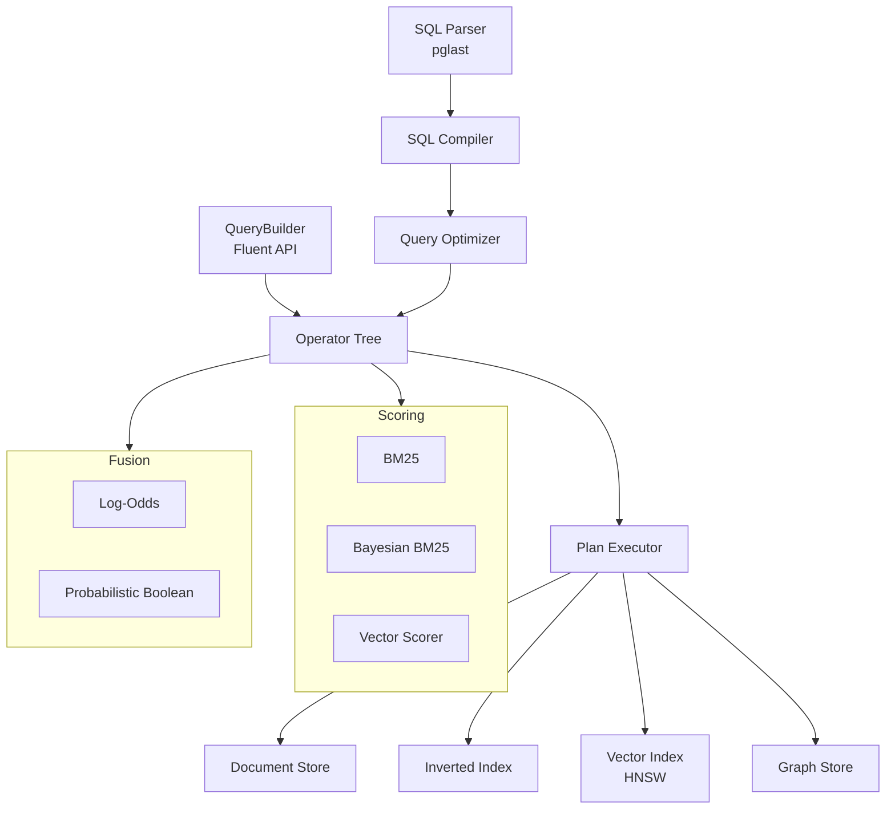

# UQA — Unified Query Algebra

A database prototype that unifies **relational**, **text retrieval**, **vector search**, and **graph query** paradigms under a single algebraic structure, using posting lists as the universal abstraction.

## Overview

UQA extends standard SQL with cross-paradigm query functions:

```sql
-- Full-text search with BM25 scoring
SELECT title, _score FROM papers
WHERE text_match(title, 'attention transformer') ORDER BY _score DESC;

-- Multi-signal fusion: text + vector + graph
SELECT title, _score FROM papers
WHERE fuse_log_odds(
    text_match(title, 'attention'),
    knn_match(5),
    traverse_match(1, 'cited_by', 2)
) AND year >= 2020
ORDER BY _score DESC;

-- Graph traversal
SELECT _doc_id, title FROM traverse(1, 'cited_by', 2);

-- Regular path query
SELECT _doc_id, title FROM rpq('cited_by/cited_by', 1);
```

## Architecture



### Package Structure

```
uqa/
  core/           PostingList, types, hierarchical documents
  storage/        DocumentStore, InvertedIndex, HNSWIndex, BlockMaxIndex
  operators/      Operator algebra (boolean, primitive, hybrid, aggregation)
  scoring/        BM25, Bayesian BM25, VectorScorer, WAND
  fusion/         Log-odds conjunction, probabilistic boolean
  graph/          GraphStore, traversal, pattern matching, RPQ, cross-paradigm
  joins/          Hash, sort-merge, index, graph, cross-paradigm, similarity joins
  planner/        Cost model, cardinality estimator, query optimizer, executor
  sql/            SQL compiler (pglast), table DDL/DML, column statistics
  api/            Fluent QueryBuilder
  tests/          266 tests (pytest + hypothesis)
```

## Key Features

### SQL Interface

| Category | Syntax |
|----------|--------|
| DDL | `CREATE TABLE`, `DROP TABLE [IF EXISTS]` |
| DML | `INSERT INTO ... VALUES` |
| DQL | `SELECT [DISTINCT] ... FROM ... WHERE ... GROUP BY ... HAVING ... ORDER BY ... LIMIT` |
| Utility | `EXPLAIN SELECT ...`, `ANALYZE [table]` |

### Extended WHERE Functions

| Function | Description |
|----------|-------------|
| `text_match(field, 'query')` | Full-text search with BM25 scoring |
| `bayesian_match(field, 'query')` | Bayesian BM25 — calibrated P(relevant) in [0,1] |
| `knn_match(k)` | K-nearest neighbor vector search |
| `traverse_match(start, 'label', hops)` | Graph reachability as a scored signal |

### Fusion Meta-Functions

| Function | Description |
|----------|-------------|
| `fuse_log_odds(sig1, sig2, ...[, alpha])` | Log-odds conjunction (resolves conjunction shrinkage) |
| `fuse_prob_and(sig1, sig2, ...)` | Probabilistic AND: P = prod(P_i) |
| `fuse_prob_or(sig1, sig2, ...)` | Probabilistic OR: P = 1 - prod(1 - P_i) |
| `fuse_prob_not(signal)` | Probabilistic NOT: P = 1 - P_signal |

### FROM-Clause Table Functions

| Function | Description |
|----------|-------------|
| `traverse(start, 'label', hops)` | BFS graph traversal |
| `rpq('path_expr', start)` | Regular path query (NFA simulation) |
| `text_search('query', 'field', 'table')` | Table-scoped full-text search |

## Requirements

- Python 3.12+
- numpy >= 1.26
- hnswlib >= 0.8
- pglast >= 7.0
- prompt-toolkit >= 3.0
- pygments >= 2.17

## Installation

```bash
pip install -e .

# With development dependencies
pip install -e ".[dev]"
```

## Usage

### Interactive SQL Shell

```bash
python usql.py

# Or with a script file
python usql.py examples/demo.sql
```

Shell commands:

| Command | Description |
|---------|-------------|
| `\dt` | List tables |
| `\d <table>` | Describe table schema |
| `\ds <table>` | Show column statistics (requires `ANALYZE` first) |
| `\timing` | Toggle query timing display |
| `\reset` | Reset the engine |
| `\q` | Quit |

### Python API

```python
from uqa.engine import Engine

engine = Engine(vector_dimensions=64, max_elements=10000)

engine.sql("""
    CREATE TABLE papers (
        id SERIAL PRIMARY KEY,
        title TEXT NOT NULL,
        year INTEGER NOT NULL,
        citations INTEGER DEFAULT 0
    )
""")

engine.sql("""INSERT INTO papers (title, year, citations) VALUES
    ('attention is all you need', 2017, 90000),
    ('bert pre-training', 2019, 75000)
""")

engine.sql("ANALYZE papers")

result = engine.sql("""
    SELECT title, _score FROM papers
    WHERE text_match(title, 'attention') ORDER BY _score DESC
""")
print(result)
```

### Fluent QueryBuilder API

```python
result = (
    engine.query()
    .term("attention", field="title")
    .score_bayesian_bm25(["attention"], field="title")
    .filter("year", lambda x: x >= 2020)
    .execute()
)
```

## Examples

```bash
# SQL interface examples (DDL, DML, search, aggregation, graph, fusion)
python examples/sql_queries.py

# Interactive demo script
python usql.py examples/demo.sql
```

## Tests

```bash
python -m pytest uqa/tests/ -v
```

## License

AGPL-3.0 — see [LICENSE](LICENSE).

## References

1. A Unified Mathematical Framework for Query Algebras Across Heterogeneous Data Paradigms
2. Extending the Unified Mathematical Framework to Support Graph Data Structures
3. Bayesian BM25: A Probabilistic Framework for Hybrid Text and Vector Search
4. From Bayesian Inference to Neural Computation (Log-Odds Conjunction)
