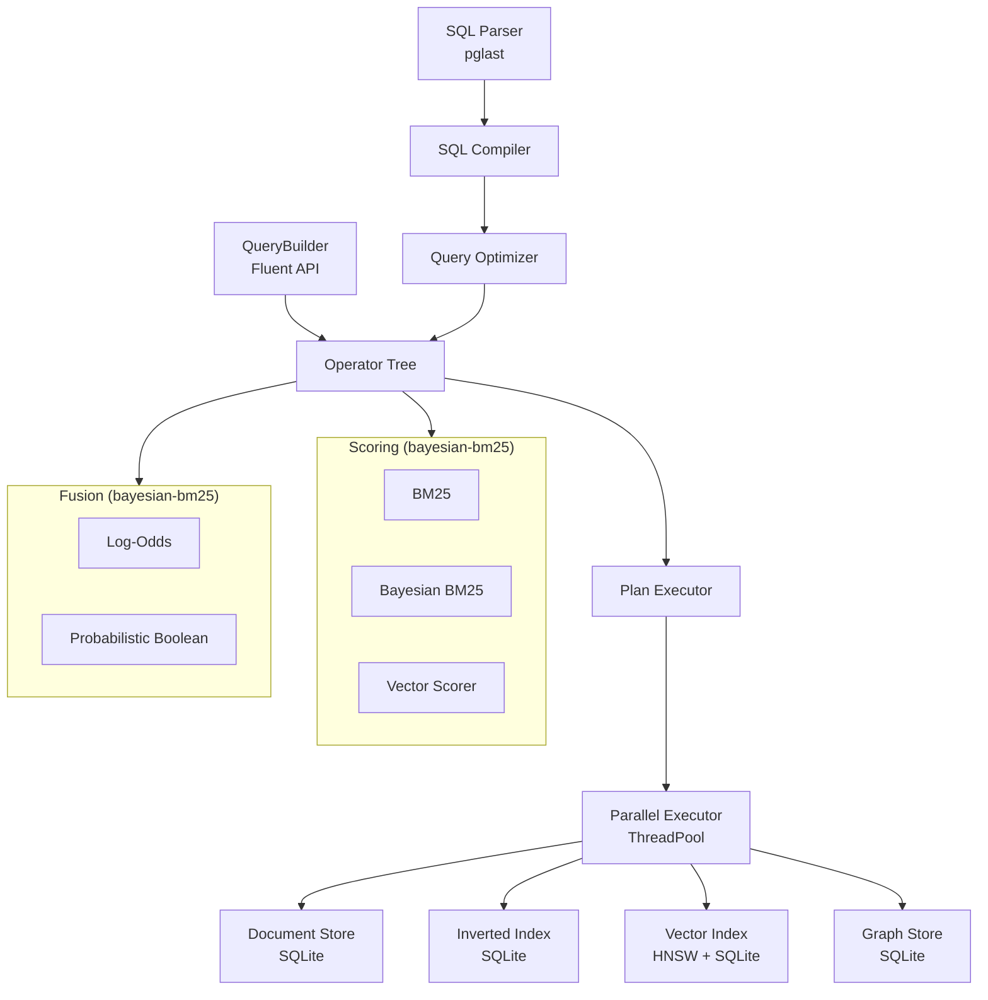

# UQA — Unified Query Algebra

A database prototype that unifies **relational**, **text retrieval**, **vector search**, and **graph query** paradigms under a single algebraic structure, using posting lists as the universal abstraction.

## Overview

UQA extends standard SQL with cross-paradigm query functions:

```sql
-- Full-text search with BM25 scoring
SELECT title, _score FROM papers
WHERE text_match(title, 'attention transformer') ORDER BY _score DESC;

-- Multi-signal fusion: text + vector + graph
SELECT title, _score FROM papers
WHERE fuse_log_odds(
    text_match(title, 'attention'),
    knn_match(5),
    traverse_match(1, 'cited_by', 2)
) AND year >= 2020
ORDER BY _score DESC;

-- Graph traversal
SELECT _doc_id, title FROM traverse(1, 'cited_by', 2);

-- Regular path query
SELECT _doc_id, title FROM rpq('cited_by/cited_by', 1);

-- Hierarchical data: nested array aggregation
SELECT path_agg('items.price', 'sum') AS total FROM _default
WHERE path_filter('shipping.city', 'Seoul');

-- Prepared statements
PREPARE find_by_year AS SELECT title FROM papers WHERE year = $1;
EXECUTE find_by_year(2024);

-- Window functions
SELECT title, year, ROW_NUMBER() OVER (PARTITION BY field ORDER BY year) AS rn
FROM papers;
```

## Architecture



### Package Structure

```
uqa/
  core/           PostingList, types, hierarchical documents
  storage/        SQLite-backed stores: documents, inverted index, vectors, graph
  operators/      Operator algebra (boolean, primitive, hybrid, aggregation, hierarchical)
  scoring/        BM25, Bayesian BM25, VectorScorer, WAND/BlockMaxWAND (via bayesian-bm25)
  fusion/         Log-odds conjunction, probabilistic boolean (via bayesian-bm25)
  graph/          GraphStore, traversal, pattern matching, RPQ, cross-paradigm, indexes
  joins/          Hash, sort-merge, index, graph, cross-paradigm, similarity joins
  execution/      Volcano iterator engine: Apache Arrow columnar batches, physical operators, disk spilling
  planner/        Cost model, cardinality estimator, optimizer, parallel executor
  sql/            SQL compiler (pglast), expression evaluator, table DDL/DML
  api/            Fluent QueryBuilder
  tests/          999 tests across 31 test files
```

## Key Features

### SQL Interface

| Category | Syntax |
|----------|--------|
| DDL | `CREATE TABLE`, `DROP TABLE [IF EXISTS]`, `CREATE INDEX`, `DROP INDEX` |
| DML | `INSERT INTO ... VALUES`, `UPDATE ... SET ... WHERE`, `DELETE FROM ... WHERE` |
| DQL | `SELECT [DISTINCT] ... FROM ... WHERE ... GROUP BY ... HAVING ... ORDER BY ... LIMIT ... OFFSET` |
| Joins | `INNER JOIN`, `LEFT JOIN` with `ON` condition |
| Subqueries | `IN (SELECT ...)`, `EXISTS (SELECT ...)`, scalar subqueries, correlated subqueries |
| CTEs | `WITH name AS (SELECT ...) SELECT ...` |
| Views | `CREATE VIEW`, `DROP VIEW` |
| Window | `ROW_NUMBER`, `RANK`, `DENSE_RANK`, `NTILE`, `LAG`, `LEAD`, aggregates `OVER (PARTITION BY ... ORDER BY ...)` |
| Prepared | `PREPARE name AS ...`, `EXECUTE name(params)`, `DEALLOCATE name` |
| Utility | `EXPLAIN SELECT ...`, `ANALYZE [table]` |
| Transactions | `BEGIN`, `COMMIT`, `ROLLBACK`, `SAVEPOINT` |

### Extended WHERE Functions

| Function | Description |
|----------|-------------|
| `text_match(field, 'query')` | Full-text search with BM25 scoring |
| `bayesian_match(field, 'query')` | Bayesian BM25 — calibrated P(relevant) in [0,1] |
| `knn_match(k)` | K-nearest neighbor vector search |
| `traverse_match(start, 'label', hops)` | Graph reachability as a scored signal |
| `path_filter(path, value)` | Hierarchical equality filter (any-match on arrays) |
| `path_filter(path, op, value)` | Hierarchical comparison filter (`>`, `<`, `>=`, `<=`, `!=`) |

### Fusion Meta-Functions

| Function | Description |
|----------|-------------|
| `fuse_log_odds(sig1, sig2, ...[, alpha])` | Log-odds conjunction (resolves conjunction shrinkage) |
| `fuse_prob_and(sig1, sig2, ...)` | Probabilistic AND: P = prod(P_i) |
| `fuse_prob_or(sig1, sig2, ...)` | Probabilistic OR: P = 1 - prod(1 - P_i) |
| `fuse_prob_not(signal)` | Probabilistic NOT: P = 1 - P_signal |

### SELECT Scalar Functions

| Function | Description |
|----------|-------------|
| `path_agg(path, func)` | Per-row nested array aggregation (`sum`, `count`, `avg`, `min`, `max`) |
| `path_value(path)` | Access nested field value by dot-path |

### FROM-Clause Table Functions

| Function | Description |
|----------|-------------|
| `traverse(start, 'label', hops)` | BFS graph traversal |
| `rpq('path_expr', start)` | Regular path query (NFA simulation) |
| `text_search('query', 'field', 'table')` | Table-scoped full-text search |

### Persistence

All data is persisted to SQLite when an engine is created with `db_path`:

| Store | SQLite Table | Description |
|-------|-------------|-------------|
| Documents | `_data_{table}` | Typed columns per table |
| Inverted Index | `_inverted_{table}_{field}` | Per-field posting lists |
| Vectors | `_vectors` | HNSW vectors (float32 blobs) |
| Graph | `_graph_vertices`, `_graph_edges` | Adjacency-indexed graph |
| B-tree Indexes | SQLite indexes on `_data_{table}` | `CREATE INDEX` support |
| Statistics | `_column_stats` | Histograms, MCVs for optimizer |

### Query Optimizer

- Cost-based optimization with equi-depth histograms and Most Common Values (MCV)
- Filter pushdown into intersections
- Vector threshold merge (same query vector)
- Intersect operand reordering by cardinality (cheapest first)
- Fusion signal reordering by cost (cheapest first)
- B-tree index scan substitution (replace full scans when profitable)
- Cross-paradigm cardinality estimation for text, vector, graph, and fusion operators

### Disk Spilling

Blocking operators (sort, hash-aggregate, distinct) spill intermediate data to temporary Arrow IPC files when the input exceeds `spill_threshold` rows, bounding memory usage for large queries:

| Operator | Strategy |
|----------|----------|
| `SortOp` | External merge sort — sorted runs spilled to disk, merged via k-way min-heap |
| `HashAggOp` | Grace hash — rows partitioned into 16 on-disk files, each aggregated independently |
| `DistinctOp` | Hash partition dedup — same partitioning, per-partition deduplication |

```python
engine = Engine(db_path="my.db", spill_threshold=100000)  # spill after 100K rows
engine = Engine(spill_threshold=0)                        # disable (default)
```

### Parallel Execution

Independent operator branches (Union, Intersect, Fusion signals) execute concurrently via `ThreadPoolExecutor`. Configure with `parallel_workers` parameter:

```python
engine = Engine(db_path="my.db", parallel_workers=4)  # default: 4
engine = Engine(parallel_workers=0)                   # disable parallelism
```

## Requirements

- Python 3.12+
- numpy >= 1.26
- pyarrow >= 20.0
- bayesian-bm25 >= 0.8.0
- hnswlib >= 0.8
- pglast >= 7.0
- prompt-toolkit >= 3.0
- pygments >= 2.17

## Installation

```bash
pip install uqa

# From source
pip install -e .

# With development dependencies
pip install -e ".[dev]"
```

## Usage

### Interactive SQL Shell

```bash
python usql.py                 # In-memory
python usql.py --db mydata.db  # Persistent database
```

Shell commands:

| Command | Description |
|---------|-------------|
| `\dt` | List tables |
| `\d <table>` | Describe table schema |
| `\ds <table>` | Show column statistics (requires `ANALYZE` first) |
| `\di` | List indexes |
| `\timing` | Toggle query timing display |
| `\reset` | Reset the engine |
| `\q` | Quit |

### Python API

```python
from uqa.engine import Engine

# In-memory engine
engine = Engine(vector_dimensions=64, max_elements=10000)

# Persistent engine (SQLite-backed)
engine = Engine(db_path="research.db", vector_dimensions=64)

engine.sql("""
    CREATE TABLE papers (
        id SERIAL PRIMARY KEY,
        title TEXT NOT NULL,
        year INTEGER NOT NULL,
        citations INTEGER DEFAULT 0
    )
""")

engine.sql("""INSERT INTO papers (title, year, citations) VALUES
    ('attention is all you need', 2017, 90000),
    ('bert pre-training', 2019, 75000)
""")

engine.sql("ANALYZE papers")

result = engine.sql("""
    SELECT title, _score FROM papers
    WHERE text_match(title, 'attention') ORDER BY _score DESC
""")
print(result)

engine.close()  # or use: with Engine(db_path="...") as engine:
```

### Fluent QueryBuilder API

```python
from uqa.core.types import Equals, GreaterThanOrEqual

# Text search with scoring
result = (
    engine.query()
    .term("attention", field="title")
    .score_bayesian_bm25("attention")
    .execute()
)

# Nested data: filter + aggregate
result = (
    engine.query()
    .filter("shipping.city", Equals("Seoul"))
    .path_aggregate("items.price", "sum")
    .execute()
)

# Graph traversal + aggregation
team = engine.query().traverse(2, "manages", max_hops=2)
total = team.vertex_aggregate("salary", "sum")

# Facets over all documents
facets = engine.query().facet("status")
```

## Examples

### Fluent API (`examples/fluent/`)

```bash
python examples/fluent/text_search.py         # BM25, Bayesian BM25, boolean, facets
python examples/fluent/vector_and_hybrid.py   # KNN, hybrid, vector exclusion, fusion
python examples/fluent/graph.py               # Traversal, RPQ, pattern matching, indexes
python examples/fluent/hierarchical.py        # Nested data, path filters, aggregation
```

### SQL (`examples/sql/`)

```bash
python examples/sql/basics.py       # DDL, DML, SELECT, CTE, window, transactions, views
python examples/sql/functions.py    # text_match, knn_match, path_agg, path_value, path_filter
python examples/sql/graph.py        # FROM traverse/rpq, aggregates, GROUP BY, WHERE
python examples/sql/fusion.py       # fuse_log_odds, fuse_prob_and/or/not, EXPLAIN
```

### Interactive Shell

```bash
python usql.py                 # In-memory
python usql.py --db mydata.db  # Persistent
```

## Tests

```bash
# Run all 999 tests
python -m pytest uqa/tests/ -v

# Run a specific test file
python -m pytest uqa/tests/test_sql.py -v
```

## License

AGPL-3.0 — see [LICENSE](LICENSE).

## References

1. [A Unified Mathematical Framework for Query Algebras Across Heterogeneous Data Paradigms](docs/papers/1.%20A%20Unified%20Mathematical%20Framework%20for%20Query%20Algebras%20Across%20Heterogeneous%20Data%20Paradigms.pdf)
2. [Extending the Unified Mathematical Framework to Support Graph Data Structures](docs/papers/2.%20Extending%20the%20Unified%20Mathematical%20Framework%20to%20Support%20Graph%20Data%20Structures.pdf)
3. [Bayesian BM25 - A Probabilistic Framework for Hybrid Text and Vector Search](docs/papers/3.%20Bayesian%20BM25%20-%20A%20Probabilistic%20Framework%20for%20Hybrid%20Text%20and%20Vector%20Search.pdf)
4. [From Bayesian Inference to Neural Computation](docs/papers/4.%20From%20Bayesian%20Inference%20to%20Neural%20Computation.pdf)
