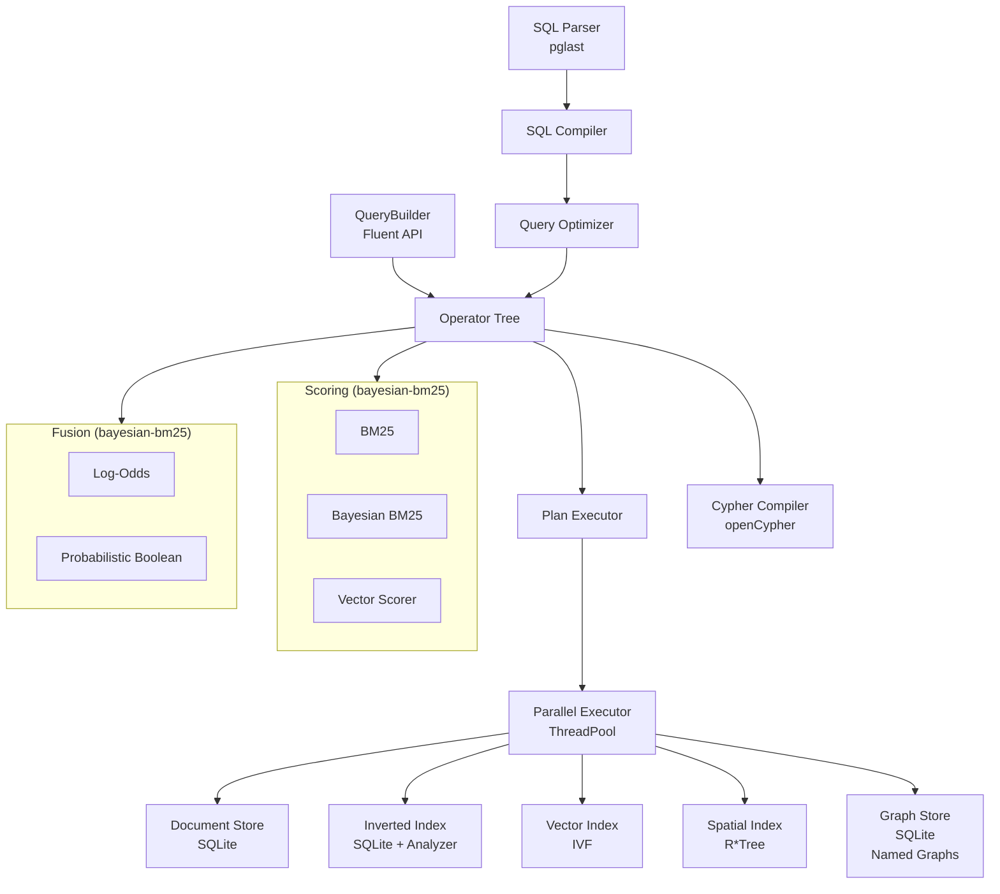

# UQA — Unified Query Algebra

A multi-paradigm database engine that unifies **relational**, **text retrieval**, **vector search**, **graph query**, and **geospatial** paradigms under a single algebraic structure, using posting lists as the universal abstraction. SQL interface targets **PostgreSQL 17** compatibility.

> **Background:** The unified query algebra theory behind this project is already deployed in production as [Cognica Database](https://cognica.io), a commercial multi-paradigm database engine built in C++20/23. UQA is the standalone Python implementation of that theory, open-sourced under AGPL-3.0. It is under active development and serves both as a production-ready embeddable database and as a reference implementation for the underlying algebraic framework.

## Background

Modern data systems are fragmented into specialized engines: relational databases built on relational algebra, search engines on probabilistic IR models, vector databases on geometric similarity, and graph databases on traversal semantics. UQA eliminates this fragmentation by proving that a single algebraic structure can express operations across all four paradigms.

### Posting Lists as Universal Abstraction

The core insight is that **posting lists** — sorted sequences of `(document_id, payload)` pairs — can represent result sets from any paradigm. A posting list $L$ is defined as:

$$
L = [(id_1, payload_1),\ (id_2, payload_2),\ \ldots,\ (id_n, payload_n)]
$$

where $id_i < id_j$ for all $i < j$. A bijection $PL: 2^{\mathcal{D}} \rightarrow \mathcal{L}$ maps document sets to posting lists and back, allowing set-theoretic reasoning to carry over directly.

### Boolean Algebra

The structure $(\mathcal{L},\ \cup,\ \cap,\ \overline{\cdot},\ \emptyset,\ \mathcal{D})$ forms a **complete Boolean algebra** — satisfying commutativity, associativity, distributivity, identity, and complement laws. This means any combination of AND, OR, and NOT across paradigms is algebraically well-defined, and query optimization can exploit lattice-theoretic rewrite rules.

### Cross-Paradigm Operators

Primitive operators map each paradigm into the posting list space:

| Operator | Definition | Paradigm |
|----------|-----------|----------|
| $T(t)$ | $PL(\lbrace d \in \mathcal{D} \mid t \in term(d, f) \rbrace)$ | Text retrieval |
| $V_\theta(q)$ | $PL(\lbrace d \in \mathcal{D} \mid sim(vec(d, f),\ q) \geq \theta \rbrace)$ | Vector search |
| $KNN_k(q)$ | $PL(D_k)$ where $\|D_k\| = k$, ranked by similarity | Vector search |
| $Filter_{f,v}(L)$ | $L \cap PL(\lbrace d \in \mathcal{D} \mid d.f = v \rbrace)$ | Relational |
| $Score_q(L)$ | $(L,\ [s_1, \ldots, s_{\|L\|}])$ | Scoring |

Because every operator produces a posting list, they compose freely. A hybrid text + vector search is simply an intersection:

$$
Hybrid_{t,q,\theta} = T(t) \cap V_\theta(q)
$$

### Graph Extension

The second paper extends the framework to graph data by establishing a **Graph-Posting List Isomorphism**. A graph posting list $L_G = [(id_1, G_1), \ldots, (id_n, G_n)]$ maps to standard posting lists via:

$$
\Phi(L_G) = PL\left(\bigcup_{i=1}^{n} \phi_{G \rightarrow D}(G_i)\right)
$$

This isomorphism preserves Boolean operations — $\Phi(L_G^1 \cup_G L_G^2) = \Phi(L_G^1) \cup \Phi(L_G^2)$ — so graph traversals, pattern matches, and path queries integrate seamlessly with text, vector, and relational operations under the same algebra.

### Vector Calibration

The fifth paper addresses a fundamental gap in hybrid search: vector similarity scores (cosine similarity, inner product, Euclidean distance) are geometric quantities, not probabilities. A cosine similarity of 0.85 does not mean an 85% chance of relevance, yet hybrid systems routinely combine such scores with calibrated lexical signals through ad-hoc normalization. The paper presents a Bayesian calibration framework that transforms vector scores into calibrated relevance probabilities through a likelihood ratio formulation:

$$
\text{logit}\ P(R=1 \mid d) = \log \frac{f_R(d)}{f_G(d)} + \text{logit}\ P(R=1)
$$

where $f_R(d)$ is the local distance density among relevant documents and $f_G(d)$ is the global background density. This has the same additive structure as Bayesian BM25 calibration, establishing a structural identity between lexical and dense retrieval scoring. Both densities are extracted from statistics already computed during ANN index construction and search — IVF cell populations and intra-cluster distances, HNSW edge distances and search trajectories — at negligible additional cost. The resulting calibrated vector scores integrate with Bayesian BM25 through additive log-odds:

$$
\text{logit}\ P(R \mid d_{vec}, s_{bm25}) = \underbrace{\log \frac{\hat{f}_R(d)}{f_G(d)}}_{\text{calibrated vector}} + \underbrace{\alpha(s_{bm25} - \beta)}_{\text{calibrated lexical}} + \underbrace{\text{logit}\ P_{base}}_{\text{corpus prior}}
$$

This completes the probabilistic unification of sparse and dense retrieval: both paradigms are calibrated through the same Bayesian likelihood ratio structure, each drawing on the statistics of its native index. For full treatment, see [Paper 5](docs/papers/5.%20Vector%20Scores%20as%20Likelihood%20Ratios%20-%20Index-Derived%20Bayesian%20Calibration%20for%20Hybrid%20Search.pdf).

### Compositional Completeness

The framework guarantees that **any query expressible as a combination of relational, text, vector, and graph operations** has a representation in the unified algebra (Theorem 3.3.5). This is not merely an interface unification — the algebraic closure ensures that cross-paradigm queries (e.g., "find papers cited by graph neighbors whose embeddings are similar to a query vector and whose titles match a keyword") are first-class operations with well-defined optimization rules.

For full formal treatment, see [Paper 1](docs/papers/1.%20A%20Unified%20Mathematical%20Framework%20for%20Query%20Algebras%20Across%20Heterogeneous%20Data%20Paradigms.pdf), [Paper 2](docs/papers/2.%20Extending%20the%20Unified%20Mathematical%20Framework%20to%20Support%20Graph%20Data%20Structures.pdf), [Paper 3](docs/papers/3.%20Bayesian%20BM25%20-%20A%20Probabilistic%20Framework%20for%20Hybrid%20Text%20and%20Vector%20Search.pdf), and [Paper 5](docs/papers/5.%20Vector%20Scores%20as%20Likelihood%20Ratios%20-%20Index-Derived%20Bayesian%20Calibration%20for%20Hybrid%20Search.pdf).

## Overview

UQA extends standard SQL with cross-paradigm query functions:

```sql
-- GIN index: enable full-text search on specific columns (PostgreSQL-compatible)
CREATE INDEX idx_articles_gin ON articles USING gin (title, body);
CREATE INDEX idx_papers_gin ON papers USING gin (title, abstract)
    WITH (analyzer='english_stem');

-- Full-text search with @@ operator (query string mini-language)
SELECT title, _score FROM articles
WHERE title @@ 'database AND query' ORDER BY _score DESC;

-- Hybrid text + vector fusion via @@
SELECT title, _score FROM articles
WHERE _all @@ 'body:search AND embedding:[0.1, 0.9, 0.0, 0.0]'
ORDER BY _score DESC;

-- Full-text search with BM25 scoring
SELECT title, _score FROM papers
WHERE text_match(title, 'attention transformer') ORDER BY _score DESC;

-- Multi-signal fusion: text + vector + graph
SELECT title, _score FROM papers
WHERE fuse_log_odds(
    text_match(title, 'attention'),
    knn_match(embedding, ARRAY[0.1, 0.2, ...], 5),
    traverse_match(1, 'cited_by', 2)
) AND year >= 2020
ORDER BY _score DESC;

-- Multi-stage retrieval: broad recall -> precise re-ranking
SELECT title, _score FROM papers
WHERE staged_retrieval(
    bayesian_match(title, 'transformer attention'), 50,
    bayesian_match(abstract, 'self attention mechanism'), 10
) ORDER BY _score DESC;

-- Multi-field search across title + abstract
SELECT title, _score FROM papers
WHERE multi_field_match(title, abstract, 'attention transformer')
ORDER BY _score DESC;

-- Deep fusion: multi-layer neural network as SQL
SELECT id, _score FROM patches
WHERE deep_fusion(
    layer(knn_match(embedding, $1, 16)),
    convolve('spatial', ARRAY[0.6, 0.4]),
    pool('spatial', 'max', 2),
    flatten(),
    dense(ARRAY[...], ARRAY[...], output_channels => 4, input_channels => 8),
    softmax(),
    gating => 'relu'
) ORDER BY _score DESC;

-- Deep learning: train a CNN classifier (no backpropagation)
SELECT deep_learn(
    'mnist_cnn', label, embedding, 'spatial',
    convolve(n_channels => 32),
    pool('max', 2),
    attention(n_heads => 4, mode => 'learned_v'),
    convolve(n_channels => 64),
    pool('max', 2),
    flatten(),
    dense(output_channels => 10),
    softmax(),
    gating => 'relu', lambda => 1.0,
    l1_ratio => 0.3, prune_ratio => 0.5
) FROM mnist_train;

-- Deep learning: inference with trained model
SELECT id, deep_predict('mnist_cnn', embedding) AS pred FROM test_data;

-- Deep learning: inference via deep_fusion pipeline
SELECT id, _score, class_probs FROM grid_28x28
WHERE deep_fusion(
    model('mnist_cnn', $1),
    gating => 'relu'
) ORDER BY _score DESC;

-- Temporal graph traversal (edges valid at timestamp)
SELECT * FROM temporal_traverse(1, 'knows', 2, 1700000000);

-- JOINs with qualified columns
SELECT e.name, d.name AS dept, e.salary
FROM employees e
INNER JOIN departments d ON e.dept_id = d.id
ORDER BY e.salary DESC;

-- Window functions with frames
SELECT rep, sale_date, amount,
       SUM(amount) OVER (ORDER BY sale_date
           ROWS BETWEEN UNBOUNDED PRECEDING AND CURRENT ROW) AS running_total
FROM sales;

-- Recursive CTE
WITH RECURSIVE org_tree AS (
    SELECT id, name, 1 AS depth FROM org_chart WHERE manager_id IS NULL
    UNION ALL
    SELECT o.id, o.name, t.depth + 1
    FROM org_chart o INNER JOIN org_tree t ON o.manager_id = t.id
)
SELECT name, depth FROM org_tree ORDER BY depth;

-- Advanced aggregates with FILTER and CASE pivot
SELECT region,
       SUM(amount) FILTER (WHERE returned = FALSE) AS net_revenue,
       COUNT(*) FILTER (WHERE returned = TRUE) AS return_count
FROM sales GROUP BY region;

-- Date/time functions
SELECT DATE_TRUNC('month', sale_date) AS month,
       COUNT(*) AS num_sales, SUM(amount) AS revenue
FROM sales GROUP BY DATE_TRUNC('month', sale_date);

-- Graph traversal and regular path queries
SELECT _doc_id, title FROM traverse(1, 'cited_by', 2);
SELECT _doc_id, title FROM rpq('cited_by/cited_by', 1);

-- Apache AGE compatible graph query (openCypher)
SELECT * FROM create_graph('social');

SELECT * FROM cypher('social', $$
    CREATE (a:Person {name: 'Alice', age: 30})-[:KNOWS]->(b:Person {name: 'Bob', age: 25})
    RETURN a.name, b.name
$$) AS (a_name agtype, b_name agtype);

SELECT * FROM cypher('social', $$
    MATCH (p:Person)-[:KNOWS]->(friend:Person)
    WHERE p.age > 25
    RETURN p.name, friend.name, p.age
    ORDER BY p.name
$$) AS (name agtype, friend agtype, age agtype);

-- Geospatial: R*Tree spatial index with Haversine distance
CREATE TABLE restaurants (
    id SERIAL PRIMARY KEY,
    name TEXT NOT NULL,
    cuisine TEXT NOT NULL,
    location POINT
);

CREATE INDEX idx_loc ON restaurants USING rtree (location);

SELECT name, ROUND(ST_Distance(location, POINT(-73.9857, 40.7484)), 0) AS dist_m
FROM restaurants
WHERE spatial_within(location, POINT(-73.9857, 40.7484), 5000)
ORDER BY dist_m;

-- Spatial + text + vector fusion
SELECT name, _score FROM restaurants
WHERE fuse_log_odds(
    text_match(description, 'pizza'),
    spatial_within(location, POINT(-73.9969, 40.7306), 3000),
    knn_match(embedding, $1, 5)
) ORDER BY _score DESC;

-- Text analysis: custom analyzer with stemming
SELECT * FROM create_analyzer('english_stem', '{
    "tokenizer": {"type": "standard"},
    "token_filters": [{"type": "lowercase"}, {"type": "stop", "language": "english"},
                      {"type": "porter_stem"}],
    "char_filters": []}');

SELECT * FROM list_analyzers();

-- Foreign Data Wrapper with Hive partitioning
CREATE SERVER warehouse FOREIGN DATA WRAPPER duckdb_fdw;

CREATE FOREIGN TABLE sales (
    id INTEGER, name TEXT, amount INTEGER,
    year INTEGER, month INTEGER
) SERVER warehouse OPTIONS (
    source '/data/sales/**/*.parquet',
    hive_partitioning 'true'
);

-- Predicate pushdown: DuckDB prunes partitions at source
SELECT name, SUM(amount) FROM sales
WHERE year IN (2024, 2025) AND month > 6
GROUP BY name ORDER BY SUM(amount) DESC;

-- Full query pushdown: entire query delegated to DuckDB
-- (JOINs, window functions, subqueries all execute in DuckDB)
SELECT pickup_zone, COUNT(*) AS trips,
       AVG(total_amount) AS avg_total
FROM taxi_trips t
JOIN taxi_zones z ON t.pu_location_id = z.location_id
GROUP BY pickup_zone ORDER BY trips DESC LIMIT 10;
```

## Architecture



### Package Structure

```
uqa/
  core/           PostingList, types, hierarchical documents, functors
  analysis/       Text analysis pipeline: CharFilter, Tokenizer, TokenFilter, Analyzer, dual index/search analyzers
  storage/        Backend-agnostic ABCs with SQLite-backed stores: documents, inverted index, vectors (IVF), spatial (R*Tree), graph
  operators/      Operator algebra (boolean, primitive, hybrid, aggregation (count/sum/avg/min/max/quantile),
                  hierarchical (with cost estimation), sparse, multi-field, attention fusion,
                  learned fusion, multi-stage, deep fusion (ResNet/GNN/CNN/DenseNet),
                  deep learning (training pipeline, PyTorch GPU backend))
  scoring/        BM25, Bayesian BM25, VectorScorer, WAND/BlockMaxWAND, calibration,
                  parameter learning, external prior, multi-field, fusion WAND (via bayesian-bm25),
                  adaptive WAND, bound tightness
  fusion/         Log-odds conjunction (fuse + fuse_mean), probabilistic boolean, attention fusion,
                  learned fusion, query features (via bayesian-bm25), adaptive fusion
  graph/          GraphStore, traversal, pattern matching, RPQ, bounded RPQ, weighted paths,
                  centrality (PageRank, HITS, betweenness), cross-paradigm, indexes,
                  subgraph index, incremental matching, temporal filter/traverse/pattern,
                  delta/versioned store, message passing, embeddings, named graphs,
                  property indexes, join operators, RPQ optimizer, pattern negation,
                  configurable graph scores (DEFAULT_GRAPH_SCORE)
    cypher/       openCypher lexer, parser, AST, posting-list-based compiler
  fdw/            Foreign Data Wrappers: DuckDB (Parquet/CSV/JSON), Arrow Flight SQL, Hive partitioning, full query pushdown
  joins/          Hash, sort-merge, index, graph, cross-paradigm, similarity joins,
                  semi-join, anti-join
  execution/      Volcano iterator engine: Apache Arrow columnar batches, vectorized operators, disk spilling
  planner/        Cost model, cardinality estimator, optimizer, DPccp join enumerator, parallel executor,
                  information-theoretic bounds, graph cost model
  sql/            SQL compiler (pglast), expression evaluator, FTS query parser, table DDL/DML
  api/            Fluent QueryBuilder
  tests/          2788 tests across 83 test files
benchmarks/       309 pytest-benchmark tests across 15 files (posting list, storage, compiler,
                  execution, planner, scoring, graph, graph centrality, end-to-end SQL,
                  calibration, multi-field, external prior, advanced scoring, advanced graph,
                  named graphs)
```

## Key Features

### SQL Interface

| Category | Syntax |
|----------|--------|
| DDL | `CREATE TABLE [IF NOT EXISTS]`, `CREATE TEMPORARY TABLE`, `DROP TABLE [IF EXISTS]`, `CREATE TABLE AS SELECT`, `ALTER TABLE` (ADD/DROP/RENAME COLUMN, SET/DROP DEFAULT, SET/DROP NOT NULL, ALTER TYPE USING), `TRUNCATE TABLE`, `CREATE INDEX`, `DROP INDEX`, `CREATE SEQUENCE`/`NEXTVAL`/`CURRVAL`/`SETVAL`, `ALTER SEQUENCE`, `TABLE name` |
| FDW | `CREATE SERVER ... FOREIGN DATA WRAPPER`, `CREATE FOREIGN TABLE ... SERVER ... OPTIONS (...)`, `DROP SERVER`, `DROP FOREIGN TABLE`, Hive partitioning (`hive_partitioning` option), predicate pushdown (`=`, `!=`, `<`, `>`, `IN`, `LIKE`, `ILIKE`, `BETWEEN`), full query pushdown (JOINs, aggregates, window functions, subqueries), mixed foreign-local query optimization (local table shipping), DuckDB FDW (Parquet/CSV/JSON), Arrow Flight SQL FDW |
| Constraints | `PRIMARY KEY`, `NOT NULL`, `DEFAULT`, `UNIQUE`, `CHECK`, `FOREIGN KEY` (with insert/update/delete validation) |
| DML | `INSERT INTO ... VALUES`, `INSERT INTO ... SELECT`, `INSERT ... ON CONFLICT DO NOTHING/UPDATE`, `INSERT ... RETURNING`, `UPDATE ... SET ... WHERE [RETURNING]`, `UPDATE ... FROM` (join), `DELETE FROM ... WHERE [RETURNING]`, `DELETE ... USING` (join) |
| DQL | `SELECT [DISTINCT] ... FROM ... WHERE ... GROUP BY ... HAVING ... ORDER BY [NULLS FIRST/LAST] ... LIMIT ... OFFSET`, `FETCH FIRST n ROWS ONLY`, standalone `VALUES` |
| Joins | `INNER JOIN`, `LEFT JOIN`, `RIGHT JOIN`, `FULL OUTER JOIN`, `CROSS JOIN` with equality and non-equality `ON` conditions, `LATERAL` subquery |
| Set Ops | `UNION [ALL]`, `INTERSECT [ALL]`, `EXCEPT [ALL]` with chaining |
| Subqueries | `IN (SELECT ...)`, `EXISTS (SELECT ...)`, scalar subqueries, correlated subqueries, derived tables (`FROM (SELECT ...) AS alias`), `LATERAL` |
| CTEs | `WITH name AS (SELECT ...)`, `WITH RECURSIVE` |
| Views | `CREATE VIEW`, `DROP VIEW` |
| Window | `ROW_NUMBER`, `RANK`, `DENSE_RANK`, `NTILE`, `LAG`, `LEAD`, `NTH_VALUE`, `PERCENT_RANK`, `CUME_DIST`, aggregates `OVER (PARTITION BY ... ORDER BY ... ROWS/RANGE BETWEEN ...)`, `WINDOW w AS (...)`, `FILTER (WHERE ...)` on window aggregates |
| Aggregates | `COUNT [DISTINCT]`, `SUM`, `AVG`, `MIN`, `MAX`, `STRING_AGG`, `ARRAY_AGG`, `BOOL_AND`/`EVERY`, `BOOL_OR`, `STDDEV`/`VARIANCE`, `PERCENTILE_CONT/DISC`, `MODE`, `JSON_OBJECT_AGG`, `CORR`, `COVAR_POP/SAMP`, `REGR_*` (10 functions), `deep_learn(...)`, `FILTER (WHERE ...)`, `ORDER BY` within aggregate |
| Types | `INTEGER`, `BIGINT`, `SERIAL`, `TEXT`, `VARCHAR`, `REAL`, `FLOAT`, `DOUBLE PRECISION`, `NUMERIC(p,s)`, `BOOLEAN`, `DATE`, `TIME`, `TIMESTAMP`, `TIMESTAMPTZ`, `INTERVAL`, `JSON`/`JSONB`, `UUID`, `BYTEA`, `INTEGER[]` (arrays), `VECTOR(N)`, `POINT` |
| Date/Time | `EXTRACT`, `DATE_TRUNC`, `DATE_PART`, `NOW()`, `CURRENT_DATE`, `CURRENT_TIMESTAMP`, `CURRENT_TIME`, `CLOCK_TIMESTAMP`, `TIMEOFDAY`, `AGE`, `TO_CHAR`, `TO_DATE`, `TO_TIMESTAMP`, `MAKE_DATE`, `MAKE_TIMESTAMP`, `MAKE_INTERVAL`, `TO_NUMBER`, `OVERLAPS`, `ISFINITE` |
| JSON | `->`, `->>`, `#>`, `#>>` operators, `@>` / `<@` containment, `?` / `?|` / `?&` key existence, `JSONB_SET`, `JSONB_STRIP_NULLS`, `JSON_BUILD_OBJECT`, `JSON_BUILD_ARRAY`, `JSON_OBJECT_KEYS`, `JSON_EXTRACT_PATH`, `JSON_TYPEOF`, `JSON_AGG`, `::jsonb` cast |
| Table Funcs | `GENERATE_SERIES`, `UNNEST`, `REGEXP_SPLIT_TO_TABLE`, `JSON_EACH`/`JSON_EACH_TEXT`, `JSON_ARRAY_ELEMENTS`/`JSON_ARRAY_ELEMENTS_TEXT` |
| FTS | `column @@ 'query'` full-text search operator with query string mini-language: bare terms, `"phrases"`, `field:term`, `field:[vector]`, `AND`/`OR`/`NOT`, implicit AND, parenthesized grouping, hybrid text+vector fusion |
| Functions | 90+ scalar functions: string (`CONCAT_WS`, `POSITION`, `LPAD`, `REVERSE`, `MD5`, `OVERLAY`, `REGEXP_MATCH`, `ENCODE`/`DECODE`, ...), math (`POWER`, `SQRT`, `LN`, `CBRT`, `GCD`, `LCM`, `MIN_SCALE`, `TRIM_SCALE`, trig, ...), conditional (`GREATEST`, `LEAST`, `NULLIF`) |
| Prepared | `PREPARE name AS ...`, `EXECUTE name(params)`, `DEALLOCATE name` |
| Utility | `EXPLAIN SELECT ...`, `ANALYZE [table]` |
| Transactions | `BEGIN`, `COMMIT`, `ROLLBACK`, `SAVEPOINT` |
| System | `information_schema.columns`, `pg_catalog.pg_tables`, `pg_catalog.pg_views`, `pg_catalog.pg_indexes`, `pg_catalog.pg_type` |

### Extended WHERE Functions

| Function | Description |
|----------|-------------|
| `column @@ 'query'` | Full-text search operator with query string mini-language (boolean, phrase, field targeting, hybrid text+vector) |
| `text_match(field, 'query')` | Full-text search with BM25 scoring |
| `bayesian_match(field, 'query')` | Bayesian BM25 — calibrated P(relevant) in [0,1] |
| `knn_match(field, vector, k)` | K-nearest neighbor vector search (vector as `ARRAY[...]` or `$N`) |
| `traverse_match(start, 'label', hops)` | Graph reachability as a scored signal |
| `path_filter(path, value)` | Hierarchical equality filter (any-match on arrays) |
| `path_filter(path, op, value)` | Hierarchical comparison filter (`>`, `<`, `>=`, `<=`, `!=`) |
| `spatial_within(field, POINT(x,y), dist)` | Geospatial range query (R*Tree + Haversine) |
| `sparse_threshold(signal, threshold)` | ReLU thresholding: max(0, score - threshold) |
| `multi_field_match(f1, f2, ..., query)` | Multi-field Bayesian BM25 with log-odds fusion |
| `bayesian_match_with_prior(f, q, pf, mode)` | Bayesian BM25 with external prior (recency/authority) |
| `temporal_traverse(start, lbl, hops, ts)` | Time-aware graph traversal |
| `message_passing(k, agg, property)` | GNN k-layer neighbor aggregation |
| `graph_embedding(dims, k)` | Structural graph embeddings |
| `vector_exclude(f, pos, neg, k, theta)` | Vector exclusion: positive minus negative similarity |
| `pagerank([damping[, iter[, tol]]][, 'graph'])` | PageRank centrality scoring |
| `hits([iter[, tol]][, 'graph'])` | HITS hub/authority scoring |
| `betweenness(['graph'])` | Betweenness centrality (Brandes) |
| `weighted_rpq('expr', start, 'prop'[, 'agg'[, threshold]])` | Weighted RPQ with aggregate predicates |

### Fusion Meta-Functions

| Function | Description |
|----------|-------------|
| `fuse_log_odds(sig1, sig2, ...[, alpha][, 'relu'\|'swish'])` | Log-odds conjunction with optional gating |
| `fuse_prob_and(sig1, sig2, ...)` | Probabilistic AND: P = prod(P_i) |
| `fuse_prob_or(sig1, sig2, ...)` | Probabilistic OR: P = 1 - prod(1 - P_i) |
| `fuse_prob_not(signal)` | Probabilistic NOT: P = 1 - P_signal |
| `fuse_attention(sig1, sig2, ...)` | Attention-weighted log-odds fusion |
| `fuse_learned(sig1, sig2, ...)` | Learned-weight log-odds fusion |
| `staged_retrieval(sig1, k1, sig2, k2, ...)` | Multi-stage cascading retrieval pipeline |
| `progressive_fusion(sig1, sig2, k1, sig3, k2[, alpha][, 'gating'])` | Progressive multi-stage WAND fusion |
| `deep_fusion(layer(...), propagate(...), convolve(...), ...[, gating])` | Multi-layer Bayesian fusion (ResNet + GNN + CNN) |

### Deep Fusion Layer Functions

Used inside `deep_fusion()` to compose neural network pipelines:

| Function | Description |
|----------|-------------|
| `layer(sig1, sig2, ...)` | Signal layer: log-odds conjunction with residual connection (ResNet) |
| `propagate('label', 'agg'[, 'dir'])` | Graph propagation: spread scores through edges (GNN) |
| `convolve('label', ARRAY[w...][, 'dir'])` | Spatial convolution: weighted multi-hop BFS aggregation (CNN) |
| `pool('label', 'method', size[, 'dir'])` | Spatial downsampling via greedy BFS partitioning |
| `dense(ARRAY[W], ARRAY[b], output_channels => N, input_channels => M)` | Fully connected layer |
| `flatten()` | Collapse spatial nodes into a single vector |
| `global_pool('avg'\|'max'\|'avg_max')` | Channel-preserving spatial reduction (alternative to flatten) |
| `softmax()` | Classification head (numerically stable) |
| `batch_norm([epsilon => 1e-5])` | Per-channel normalization across nodes |
| `dropout(p)` | Inference-mode scaling by (1 - p) |
| `attention(n_heads => N, mode => 'content'\|'random_qk'\|'learned_v')` | Self-attention: context-dependent PoE (Theorem 8.3) |
| `model('name', $1)` | Load trained model and create full inference pipeline (embed + conv + pool + dense + softmax) |
| `embed(vector, in_channels => C, grid_h => H, grid_w => W)` | Inject raw embedding vector into channel map |

### Deep Learning Functions

| Function | Description |
|----------|-------------|
| `deep_learn('model', label, embedding, 'edge_label', layers...[, gating][, lambda][, l1_ratio][, prune_ratio])` | SELECT aggregate: train a CNN classifier analytically (ridge regression, no backpropagation). Optional L1 regularization and magnitude pruning. Layers include `convolve(n_channels => N[, init => 'kaiming'\|'orthogonal'\|'gabor'\|'kmeans'])`, `pool()`, `flatten()`, `global_pool()`, `dense()`, `softmax()`, `attention()`. |
| `deep_predict('model', embedding)` | Per-row scalar: inference with trained model, returns class probabilities |
| `build_grid_graph('table', rows, cols, 'label')` | FROM-clause: construct 4-connected grid graph for spatial convolution |

### SELECT Spatial Functions

| Function | Description |
|----------|-------------|
| `ST_Distance(point1, point2)` | Haversine great-circle distance in meters |
| `ST_Within(point1, point2, dist)` | Distance predicate (boolean) |
| `ST_DWithin(point1, point2, dist)` | Alias for ST_Within |
| `POINT(x, y)` | Construct a POINT value (longitude, latitude) |

### SELECT Scalar Functions

| Function | Description |
|----------|-------------|
| `path_agg(path, func)` | Per-row nested array aggregation (`sum`, `count`, `avg`, `min`, `max`) |
| `path_value(path)` | Access nested field value by dot-path |
| `deep_predict('model', embedding)` | Inference with trained model (class probabilities) |

### FROM-Clause Table Functions

| Function | Description |
|----------|-------------|
| `traverse(start, 'label', hops)` | BFS graph traversal |
| `rpq('path_expr', start)` | Regular path query (NFA simulation) |
| `text_search('query', 'field', 'table')` | Table-scoped full-text search |
| `generate_series(start, stop[, step])` | Generate a series of values |
| `unnest(array)` | Expand an array to a set of rows |
| `regexp_split_to_table(str, pattern)` | Split string by regex into rows |
| `json_each(json)` / `json_each_text(json)` | Expand JSON object to key/value rows |
| `json_array_elements(json)` | Expand JSON array to a set of rows |
| `pagerank([damping][, 'table_or_graph'])` | PageRank centrality as table source |
| `hits([iter][, 'table_or_graph'])` | HITS hub/authority as table source |
| `betweenness(['table_or_graph'])` | Betweenness centrality as table source |
| `graph_add_vertex(id, 'label', 'table'[, 'props'])` | Add graph vertex to table's graph store |
| `graph_add_edge(eid, src, tgt, 'label', 'table'[, 'props'])` | Add graph edge to table's graph store |
| `create_graph('name')` | Create a named graph namespace |
| `drop_graph('name')` | Drop a named graph |
| `cypher('graph', $$ query $$) AS (cols)` | Execute openCypher query on a named graph |
| `create_analyzer('name', 'config')` | Create a custom text analyzer (JSON config) |
| `drop_analyzer('name')` | Drop a custom text analyzer |
| `set_table_analyzer('tbl', 'field', 'name'[, 'phase'])` | Assign index/search analyzer to a field |
| `list_analyzers()` | List all registered analyzers |
| `build_grid_graph('table', rows, cols, 'label')` | Construct 4-connected grid graph for spatial convolution |

### Persistence

All data is persisted to SQLite when an engine is created with `db_path`:

| Store | SQLite Table | Description |
|-------|-------------|-------------|
| Documents | `_data_{table}` | Typed columns per table |
| Inverted Index | `_inverted_{table}_{field}` | Per-table per-field posting lists |
| Field Stats | `_field_stats_{table}` | Per-table field-level statistics (BM25) |
| Doc Lengths | `_doc_lengths_{table}` | Per-table per-document token lengths (BM25) |
| Vectors | `_ivf_centroids_{table}_{field}`, `_ivf_lists_{table}_{field}` | IVF index via `CREATE INDEX ... USING hnsw` or `USING ivf`; centroids in memory, posting lists in SQLite |
| Spatial | `_rtree_{table}_{field}` | R*Tree virtual table for POINT columns; created via `CREATE INDEX ... USING rtree` |
| Graph | `_graph_vertices_{table}`, `_graph_edges_{table}` | Per-table adjacency-indexed graph with vertex labels |
| Named Graphs | `_graph_catalog_{table}`, `_graph_membership_{table}` | Per-graph partitioned adjacency with catalog and membership tables |
| GIN Indexes | Catalog entry + `fts_fields` | `CREATE INDEX ... USING gin`; controls which columns are indexed in the inverted index |
| B-tree Indexes | SQLite indexes on `_data_{table}` | `CREATE INDEX` support |
| Analyzers | `_analyzers` | Custom text analyzer configurations |
| Field Analyzers | `_table_field_analyzers` | Per-field index/search analyzer assignments |
| Foreign Servers | `_foreign_servers` | FDW server definitions (type, connection options) |
| Foreign Tables | `_foreign_tables` | FDW table definitions (columns, source, options) |
| Path Indexes | `_path_indexes` | Pre-computed label-sequence RPQ accelerators |
| Statistics | `_column_stats` | Per-table histograms and MCVs for optimizer |
| Models | `_models` | Trained deep learning model configurations (JSON) |

### Query Optimizer

- Algebraic simplification (idempotent intersection/union, absorption law, empty elimination)
- Cost-based optimization with equi-depth histograms and Most Common Values (MCV)
- **DPccp join order optimization** (Moerkotte & Neumann, 2006) — O(3^n) dynamic programming over connected subgraph complement pairs; produces optimal bushy join trees for INNER JOIN chains with 2+ relations; greedy fallback for 16+ relations; bitmask DP table with bytearray connectivity lookup and incremental connected subgraph enumeration
- Filter pushdown into intersections (recursive through nested IntersectOperators)
- Vector threshold merge with floating-point tolerance (same query vector, `np.allclose`)
- Intersect operand reordering by execution cost (cheapest first)
- Fusion signal reordering by cost (cheapest first)
- Early termination in IntersectOperator (skip remaining operands when accumulator is empty)
- Predicate-aware cardinality damping (same-column vs different-column correlation)
- Join-algorithm-aware DPccp cost model (index join vs hash join threshold)
- R*Tree spatial index scan for POINT column range queries
- GIN index for explicit full-text search column management (`CREATE INDEX ... USING gin`)
- B-tree index scan substitution (replace full scans when profitable)
- FDW predicate pushdown (comparison, IN, LIKE, ILIKE, BETWEEN pushed to DuckDB/Arrow Flight SQL for Hive partition pruning)
- FDW full query pushdown (same-server queries delegated entirely to DuckDB/Arrow Flight SQL via AST deparsing)
- FDW mixed foreign-local optimization (small local tables shipped to DuckDB for in-process JOIN execution)
- Cross-paradigm cardinality estimation for text, vector, graph, fusion, temporal, and GNN operators
- Edge property filter pushdown into graph pattern constraints
- Join-pattern fusion (merge intersected pattern matches with shared variables)
- Cross-paradigm join cost models (text similarity, vector similarity, graph, hybrid joins)
- Threshold-aware vector selectivity estimation (4-tier threshold buckets)
- Temporal graph cardinality correction with timestamp/range selectivity
- Path index acceleration for simple Concat-of-Labels RPQ expressions and Cypher MATCH patterns
- CTE inlining for single-reference non-recursive CTEs
- Predicate pushdown into views and derived tables
- Implicit cross join reordering via DPccp when equijoin predicates exist in WHERE
- Filter pushdown into graph traverse operators (vertex predicate BFS pruning)
- Graph-aware fusion signal reordering with per-graph cost model
- Named graph scoped statistics (degree distribution, label degree, vertex label counts)
- Information-theoretic cardinality lower bounds (entropy-based, histogram-aware)
- Hierarchical operator cost estimation (PathFilter, PathProject, PathUnnest, PathAggregate)
- Negation-aware pattern match cost estimation

### Disk Spilling

Blocking operators (sort, hash-aggregate, distinct) spill intermediate data to temporary Arrow IPC files when the input exceeds `spill_threshold` rows, bounding memory usage for large queries:

| Operator | Strategy |
|----------|----------|
| `SortOp` | External merge sort — sorted runs spilled to disk, merged via k-way min-heap |
| `HashAggOp` | Grace hash — rows partitioned into 16 on-disk files, each aggregated independently |
| `DistinctOp` | Hash partition dedup — same partitioning, per-partition deduplication |

```python
engine = Engine(db_path="my.db", spill_threshold=100000)  # spill after 100K rows
engine = Engine(spill_threshold=0)                        # disable (default)
```

### Parallel Execution

Independent operator branches (Union, Intersect, Fusion signals) execute concurrently via `ThreadPoolExecutor`. Configure with `parallel_workers` parameter:

```python
engine = Engine(db_path="my.db", parallel_workers=4)  # default: 4
engine = Engine(parallel_workers=0)                   # disable parallelism
```

## Requirements

- Python 3.12+
- numpy >= 1.26
- pyarrow >= 10.0
- bayesian-bm25 >= 0.8.1
- duckdb >= 1.0
- pglast >= 7.0
- prompt-toolkit >= 3.0
- pygments >= 2.17

## Installation

```bash
pip install uqa

# From source
pip install -e .

# With development dependencies
pip install -e ".[dev]"
```

## Usage

### Interactive SQL Shell

```bash
usql                 # In-memory
usql --db mydata.db  # Persistent database
```

Shell commands:

| Command | Description |
|---------|-------------|
| `\dt` | List tables (regular and foreign) |
| `\d <table>` | Describe table schema (regular or foreign) |
| `\di` | List GIN-indexed fields per table |
| `\dF` | List foreign tables (server, source, options) |
| `\dS` | List foreign servers (type, connection options) |
| `\dg` | List named graphs (vertex/edge counts) |
| `\ds <table>` | Show column statistics (requires `ANALYZE` first) |
| `\x` | Toggle expanded (vertical) display |
| `\o [file]` | Redirect output to file (no arg restores stdout) |
| `\timing` | Toggle query timing display |
| `\reset` | Reset the engine |
| `\?` | Show help |
| `\q` | Quit |

### Python API

```python
from uqa.engine import Engine

# In-memory engine
engine = Engine()

# Persistent engine (SQLite-backed)
engine = Engine(db_path="research.db")

engine.sql("""
    CREATE TABLE papers (
        id SERIAL PRIMARY KEY,
        title TEXT NOT NULL,
        year INTEGER NOT NULL,
        citations INTEGER DEFAULT 0
    )
""")

engine.sql("""INSERT INTO papers (title, year, citations) VALUES
    ('attention is all you need', 2017, 90000),
    ('bert pre-training', 2019, 75000)
""")

engine.sql("ANALYZE papers")

result = engine.sql("""
    SELECT title, _score FROM papers
    WHERE text_match(title, 'attention') ORDER BY _score DESC
""")
print(result)

# Retrieve a document by ID
doc = engine.get_document(1, table="papers")

engine.close()  # or use: with Engine(db_path="...") as engine:
```

### Fluent QueryBuilder API

```python
from uqa.core.types import Equals, GreaterThanOrEqual

# Text search with scoring
result = (
    engine.query(table="papers")
    .term("attention", field="title")
    .score_bayesian_bm25("attention")
    .execute()
)

# Nested data: filter + aggregate
result = (
    engine.query(table="orders")
    .filter("shipping.city", Equals("Seoul"))
    .path_aggregate("items.price", "sum")
    .execute()
)

# Graph traversal + aggregation
team = engine.query(table="employees").traverse(2, "manages", max_hops=2)
total = team.vertex_aggregate("salary", "sum")

# Multi-field search with per-field weights
result = (
    engine.query(table="papers")
    .score_multi_field_bayesian("attention", ["title", "abstract"], [2.0, 1.0])
    .execute()
)

# Multi-stage pipeline: broad recall -> re-rank
s1 = engine.query(table="papers").score_bayesian_bm25("transformer", "title")
s2 = engine.query(table="papers").score_bayesian_bm25("attention", "abstract")
result = engine.query(table="papers").multi_stage([(s1, 50), (s2, 10)]).execute()

# Temporal graph traversal
result = engine.query(table="social").temporal_traverse(
    1, "knows", max_hops=2, timestamp=1700000000.0
).execute()

# Facets over all documents
facets = engine.query(table="papers").facet("status")
```

### Arrow / Parquet Export

```python
# SQL result -> Arrow Table (zero-copy from execution engine)
result = engine.sql("SELECT title, year FROM papers ORDER BY year")
arrow_table = result.to_arrow()

# SQL result -> Parquet file
result.to_parquet("papers.parquet")

# Fluent API -> Arrow Table
arrow_table = (
    engine.query(table="papers")
    .term("attention", field="title")
    .score_bm25("attention")
    .execute_arrow()
)

# Fluent API -> Parquet file
engine.query(table="papers").term("attention", field="title").execute_parquet("results.parquet")
```

## Examples

### Quickstart

```bash
python examples/quickstart.py      # Hybrid search in under 30 lines
```

### Fluent API (`examples/fluent/`)

```bash
python examples/fluent/text_search.py         # BM25, Bayesian BM25, boolean, facets
python examples/fluent/vector_and_hybrid.py   # KNN, hybrid, vector exclusion, fusion
python examples/fluent/graph.py               # Traversal, RPQ, pattern matching, indexes
python examples/fluent/hierarchical.py        # Nested data, path filters, aggregation
python examples/fluent/multi_paradigm.py      # Multi-signal fusion, graph analytics, query plans
python examples/fluent/scoring.py             # Bayesian BM25, sparse threshold, multi-field, priors
python examples/fluent/fusion_advanced.py     # Attention/learned fusion, multi-stage pipelines
python examples/fluent/graph_advanced.py      # Temporal traversal, message passing, path index, delta
python examples/fluent/graph_centrality.py    # PageRank, HITS, betweenness, bounded RPQ, weighted paths, indexing
python examples/fluent/named_graphs.py        # Named graphs, graph algebra, property indexes, functors, adaptive fusion
python examples/fluent/analysis.py            # Text analysis pipeline, tokenizers, filters, stemming
python examples/fluent/export.py              # Arrow/Parquet export from fluent queries
```

### SQL (`examples/sql/`)

```bash
python examples/sql/basics.py                 # DDL, DML, SELECT, CTE, window, transactions, views
python examples/sql/functions.py              # text_match, knn_match, path_agg, path_value, path_filter
python examples/sql/graph.py                  # FROM traverse/rpq, aggregates, GROUP BY, WHERE
python examples/sql/fts_match.py              # @@ operator: boolean, phrase, field, hybrid text+vector
python examples/sql/fusion.py                 # fuse_log_odds, fuse_prob_and/or/not, EXPLAIN
python examples/sql/joins_and_subqueries.py   # JOINs, derived tables, set operations, recursive CTE
python examples/sql/analytics.py              # Aggregates, window functions, JSON, date/time, UPSERT
python examples/sql/analysis.py               # Text analyzers via SQL: create, list, drop, persistence
python examples/sql/export.py                 # Arrow/Parquet export from SQL queries
python examples/sql/spatial.py                # Geospatial: POINT, R*Tree, spatial_within, ST_Distance, fusion
python examples/sql/synonyms.py               # Synonym search: dual analyzers, index/search-time expansion
python examples/sql/scoring_advanced.py       # Sparse threshold, multi-field, attention/learned fusion, staged retrieval
python examples/sql/calibration.py            # ECE, Brier, reliability diagram, parameter learning
python examples/sql/temporal_graph.py         # Temporal traversal, message passing, graph embeddings
python examples/sql/graph_delta.py            # Delta operations, path index invalidation, rollback
python examples/sql/fdw.py                    # Foreign Data Wrappers, Hive partitioning, predicate pushdown
python examples/sql/nyc_taxi.py               # NYC Taxi analytics, remote Parquet, full query pushdown, spatial JOIN
python examples/sql/fusion_gating.py          # ReLU/Swish gating, alpha+gating, progressive fusion
python examples/sql/graph_centrality.py       # PageRank, HITS, betweenness, bounded RPQ, weighted RPQ via SQL
python examples/sql/named_graphs.py           # Named graphs via SQL: traverse, RPQ, Cypher, centrality, algebra
```

### Showcase (`examples/showcase/`)

```bash
python examples/showcase/knowledge_discovery.py  # Cross-paradigm unification: SQL + FTS + vector + graph + Cypher
python examples/showcase/calibration_matters.py  # Bayesian fusion vs naive scoring, calibration metrics
python examples/showcase/bayesian_neural.py      # Bayesian fusion IS a feedforward neural network (Paper 4)
python examples/showcase/deep_fusion_resnet.py   # Deep fusion as ResNet: hierarchical signal layers
python examples/showcase/deep_fusion_gnn.py      # Deep fusion as GNN: graph propagation layers
python examples/showcase/deep_fusion_cnn.py      # Deep fusion as CNN: spatial convolution over grids
python examples/showcase/deep_fusion_nn.py       # Full neural network: pool, dense, flatten, softmax, batch_norm, dropout
python examples/showcase/deep_learn_mnist.py     # MNIST training pipeline: deep_learn + deep_predict + deep_fusion(model())
python examples/showcase/deep_learn_tiny_imagenet.py  # Tiny ImageNet RGB: 50-class CNN training on 64x64 images
python examples/showcase/deep_learn_attention.py # Self-attention on MNIST: content, random_qk, learned_v modes
python examples/showcase/deep_learn_mnist_pruning.py  # Neural network pruning: elastic net + magnitude pruning
```

### Interactive Shell

```bash
usql                 # In-memory
usql --db mydata.db  # Persistent
```

## Tests

```bash
# Run all tests
python -m pytest uqa/tests/ -v

# Run a specific test file
python -m pytest uqa/tests/test_sql.py -v

# Run benchmarks (requires pytest-benchmark)
pip install -e ".[benchmark]"
python -m pytest benchmarks/ --benchmark-sort=name
```

## License

AGPL-3.0 — see [LICENSE](LICENSE).

## References

1. [A Unified Mathematical Framework for Query Algebras Across Heterogeneous Data Paradigms](docs/papers/1.%20A%20Unified%20Mathematical%20Framework%20for%20Query%20Algebras%20Across%20Heterogeneous%20Data%20Paradigms.pdf)
2. [Extending the Unified Mathematical Framework to Support Graph Data Structures](docs/papers/2.%20Extending%20the%20Unified%20Mathematical%20Framework%20to%20Support%20Graph%20Data%20Structures.pdf)
3. [Bayesian BM25 - A Probabilistic Framework for Hybrid Text and Vector Search](docs/papers/3.%20Bayesian%20BM25%20-%20A%20Probabilistic%20Framework%20for%20Hybrid%20Text%20and%20Vector%20Search.pdf)
4. [From Bayesian Inference to Neural Computation - The Analytical Emergence of Neural Network Structure from Probabilistic Relevance Estimation](docs/papers/4.%20From%20Bayesian%20Inference%20to%20Neural%20Computation%20-%20The%20Analytical%20Emergence%20of%20Neural%20Network%20Structure%20from%20Probabilistic%20Relevance%20Estimation.pdf)
5. [Vector Scores as Likelihood Ratios - Index-Derived Bayesian Calibration for Hybrid Search](docs/papers/5.%20Vector%20Scores%20as%20Likelihood%20Ratios%20-%20Index-Derived%20Bayesian%20Calibration%20for%20Hybrid%20Search.pdf)
