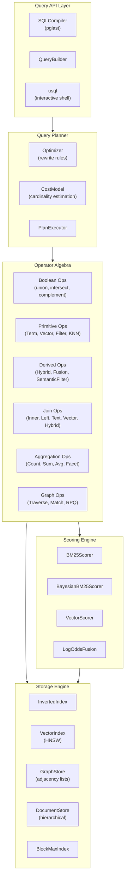
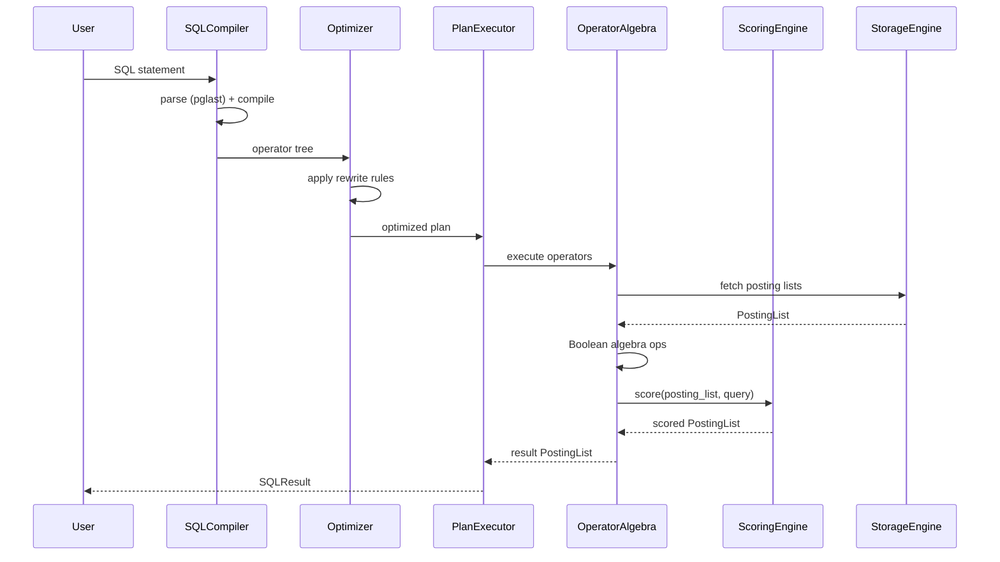
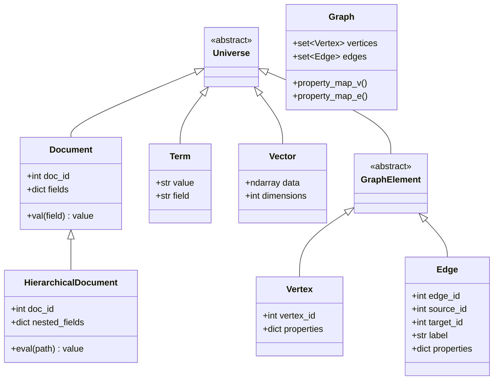
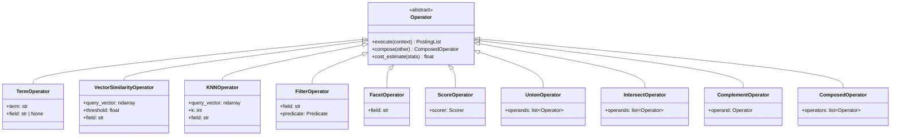
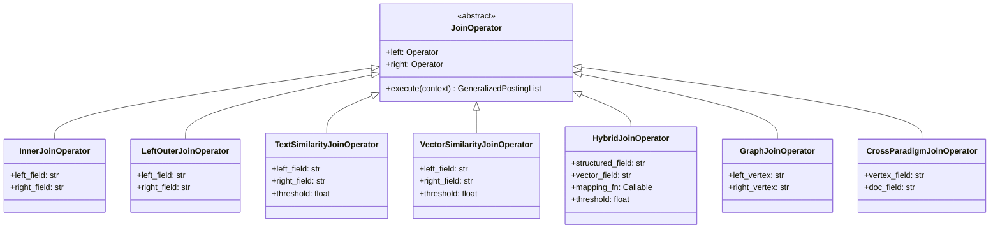
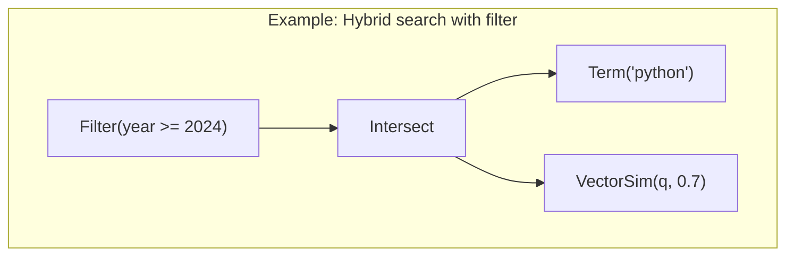

# Unified Query Algebra Database Prototype — Design Document

**Project**: UQA (Unified Query Algebra)
**Language**: Python 3.12+
**Date**: 2026-03-05

---

## 1. Overview

This document describes the design of a database prototype that implements the unified query algebra defined across four papers by Jeong (2023—2026). The system unifies relational, text retrieval, vector search, and graph query paradigms under a single algebraic structure, using **posting lists** as the universal abstraction.

### 1.1 Design Goals

| Goal | Description |
|------|-------------|
| **Algebraic correctness** | All operations satisfy the Boolean algebra axioms (Theorem 2.1.2, Paper 1) |
| **Cross-paradigm fusion** | Relational filters, text search, vector search, and graph traversal compose freely |
| **Probabilistic scoring** | Bayesian BM25 produces calibrated $P(R=1 \mid s) \in [0,1]$ (Paper 3) |
| **Log-odds conjunction** | Multi-signal fusion via the log-odds mean framework (Paper 4, Section 4) |
| **Extensibility** | New paradigms (e.g., time-series) can be added without modifying the core algebra |
| **SQL interface** | Extended SQL syntax with pglast (PostgreSQL parser) for DDL, DML, DQL, and cross-paradigm functions |

### 1.2 Paper-to-Module Mapping

| Paper | Core Contribution | Module |
|-------|-------------------|--------|
| 1. Unified Framework (2023) | Posting list algebra, operators, joins, aggregations, hierarchical data | `uqa.core`, `uqa.operators`, `uqa.joins` |
| 2. Graph Extension (2024) | Graph posting lists, traversal, pattern matching, RPQ | `uqa.graph` |
| 3. Bayesian BM25 (2026a) | Score calibration, composite prior, WAND/BMW | `uqa.scoring` |
| 4. Neural Computation (2026b) | Log-odds conjunction, confidence scaling, attention-weighted fusion | `uqa.fusion` |
| SQL interface | SQL compiler, DDL/DML, per-table storage | `uqa.sql` |

---

## 2. Architecture

### 2.1 System Architecture



### 2.2 Data Flow



---

## 3. Type System

The type system mirrors Definition 1.2.2 (Paper 1) and Definition 1.1.2 (Paper 2).

### 3.1 Type Hierarchy



### 3.2 Core Python Types

```python
# uqa/types.py

from dataclasses import dataclass, field
from typing import Any
import numpy as np
from numpy.typing import NDArray


DocId = int
FieldName = str
TermValue = str
PathExpr = list[str | int]


@dataclass(frozen=True, slots=True)
class Payload:
    """Posting list entry payload (positions, scores, field values)."""
    positions: tuple[int, ...] = ()
    score: float = 0.0
    fields: dict[FieldName, Any] = field(default_factory=dict)


@dataclass(frozen=True, slots=True)
class PostingEntry:
    """A single entry in a posting list: (doc_id, payload)."""
    doc_id: DocId
    payload: Payload


@dataclass(frozen=True, slots=True)
class Vertex:
    vertex_id: int
    properties: dict[str, Any] = field(default_factory=dict)


@dataclass(frozen=True, slots=True)
class Edge:
    edge_id: int
    source_id: int
    target_id: int
    label: str
    properties: dict[str, Any] = field(default_factory=dict)
```

---

## 4. Posting List — The Universal Abstraction

The posting list is the central data structure (Definition 1.2.3, Paper 1). All paradigms produce and consume posting lists, enabling cross-paradigm composition.

### 4.1 PostingList Class

```python
# uqa/core/posting_list.py

class PostingList:
    """Ordered sequence of (doc_id, payload) pairs.

    Invariant: entries are sorted by doc_id in ascending order.
    Implements the Boolean algebra (L, union, intersect, complement, empty, universal).
    """

    def __init__(self, entries: list[PostingEntry] | None = None):
        self._entries: list[PostingEntry] = sorted(
            entries or [], key=lambda e: e.doc_id
        )

    # -- Boolean Algebra Operations (Theorem 2.1.2, Paper 1) --

    def union(self, other: "PostingList") -> "PostingList": ...
    def intersect(self, other: "PostingList") -> "PostingList": ...
    def difference(self, other: "PostingList") -> "PostingList": ...
    def complement(self, universal: "PostingList") -> "PostingList": ...

    # -- Merge strategy for payloads during set operations --

    def _merge_payloads(self, a: Payload, b: Payload) -> Payload: ...

    # -- Properties --

    @property
    def doc_ids(self) -> set[DocId]: ...

    def __len__(self) -> int: ...
    def __iter__(self): ...
    def __and__(self, other): return self.intersect(other)
    def __or__(self, other): return self.union(other)
    def __invert__(self): raise TypeError("complement requires universal set")
    def __sub__(self, other): return self.difference(other)
```

### 4.2 Boolean Algebra Verification

The implementation must satisfy the five axioms from Theorem 2.1.2 (Paper 1):

| Axiom | Property | Verification |
|-------|----------|--------------|
| A1 | Commutativity | $A \cup B = B \cup A$, $A \cap B = B \cap A$ |
| A2 | Associativity | $A \cup (B \cup C) = (A \cup B) \cup C$ |
| A3 | Distributivity | $A \cap (B \cup C) = (A \cap B) \cup (A \cap C)$ |
| A4 | Identity | $A \cup \emptyset = A$, $A \cap \mathcal{U} = A$ |
| A5 | Complement | $A \cup \overline{A} = \mathcal{U}$, $A \cap \overline{A} = \emptyset$ |

### 4.3 Intersection Algorithm

Since posting lists are sorted by `doc_id`, intersection uses a two-pointer merge in $O(\min(|A|, |B|))$ with skip-ahead:

```python
def intersect(self, other: "PostingList") -> "PostingList":
    result = []
    i, j = 0, 0
    while i < len(self._entries) and j < len(other._entries):
        a, b = self._entries[i], other._entries[j]
        if a.doc_id == b.doc_id:
            merged = self._merge_payloads(a.payload, b.payload)
            result.append(PostingEntry(a.doc_id, merged))
            i += 1
            j += 1
        elif a.doc_id < b.doc_id:
            i += 1
        else:
            j += 1
    return PostingList(result)
```

### 4.4 Generalized Posting List (for Joins)

Per Definition 4.1.2 (Paper 1), join results produce tuples of document IDs:

```python
@dataclass(frozen=True, slots=True)
class GeneralizedPostingEntry:
    doc_ids: tuple[DocId, ...]
    payload: Payload


class GeneralizedPostingList:
    """Posting list with multi-document tuples for join results."""
    ...
```

---

## 5. Operator Algebra

### 5.1 Operator Type Hierarchy

All operators are composable. Their compositions form a monoid (Theorem 3.2.3, Paper 1).



### 5.2 Primitive Operators

Each primitive operator corresponds to a formal definition from Paper 1, Section 3.1:

| Operator | Paper Reference | Signature | Description |
|----------|----------------|-----------|-------------|
| `TermOperator` | Def 3.1.1 | $T: \mathcal{T} \to \mathcal{L}$ | Retrieves posting list for a term |
| `VectorSimilarityOperator` | Def 3.1.2 | $V_\theta: \mathcal{V} \to \mathcal{L}$ | Documents with $\text{sim} \geq \theta$ |
| `KNNOperator` | Def 3.1.3 | $KNN_k: \mathcal{V} \to \mathcal{L}$ | Top-$k$ nearest neighbors |
| `FilterOperator` | Def 3.1.4 | $Filter_{f,v}: \mathcal{L} \to \mathcal{L}$ | Field-value filter |
| `FacetOperator` | Def 3.1.5 | $Facet_f: \mathcal{L} \to (dom(f) \times \mathbb{N})$ | Facet counts |
| `ScoreOperator` | Def 3.1.6 | $Score_q: \mathcal{L} \to (\mathcal{L} \times \mathbb{R}^n)$ | Relevance scoring |

### 5.3 Derived Operators for Hybrid Queries

Per Definitions 3.3.1—3.3.4 (Paper 1):

```python
# uqa/operators/hybrid.py

class HybridTextVectorOperator(Operator):
    """Definition 3.3.1: Hybrid_{t,q,theta} = T(t) AND V_theta(q)"""

    def __init__(self, term: str, query_vector: NDArray, threshold: float):
        self.term_op = TermOperator(term)
        self.vector_op = VectorSimilarityOperator(query_vector, threshold)

    def execute(self, ctx: ExecutionContext) -> PostingList:
        return self.term_op.execute(ctx).intersect(
            self.vector_op.execute(ctx)
        )


class SemanticFilterOperator(Operator):
    """Definition 3.3.4: SemanticFilter_{q,theta,L} = L AND V_theta(q)"""

    def __init__(self, source: Operator, query_vector: NDArray, threshold: float):
        self.source = source
        self.vector_op = VectorSimilarityOperator(query_vector, threshold)

    def execute(self, ctx: ExecutionContext) -> PostingList:
        return self.source.execute(ctx).intersect(
            self.vector_op.execute(ctx)
        )
```

```python
# uqa/operators/hybrid.py (fusion operators)

class LogOddsFusionOperator(Operator):
    """Multi-signal fusion via log-odds conjunction (Paper 4, Section 4).

    All signal operators MUST produce calibrated probabilities in (0, 1).
    Documents missing from a signal receive default_prob (no evidence).
    """
    def __init__(self, signals: list[Operator], alpha: float = 0.5,
                 default_prob: float = 0.01):
        self.signals = signals
        self.alpha = alpha
        self.default_prob = default_prob

    def execute(self, ctx: ExecutionContext) -> PostingList:
        # Execute each signal, collect score maps, fuse via LogOddsFusion
        ...


class ProbBoolFusionOperator(Operator):
    """Probabilistic AND/OR fusion (Paper 3, Section 5)."""
    def __init__(self, signals: list[Operator], mode: str = "and"):
        ...


class ProbNotOperator(Operator):
    """Probabilistic NOT: P = 1 - P_signal (Paper 3, Section 5)."""
    def __init__(self, signal: Operator):
        ...
```

---

## 6. Join Operations

### 6.1 Join Operator Hierarchy

Per Section 4 of Paper 1:



### 6.2 Join Properties

The implementation must preserve the algebraic properties from Theorems 4.3.1—4.3.3 (Paper 1):

- **Commutativity** (up to tuple reordering): $Join_{f_1=f_2}(L_1, L_2) \cong Join_{f_2=f_1}(L_2, L_1)$
- **Associativity**: $Join_{f_2=f_3}(Join_{f_1=f_2}(L_1, L_2), L_3) \cong Join_{f_1=f_2}(L_1, Join_{f_2=f_3}(L_2, L_3))$
- **Distribution over union**: $Join_{f_1=f_2}(L_1, L_2 \cup L_3) = Join_{f_1=f_2}(L_1, L_2) \cup Join_{f_1=f_2}(L_1, L_3)$

### 6.3 Join Algorithm Selection

| Algorithm | Condition | Complexity |
|-----------|-----------|------------|
| Sort-merge join | Both inputs sorted on join key | $O(\|L_1\| + \|L_2\|)$ |
| Hash join | One input fits in memory | $O(\|L_1\| + \|L_2\|)$ |
| Nested-loop join | Similarity joins (text, vector) | $O(\|L_1\| \cdot \|L_2\| \cdot d)$ |
| Index join | Join key is indexed | $O(\|L_1\| \cdot \log \|L_2\|)$ |

---

## 7. Aggregation and Hierarchical Data

### 7.1 Aggregation Framework

Per Section 5.1 of Paper 1, aggregation functions form monoids enabling parallel decomposition (Theorem 5.1.5):

```python
# uqa/operators/aggregation.py

class AggregationMonoid(ABC):
    """Aggregation function with monoid structure for decomposition."""

    @abstractmethod
    def identity(self) -> Any: ...

    @abstractmethod
    def accumulate(self, state: Any, value: Any) -> Any: ...

    @abstractmethod
    def combine(self, state_a: Any, state_b: Any) -> Any: ...

    @abstractmethod
    def finalize(self, state: Any) -> Any: ...


class CountMonoid(AggregationMonoid):
    def identity(self) -> int: return 0
    def accumulate(self, state: int, value: Any) -> int: return state + 1
    def combine(self, a: int, b: int) -> int: return a + b
    def finalize(self, state: int) -> int: return state


class SumMonoid(AggregationMonoid):
    def identity(self) -> float: return 0.0
    def accumulate(self, state: float, value: float) -> float: return state + value
    def combine(self, a: float, b: float) -> float: return a + b
    def finalize(self, state: float) -> float: return state


class AvgMonoid(AggregationMonoid):
    """Avg = (sum, count) pair -- monoid over tuples."""
    def identity(self) -> tuple[float, int]: return (0.0, 0)
    def accumulate(self, state, value):
        return (state[0] + value, state[1] + 1)
    def combine(self, a, b):
        return (a[0] + b[0], a[1] + b[1])
    def finalize(self, state) -> float:
        return state[0] / state[1] if state[1] > 0 else 0.0
```

### 7.2 Hierarchical Document Operations

Per Section 5.2—5.3 of Paper 1:

```python
# uqa/core/hierarchical.py

class HierarchicalDocument:
    """Recursive document structure (Definition 5.2.1)."""

    def __init__(self, doc_id: DocId, data: dict | list | Any):
        self.doc_id = doc_id
        self.data = data

    def eval_path(self, path: PathExpr) -> Any:
        """Path evaluation (Definition 5.2.3)."""
        current = self.data
        for component in path:
            if isinstance(current, dict) and isinstance(component, str):
                current = current.get(component)
            elif isinstance(current, list) and isinstance(component, int):
                current = current[component] if component < len(current) else None
            else:
                return None
            if current is None:
                return None
        return current


class PathFilterOperator(Operator):
    """Definition 5.3.1: Filter by path expression and predicate."""
    def __init__(self, path: PathExpr, predicate: Callable[[Any], bool]):
        self.path = path
        self.predicate = predicate


class PathProjectOperator(Operator):
    """Definition 5.3.2: Project to a set of path expressions."""
    def __init__(self, paths: list[PathExpr]):
        self.paths = paths


class PathUnnestOperator(Operator):
    """Definition 5.3.4: Unnest an array at a given path."""
    def __init__(self, path: PathExpr):
        self.path = path
```

---

## 8. Graph Operations

### 8.1 Graph Store

Per Section 1 of Paper 2, a graph $G = (V, E, \lambda_V, \lambda_E)$:

```python
# uqa/graph/store.py

class GraphStore:
    """Adjacency-list graph storage with property maps."""

    def __init__(self):
        self._vertices: dict[int, Vertex] = {}
        self._edges: dict[int, Edge] = {}
        self._adj_out: dict[int, list[int]] = {}   # vertex_id -> [edge_id]
        self._adj_in: dict[int, list[int]] = {}     # vertex_id -> [edge_id]
        self._label_index: dict[str, list[int]] = {}  # label -> [edge_id]

    def add_vertex(self, vertex: Vertex) -> None: ...
    def add_edge(self, edge: Edge) -> None: ...
    def neighbors(self, vertex_id: int, label: str | None = None,
                  direction: str = "out") -> list[int]: ...
    def get_vertex(self, vertex_id: int) -> Vertex | None: ...
    def get_edge(self, edge_id: int) -> Edge | None: ...
```

### 8.2 Graph Posting List

Per Definition 1.1.4 (Paper 2), graph posting lists are isomorphic to standard posting lists (Theorem 1.1.6):

```python
# uqa/graph/posting_list.py

@dataclass(frozen=True, slots=True)
class GraphPayload:
    subgraph_vertices: frozenset[int]
    subgraph_edges: frozenset[int]
    score: float = 0.0


class GraphPostingList(PostingList):
    """Graph posting list with isomorphism to standard PostingList.

    The isomorphism Phi: L_G -> L (Theorem 1.1.6, Paper 2) is
    realized by the to_posting_list() / from_posting_list() methods.
    """

    def to_posting_list(self) -> PostingList:
        """Phi: L_G -> L (isomorphism)."""
        ...

    @classmethod
    def from_posting_list(cls, pl: PostingList) -> "GraphPostingList":
        """Phi^{-1}: L -> L_G (inverse isomorphism)."""
        ...
```

### 8.3 Graph Operators

Per Section 2.2 and Section 5 of Paper 2:

```python
# uqa/graph/operators.py

class TraverseOperator(Operator):
    """Definition 2.2.1: Traverse_{v,l,k}
    Returns subgraphs reachable from vertex v via label l up to k hops.
    """
    def __init__(self, start_vertex: int, label: str | None, max_hops: int):
        self.start_vertex = start_vertex
        self.label = label
        self.max_hops = max_hops

    def execute(self, ctx: ExecutionContext) -> GraphPostingList:
        graph = ctx.graph_store
        visited: set[int] = set()
        frontier: set[int] = {self.start_vertex}

        for _ in range(self.max_hops):
            next_frontier: set[int] = set()
            for v in frontier:
                for neighbor in graph.neighbors(v, self.label, "out"):
                    if neighbor not in visited:
                        next_frontier.add(neighbor)
            visited.update(frontier)
            frontier = next_frontier
            if not frontier:
                break
        visited.update(frontier)
        # Build graph posting list from visited subgraph
        ...


class PatternMatchOperator(Operator):
    """Definition 2.2.2 / 5.2.2: GMatch_P
    Subgraph isomorphism pattern matching.
    Complexity: O(|V_G|^{|V_P|}) worst case (Theorem 8.1.1, Paper 2).
    """
    def __init__(self, pattern: "GraphPattern"):
        self.pattern = pattern


class RegularPathQueryOperator(Operator):
    """Definition 5.1.2: RPQ_R
    Regular path expression evaluation.
    Complexity: O(|V|^2 * |R|) (Theorem 8.1.2, Paper 2).
    """
    def __init__(self, path_expr: "RegularPathExpr"):
        self.path_expr = path_expr
```

### 8.4 Graph Pattern Language

Per Definition 5.2.1 (Paper 2), a pattern $P = (V_P, E_P, C_V, C_E)$:

```python
# uqa/graph/pattern.py

@dataclass
class VertexPattern:
    variable: str
    constraints: list[Callable[[Vertex], bool]] = field(default_factory=list)


@dataclass
class EdgePattern:
    source_var: str
    target_var: str
    label: str | None = None
    constraints: list[Callable[[Edge], bool]] = field(default_factory=list)


@dataclass
class GraphPattern:
    """Definition 5.2.1 (Paper 2): P = (V_P, E_P, C_V, C_E)"""
    vertex_patterns: list[VertexPattern]
    edge_patterns: list[EdgePattern]
```

### 8.5 Cross-Paradigm Graph Integration

Per Section 3 of Paper 2:

| Operator | Paper Reference | Description |
|----------|----------------|-------------|
| `ToGraphOperator` | Def 3.1.1 | Document collection to graph |
| `FromGraphOperator` | Def 3.1.2 | Graph to document collection |
| `VertexEmbeddingOperator` | Def 3.2.1 | Vertex property to vector |
| `VectorEnhancedMatchOperator` | Def 3.2.3 | Pattern match + vector similarity |
| `TextToGraphOperator` | Def 3.3.1 | Text to co-occurrence graph |
| `SemanticGraphSearchOperator` | Def 3.3.2 | Semantic search over graph |

---

## 9. Scoring Engine

### 9.1 BM25 Scorer

Per Definition 3.2.1 (Paper 3), the numerically stable BM25 formulation:

$$\text{score}(f, n) = w - \frac{w}{1 + f \cdot \text{inv\_norm}}$$

where $w = \text{boost} \cdot \text{IDF}(t)$ and $\text{inv\_norm} = \frac{1}{k_1 \cdot ((1-b) + b \cdot n / \text{avgdl})}$.

```python
# uqa/scoring/bm25.py

@dataclass(slots=True)
class BM25Params:
    k1: float = 1.2
    b: float = 0.75
    boost: float = 1.0


class BM25Scorer:
    """Standard BM25 scorer (Definition 3.2.1, Paper 3).

    Properties (Theorem 3.2.2):
    - Monotonically increasing in term frequency
    - Monotonically decreasing in document length
    - Upper bound: boost * IDF (Theorem 3.2.3)
    """

    def __init__(self, params: BM25Params, index_stats: "IndexStats"):
        self.params = params
        self.stats = index_stats

    def idf(self, doc_freq: int) -> float:
        """Robertson-Sparck Jones IDF (Definition 3.1.1, Paper 3).
        IDF(t) = ln((N - df(t) + 0.5) / (df(t) + 0.5) + 1)
        """
        n = self.stats.total_docs
        return math.log((n - doc_freq + 0.5) / (doc_freq + 0.5) + 1.0)

    def score(self, term_freq: int, doc_length: int, doc_freq: int) -> float:
        idf_val = self.idf(doc_freq)
        w = self.params.boost * idf_val
        b_factor = (1.0 - self.params.b) + self.params.b * (
            doc_length / self.stats.avg_doc_length
        )
        inv_norm = 1.0 / (self.params.k1 * b_factor)
        return w - w / (1.0 + term_freq * inv_norm)

    def upper_bound(self, doc_freq: int) -> float:
        """Theorem 3.2.3: sup score = boost * IDF."""
        return self.params.boost * self.idf(doc_freq)
```

### 9.2 Bayesian BM25 Scorer

Per Section 4 of Paper 3, the Bayesian transformation:

$$P(R=1 \mid s) = \frac{L \cdot p}{L \cdot p + (1-L)(1-p)}$$

where $L = \sigma(\alpha(s - \beta))$ is the sigmoid likelihood and $p = P_{\text{prior}}(f, \hat{n})$ is the composite prior.

```python
# uqa/scoring/bayesian_bm25.py

@dataclass(slots=True)
class BayesianBM25Params:
    bm25: BM25Params = field(default_factory=BM25Params)
    alpha: float = 1.0    # sigmoid steepness
    beta: float = 0.0     # sigmoid midpoint
    base_rate: float = 0.5  # corpus-level base rate b_r


class BayesianBM25Scorer:
    """Bayesian BM25 scorer (Section 4, Paper 3).

    Transforms BM25 scores into calibrated probabilities P(R=1|s) in [0,1].

    Three-term posterior decomposition (Theorem 4.4.2):
        logit(P) = logit(L) + logit(b_r) + logit(p)

    Implemented as two successive Bayes updates (Remark 4.4.5)
    for computational efficiency (2 mul + 1 sub + 1 div overhead).
    """

    def __init__(self, params: BayesianBM25Params, index_stats: "IndexStats"):
        self.params = params
        self.bm25 = BM25Scorer(params.bm25, index_stats)

    @staticmethod
    def _sigmoid(x: float) -> float:
        if x >= 0:
            z = math.exp(-x)
            return 1.0 / (1.0 + z)
        else:
            z = math.exp(x)
            return z / (1.0 + z)

    def _composite_prior(self, term_freq: int, doc_length: int) -> float:
        """Composite prior P_prior(f, n) (Definition 4.2.3, Paper 3).

        P_tf(f)   = 0.2 + 0.7 * min(1, f/10)
        P_norm(n) = 0.3 + 0.6 * (1 - min(1, |n - 0.5| * 2))
        P_prior   = clamp(0.7 * P_tf + 0.3 * P_norm, 0.1, 0.9)
        """
        p_tf = 0.2 + 0.7 * min(1.0, term_freq / 10.0)

        norm = doc_length / self.bm25.stats.avg_doc_length if self.bm25.stats.avg_doc_length > 0 else 1.0
        p_norm = 0.3 + 0.6 * (1.0 - min(1.0, abs(norm - 0.5) * 2.0))

        prior = 0.7 * p_tf + 0.3 * p_norm
        return max(0.1, min(0.9, prior))

    def _bayes_update(self, likelihood: float, prior: float) -> float:
        """Single Bayes update: P = (L*p) / (L*p + (1-L)*(1-p))"""
        lp = likelihood * prior
        return lp / (lp + (1.0 - likelihood) * (1.0 - prior))

    def score(self, term_freq: int, doc_length: int, doc_freq: int) -> float:
        """Full Bayesian BM25 posterior with three-term decomposition."""
        # Step 1: BM25 raw score
        raw = self.bm25.score(term_freq, doc_length, doc_freq)

        # Step 2: Sigmoid likelihood L = sigma(alpha * (s - beta))
        likelihood = self._sigmoid(
            self.params.alpha * (raw - self.params.beta)
        )

        # Step 3: Composite prior
        prior = self._composite_prior(term_freq, doc_length)

        # Step 4: First Bayes update (likelihood + prior)
        p1 = self._bayes_update(likelihood, prior)

        # Step 5: Second Bayes update (base rate) -- Theorem 4.4.2
        if self.params.base_rate != 0.5:
            p1 = self._bayes_update(p1, self.params.base_rate)

        return p1

    def upper_bound(self, doc_freq: int) -> float:
        """Theorem 6.1.2 (Paper 3): Safe WAND upper bound.
        Uses max likelihood and max prior (p_max = 0.9).
        """
        bm25_ub = self.bm25.upper_bound(doc_freq)
        l_max = self._sigmoid(self.params.alpha * (bm25_ub - self.params.beta))
        p_max = 0.9
        return self._bayes_update(l_max, p_max)
```

### 9.3 Vector Scorer

Per Section 7.1 of Paper 3:

```python
# uqa/scoring/vector.py

class VectorScorer:
    """Vector similarity to probability conversion (Definition 7.1.2, Paper 3).

    For cosine distance d in [0, 2]:
        score_vector = 1 - d  (in [-1, 1])
        P_vector = (1 + score_vector) / 2  (in [0, 1])
    """

    @staticmethod
    def cosine_similarity(a: NDArray, b: NDArray) -> float:
        dot = float(np.dot(a, b))
        norm_a = float(np.linalg.norm(a))
        norm_b = float(np.linalg.norm(b))
        if norm_a == 0.0 or norm_b == 0.0:
            return 0.0
        return dot / (norm_a * norm_b)

    @staticmethod
    def similarity_to_probability(cosine_sim: float) -> float:
        """Definition 7.1.2: P_vector = (1 + score) / 2"""
        return (1.0 + cosine_sim) / 2.0
```

### 9.4 WAND / Block-Max WAND

Per Section 6 of Paper 3:

```python
# uqa/scoring/wand.py

class WANDScorer:
    """WAND top-k scorer with safe pruning (Section 6.1, Paper 3).

    Pruning condition: sum(upper_bound_i for i in 0..pivot) < theta
    where theta is the current k-th highest score.

    For Bayesian BM25, uses modified upper bounds (Theorem 6.1.2)
    that account for document-dependent priors.
    """

    def __init__(self, scorers: list[BayesianBM25Scorer], k: int):
        self.scorers = scorers
        self.k = k
        self._upper_bounds = [s.upper_bound for s in scorers]

    def score_top_k(self, posting_lists: list[PostingList]) -> PostingList:
        ...


class BlockMaxWANDScorer:
    """Block-Max WAND with per-block upper bounds (Section 6.2, Paper 3).

    Block size B = 128 (typical).
    Storage overhead: O(|PostingList| / B * |Terms|) -- Theorem 6.2.2.
    Achieves higher skip rates than WAND: Skip_BMW >= Skip_WAND.
    """

    def __init__(self, scorers: list[BayesianBM25Scorer], k: int,
                 block_size: int = 128):
        self.scorers = scorers
        self.k = k
        self.block_size = block_size
```

---

## 10. Multi-Signal Fusion Engine

### 10.1 The Conjunction Shrinkage Problem

Per Theorem 3.2.1 (Paper 4), naive product conjunction $\prod P_i = p^n \to 0$ causes confidence to collapse as signals increase. The log-odds conjunction framework resolves this.

### 10.2 Log-Odds Conjunction

Per Section 4 of Paper 4:

$$P_{\text{final}} = \sigma\!\left(\frac{1}{n^{1-\alpha}} \sum_{i=1}^{n} \text{logit}(P_i)\right)$$

```python
# uqa/fusion/log_odds.py

class LogOddsFusion:
    """Log-odds conjunction framework (Section 4, Paper 4).

    Resolves the conjunction shrinkage problem while preserving:
    - Scale neutrality (Theorem 4.1.2): P_i = p for all i => P_final = p
    - Sign preservation (Theorem 4.2.2): sgn(adjusted) = sgn(mean)
    - Irrelevance preservation (Theorem 4.5.1 iii): all P_i < 0.5 => P_final < 0.5
    - Relevance preservation (Theorem 4.5.1 iv): all P_i > 0.5 => P_final > 0.5

    Equivalent to normalized Logarithmic Opinion Pooling / Product of Experts
    (Theorem 4.1.2a).
    """

    EPSILON = 1e-10

    def __init__(self, confidence_alpha: float = 0.5):
        """
        Args:
            confidence_alpha: Confidence scaling exponent.
                alpha=0.5 yields the sqrt(n) scaling law (Theorem 4.4.1).
        """
        self.alpha = confidence_alpha

    @staticmethod
    def _logit(p: float) -> float:
        p = max(LogOddsFusion.EPSILON, min(1.0 - LogOddsFusion.EPSILON, p))
        return math.log(p / (1.0 - p))

    @staticmethod
    def _sigmoid(x: float) -> float:
        if x >= 0:
            z = math.exp(-x)
            return 1.0 / (1.0 + z)
        else:
            z = math.exp(x)
            return z / (1.0 + z)

    def fuse(self, probabilities: list[float]) -> float:
        """Combine calibrated probability signals via log-odds conjunction.

        P_final = sigmoid( (1/n^{1-alpha}) * sum(logit(P_i)) )
        """
        n = len(probabilities)
        if n == 0:
            return 0.5
        if n == 1:
            return probabilities[0]  # Proposition 4.3.2: identity for n=1

        logit_sum = sum(self._logit(p) for p in probabilities)
        weight = 1.0 / (n ** (1.0 - self.alpha))
        adjusted = logit_sum * weight

        return self._sigmoid(adjusted)

    def fuse_weighted(self, probabilities: list[float],
                      weights: list[float]) -> float:
        """Weighted log-odds conjunction (attention-like, Section 8, Paper 4).

        S = sum(w_i * logit(P_i)) where sum(w_i) = 1
        P_final = sigmoid(S * n^alpha)
        """
        n = len(probabilities)
        if n == 0:
            return 0.5

        logit_sum = sum(
            w * self._logit(p) for w, p in zip(weights, probabilities)
        )
        scaled = logit_sum * (n ** self.alpha)

        return self._sigmoid(scaled)
```

### 10.3 Probabilistic Boolean Combinations

Per Section 5 of Paper 3 (simple product/complement for Boolean queries):

```python
# uqa/fusion/boolean.py

class ProbabilisticBoolean:
    """Probabilistic Boolean operations for hybrid search (Section 5, Paper 3).

    AND: P = prod(p_i)               -- joint satisfaction
    OR:  P = 1 - prod(1 - p_i)       -- at least one
    NOT: P = 1 - p                    -- complement

    Computed in log-space for numerical stability (Theorem 5.3.1).
    """

    EPSILON = 1e-10

    @staticmethod
    def prob_and(probabilities: list[float]) -> float:
        """Theorem 5.1.1: P(AND) = exp(sum(ln(p_i)))"""
        log_sum = sum(
            math.log(max(p, ProbabilisticBoolean.EPSILON))
            for p in probabilities
        )
        return math.exp(log_sum)

    @staticmethod
    def prob_or(probabilities: list[float]) -> float:
        """Theorem 5.2.1: P(OR) = 1 - exp(sum(ln(1-p_i)))"""
        log_sum = sum(
            math.log(max(1.0 - p, ProbabilisticBoolean.EPSILON))
            for p in probabilities
        )
        return 1.0 - math.exp(log_sum)

    @staticmethod
    def prob_not(p: float) -> float:
        return 1.0 - p
```

### 10.4 Neural Network Interpretation

Per Theorem 5.2.1 (Paper 4), the full fusion pipeline has the structure of a two-layer feedforward network:

```
Input signals: s_1, s_2, ..., s_n
     |
     v
[Stage 1: Calibration Layer]          -- sigmoid / linear / external
     P_1 = sigma(alpha_1 * (s_1 - beta_1))
     P_2 = (1 + cos_theta) / 2
     ...
     |
     v
[Stage 2: Hidden Layer -- logit]      -- canonical link of Bernoulli family
     x_i = logit(P_i)
     |
     v
[Stage 3: Linear Aggregation]         -- weighted sum in log-odds space
     l_adj = (1/n^{1-alpha}) * sum(x_i)
     |
     v
[Stage 4: Output Activation -- sigmoid]
     P_final = sigma(l_adj)
```

When all signals are sigmoid-calibrated, the logit-sigmoid identity collapses the hidden layer to logistic regression (Theorem 5.2.1a). When calibrations are heterogeneous (the practical case), the logit performs a genuine nonlinear transformation.

---

## 11. Storage Engine

### 11.1 Inverted Index

```python
# uqa/storage/inverted_index.py

class InvertedIndex:
    """Term-to-posting-list mapping with per-term statistics."""

    def __init__(self):
        self._index: dict[tuple[str, str], PostingList] = {}
        # key: (field, term) -> PostingList
        self._doc_lengths: dict[DocId, dict[FieldName, int]] = {}
        self._doc_count: int = 0
        self._total_length: dict[FieldName, int] = {}

    def add_document(self, doc_id: DocId, fields: dict[FieldName, str]) -> None:
        """Index a document by tokenizing each field."""
        ...

    def get_posting_list(self, field: str, term: str) -> PostingList:
        return self._index.get((field, term), PostingList())

    def doc_freq(self, field: str, term: str) -> int:
        return len(self._index.get((field, term), PostingList()))

    @property
    def stats(self) -> "IndexStats":
        ...
```

### 11.2 Vector Index (HNSW)

```python
# uqa/storage/vector_index.py

class HNSWIndex:
    """Hierarchical Navigable Small World graph for ANN search.

    Cost: O(d * log|D|) per query (Definition 6.2.1, Paper 1).
    """

    def __init__(self, dimensions: int, max_elements: int,
                 ef_construction: int = 200, m: int = 16):
        self.dimensions = dimensions
        # Uses hnswlib or a pure-Python implementation
        ...

    def add(self, doc_id: DocId, vector: NDArray) -> None: ...

    def search_knn(self, query: NDArray, k: int) -> PostingList:
        """KNN_k operator (Definition 3.1.3)."""
        ...

    def search_threshold(self, query: NDArray, threshold: float) -> PostingList:
        """V_theta operator (Definition 3.1.2)."""
        ...
```

### 11.3 Document Store

```python
# uqa/storage/document_store.py

class DocumentStore:
    """Storage for full documents (flat and hierarchical)."""

    def __init__(self):
        self._documents: dict[DocId, dict | HierarchicalDocument] = {}

    def put(self, doc_id: DocId, document: dict) -> None: ...
    def get(self, doc_id: DocId) -> dict | None: ...
    def delete(self, doc_id: DocId) -> None: ...

    def get_field(self, doc_id: DocId, field: FieldName) -> Any: ...
    def eval_path(self, doc_id: DocId, path: PathExpr) -> Any: ...
```

### 11.4 Block-Max Index

```python
# uqa/storage/block_max_index.py

class BlockMaxIndex:
    """Per-block maximum score index for BMW optimization.

    Storage: O(|PostingList| / B * |Terms|) -- Theorem 6.2.2, Paper 3.
    """

    def __init__(self, block_size: int = 128):
        self.block_size = block_size
        # (field, term) -> list of block-max scores
        self._block_maxes: dict[tuple[str, str], list[float]] = {}

    def build(self, posting_list: PostingList, scorer: BM25Scorer,
              field: str, term: str) -> None: ...

    def get_block_max(self, field: str, term: str,
                      block_idx: int) -> float: ...
```

---

## 12. Query Planner and Optimizer

### 12.1 Logical Plan Representation

Queries are represented as operator trees. The optimizer applies equivalence-preserving rewrite rules (Theorem 6.1.2, Paper 1).



### 12.2 Rewrite Rules

Per Theorem 6.1.2 (Paper 1) and Theorem 6.1.1 (Paper 2):

| Rule | Description | Condition |
|------|-------------|-----------|
| Filter pushdown | $Filter_{f,v}(A \cap B) \equiv Filter_{f,v}(A) \cap B$ | $f$ relevant only to $A$ |
| Vector threshold merge | $V_{\theta_1}(q) \cap V_{\theta_2}(q) \equiv V_{\max(\theta_1,\theta_2)}(q)$ | Same query vector |
| Commutativity | $A \cap B \equiv B \cap A$ | Always |
| Facet distribution | $Facet_f(A \cup B) \equiv Facet_f(A) \oplus Facet_f(B)$ | Disjoint $A$, $B$ |
| Graph pattern pushdown | $Filter_F(GMatch_P(L)) \equiv GMatch_{P'}(L)$ | $F$ incorporable into $P$ |
| Join-pattern fusion | $GMatch_{P_1}(L) \bowtie GMatch_{P_2}(L) \equiv GMatch_{P_1 \sqcup P_2}(L)$ | Common variables |
| Join-filter commutativity | $F(Join(L_1, L_2)) \equiv Join(F'(L_1), L_2)$ | $F$ on $L_1$'s fields |

### 12.3 Cost Model

Per Definition 6.2.1 (Paper 1):

```python
# uqa/planner/cost_model.py

class CostModel:
    """Operator cost estimation for query optimization."""

    def estimate(self, op: Operator, stats: "IndexStats") -> float:
        match op:
            case TermOperator(term=t, field=f):
                return float(stats.doc_freq(f, t))
            case VectorSimilarityOperator():
                return stats.dimensions * math.log2(stats.total_docs + 1)
            case FilterOperator():
                return float(stats.total_docs)  # linear scan
            case IntersectOperator(operands=ops):
                child_costs = [self.estimate(o, stats) for o in ops]
                return min(child_costs)  # two-pointer merge
            case UnionOperator(operands=ops):
                return sum(self.estimate(o, stats) for o in ops)
            case _:
                return float(stats.total_docs)
```

### 12.4 Cardinality Estimation

Per Definition 6.2.3 (Paper 1):

| Operation | Estimator |
|-----------|-----------|
| $\|T(t_1) \cap T(t_2)\|$ | $\frac{\|T(t_1)\| \cdot \|T(t_2)\|}{\|D\|} \cdot c_{t_1,t_2}$ |
| $\|V_\theta(q) \cap T(t)\|$ | $\|V_\theta(q)\| \cdot \frac{\|T(t)\|}{\|D\|} \cdot c_{q,t}$ |
| $\|Join_{f_1=f_2}(L_1, L_2)\|$ | $\frac{\|L_1\| \cdot \|L_2\|}{\|dom(f_1)\|} \cdot c_{f_1,f_2}$ |

---

## 13. Query API

### 13.1 QueryBuilder — Fluent API

```python
# uqa/api/query_builder.py

class QueryBuilder:
    """Fluent API for constructing queries over the unified algebra."""

    def __init__(self, engine: "Engine"):
        self._engine = engine
        self._root: Operator | None = None

    # -- Term retrieval (Definition 3.1.1) --
    def term(self, term: str, field: str | None = None) -> "QueryBuilder": ...

    # -- Vector search (Definitions 3.1.2, 3.1.3) --
    def vector(self, query: NDArray, threshold: float,
               field: str = "embedding") -> "QueryBuilder": ...
    def knn(self, query: NDArray, k: int,
            field: str = "embedding") -> "QueryBuilder": ...

    # -- Boolean algebra --
    def and_(self, other: "QueryBuilder") -> "QueryBuilder": ...
    def or_(self, other: "QueryBuilder") -> "QueryBuilder": ...
    def not_(self) -> "QueryBuilder": ...

    # -- Filter (Definition 3.1.4) --
    def filter(self, field: str, predicate: Predicate) -> "QueryBuilder": ...

    # -- Joins (Section 4, Paper 1) --
    def join(self, other: "QueryBuilder", left_field: str,
             right_field: str) -> "QueryBuilder": ...
    def vector_join(self, other: "QueryBuilder", left_field: str,
                    right_field: str, threshold: float) -> "QueryBuilder": ...

    # -- Graph operations (Paper 2) --
    def traverse(self, start: int, label: str | None = None,
                 max_hops: int = 1) -> "QueryBuilder": ...
    def match_pattern(self, pattern: GraphPattern) -> "QueryBuilder": ...
    def rpq(self, expr: str) -> "QueryBuilder": ...

    # -- Aggregation (Section 5.1, Paper 1) --
    def aggregate(self, field: str, agg: str) -> "AggregateResult": ...
    def facet(self, field: str) -> "FacetResult": ...

    # -- Hierarchical (Section 5.2-5.3, Paper 1) --
    def path_filter(self, path: PathExpr,
                    predicate: Predicate) -> "QueryBuilder": ...
    def path_project(self, *paths: PathExpr) -> "QueryBuilder": ...
    def unnest(self, path: PathExpr) -> "QueryBuilder": ...

    # -- Scoring --
    def score_bm25(self, query: str) -> "QueryBuilder": ...
    def score_bayesian_bm25(self, query: str) -> "QueryBuilder": ...

    # -- Fusion (Paper 4) --
    def fuse_log_odds(self, *builders: "QueryBuilder",
                      alpha: float = 0.5) -> "QueryBuilder": ...
    def fuse_prob_and(self, *builders: "QueryBuilder") -> "QueryBuilder": ...
    def fuse_prob_or(self, *builders: "QueryBuilder") -> "QueryBuilder": ...

    # -- Execution --
    def execute(self) -> PostingList: ...
    def explain(self) -> str: ...
```

### 13.2 SQL Interface

The SQL compiler translates PostgreSQL-compatible SQL into UQA operator trees using `pglast` v7.

#### Supported Statements

| Category | Syntax |
|----------|--------|
| DDL | `CREATE TABLE name (col type [PRIMARY KEY] [NOT NULL] [DEFAULT val], ...)` |
| DDL | `DROP TABLE [IF EXISTS] name` |
| DML | `INSERT INTO name (col, ...) VALUES (val, ...), ...` |
| DQL | `SELECT [DISTINCT] [* \| col, ... \| aggregates] FROM table [WHERE ...] [GROUP BY ... [HAVING ...]] [ORDER BY ... [ASC\|DESC]] [LIMIT n]` |
| Utility | `EXPLAIN SELECT ...` |
| Utility | `ANALYZE [table]` |

#### Extended WHERE Functions

| Function | Paradigm | Output |
|----------|----------|--------|
| `text_match(field, 'query')` | Text retrieval | BM25 score (unbounded) |
| `bayesian_match(field, 'query')` | Text retrieval | P(relevant) in [0,1] |
| `knn_match(k)` | Vector search | Cosine similarity |
| `traverse_match(start, 'label', hops)` | Graph | Reachability score (0.9) |

#### Fusion Meta-Functions

Fusion functions combine multiple calibrated signals into a single probability score per document. Signal scores are automatically calibrated inside fusion: `text_match` compiles as Bayesian BM25, `knn_match` applies P = (1 + cosine_sim) / 2.

| Function | Method | Reference |
|----------|--------|-----------|
| `fuse_log_odds(sig1, sig2, ...[, alpha])` | Log-odds conjunction | Paper 4, Section 4 |
| `fuse_prob_and(sig1, sig2, ...)` | P = prod(P_i) | Paper 3, Section 5 |
| `fuse_prob_or(sig1, sig2, ...)` | P = 1 - prod(1 - P_i) | Paper 3, Section 5 |
| `fuse_prob_not(signal)` | P = 1 - P_signal | Paper 3, Section 5 |

#### FROM-Clause Table Functions

| Function | Description |
|----------|-------------|
| `traverse(start_id, 'label', max_hops)` | BFS graph traversal |
| `rpq('path_expr', start_id)` | Regular path query (NFA simulation) |
| `text_search('query', 'field', 'table')` | Table-scoped full-text search |

#### Per-Table Storage Isolation

Each SQL table (`CREATE TABLE`) owns its own `DocumentStore` and `InvertedIndex`. The engine's global `VectorIndex` and `GraphStore` are shared across tables. This ensures text indexing is scoped per table while vector and graph data remain globally accessible.

```python
# Conceptual: per-table context construction
def _context_for_table(self, table: Table) -> ExecutionContext:
    return ExecutionContext(
        document_store=table.document_store,
        inverted_index=table.inverted_index,
        vector_index=self._engine.vector_index,   # global
        graph_store=self._engine.graph_store,       # global
        block_max_index=self._engine.block_max_index,
    )
```

#### Column Statistics and Query Optimization

`ANALYZE [table]` collects per-column statistics (distinct count, null count, min/max, selectivity). These statistics drive the `CardinalityEstimator` for more accurate cost-based optimization:

- Equality selectivity: 1/ndv (number of distinct values)
- Range selectivity: fraction of [min, max] interval
- IN selectivity: |set| / ndv
- BETWEEN selectivity: (high - low) / (max - min)

All SELECT queries pass through the `QueryOptimizer` (filter pushdown, vector threshold merge, intersect reordering by cardinality) before execution via `PlanExecutor`.

### 13.3 Interactive SQL Shell (usql)

`usql` is an interactive SQL shell built with `prompt_toolkit`:

- Syntax highlighting via Pygments SQL lexer
- Context-aware auto-completion (SQL keywords, table names, column names)
- Auto-suggest from command history
- Multi-line statement accumulation (until `;`)
- SQL script file execution (`python usql.py script.sql`)

Shell commands:

| Command | Description |
|---------|-------------|
| `\dt` | List tables |
| `\d <table>` | Describe table schema |
| `\ds <table>` | Show column statistics |
| `\timing` | Toggle query timing display |
| `\reset` | Reset the engine |
| `\q` | Quit |

### 13.4 Usage Examples

**Example 1: Hybrid text + vector search with Bayesian BM25 and log-odds fusion**

```python
from uqa import Engine

engine = Engine()

# Bayesian BM25 text search
text_query = (
    engine.query()
    .term("neural network")
    .score_bayesian_bm25("neural network")
)

# Vector similarity search
vector_query = (
    engine.query()
    .knn(embedding_vector, k=100)
)

# Fuse via log-odds conjunction (Paper 4, alpha=0.5 for sqrt(n) law)
results = (
    engine.query()
    .fuse_log_odds(text_query, vector_query, alpha=0.5)
    .filter("year", GreaterThanOrEqual(2024))
    .execute()
)
```

**Example 2: Cross-paradigm graph + text + vector query**

```python
# Find papers citing "attention" papers, with semantic similarity
graph_results = (
    engine.query()
    .traverse(start=paper_id, label="cites", max_hops=2)
)

text_results = (
    engine.query()
    .term("transformer", field="abstract")
    .score_bayesian_bm25("transformer")
)

vector_results = (
    engine.query()
    .knn(query_embedding, k=50)
)

# Three-signal fusion
final = (
    engine.query()
    .fuse_log_odds(graph_results, text_results, vector_results, alpha=0.5)
    .execute()
)
```

**Example 3: Aggregation over hierarchical data with joins**

```python
# Join orders with products, aggregate by category
results = (
    engine.query()
    .term("electronics", field="category")
    .join(
        engine.query().path_filter(["order", "status"], Equals("shipped")),
        left_field="product_id",
        right_field="order.product_id"
    )
    .aggregate("price", "avg")
)
```

---

## 14. Category-Theoretic Structure

The system's algebraic structure is grounded in category theory (Section 7, Paper 1; Section 7, Paper 2).

### 14.1 Categories in the System

| Category | Objects | Morphisms | Paper Reference |
|----------|---------|-----------|-----------------|
| $\mathcal{C}$ | Posting lists $L \in \mathcal{L}$ | Query operators | Def 7.2.1, Paper 1 |
| $\mathcal{R}$ | Query results $R \in \mathcal{L} \cup \mathcal{L}_H \cup \mathcal{A}$ | All operators | Def 7.2.2, Paper 1 |
| $\mathcal{C}_G$ | Graph posting lists $L_G \in \mathcal{L}_G$ | Graph operators | Def 7.1.1, Paper 2 |

### 14.2 Functors

| Functor | Direction | Description |
|---------|-----------|-------------|
| $F_G: \mathcal{C}_G \to \mathcal{C}$ | Graph to standard | Graph posting list isomorphism (Def 7.1.2, Paper 2) |
| $T_G: \mathcal{C} \to \mathcal{C}_G$ | Standard to graph | Left adjoint to $F_G$ (Theorem 7.2.2, Paper 2) |
| $F: \mathcal{L} \to \mathcal{L}_H$ | Flat to hierarchical | Free functor (Theorem 7.2.4, Paper 1) |
| $U: \mathcal{L}_H \to \mathcal{L}$ | Hierarchical to flat | Forgetful functor (Theorem 7.2.4, Paper 1) |

### 14.3 Monads

The system uses three monads for composing operations (Definition 7.2.3, Paper 1):

- **Query Monad** $(T, \eta, \mu)$: Sequences query operations
- **Join Monad** $(T_{join}, \eta_{join}, \mu_{join})$: Composes join operations
- **Aggregation Monad** $(T_{agg}, \eta_{agg}, \mu_{agg})$: Chains aggregations

---

## 15. Project Structure

```
uqa/
  __init__.py
  engine.py                       # Main Engine class

  core/
    __init__.py
    posting_list.py               # PostingList, GeneralizedPostingList
    hierarchical.py               # HierarchicalDocument, path operations
    types.py                      # Core type definitions

  operators/
    __init__.py
    base.py                       # Operator ABC, ComposedOperator
    primitive.py                  # Term, Vector, KNN, Filter, Facet, Score
    hybrid.py                     # HybridTextVector, SemanticFilter
    boolean.py                    # Union, Intersect, Complement operators
    aggregation.py                # Aggregation monoids and operators
    hierarchical.py               # PathFilter, PathProject, PathUnnest

  joins/
    __init__.py
    base.py                       # JoinOperator ABC
    inner.py                      # InnerJoinOperator
    outer.py                      # LeftOuterJoinOperator
    cross_paradigm.py             # Text, Vector, Hybrid joins

  graph/
    __init__.py
    store.py                      # GraphStore (adjacency lists)
    posting_list.py               # GraphPostingList
    operators.py                  # Traverse, PatternMatch, RPQ
    pattern.py                    # GraphPattern, RegularPathExpr
    cross_paradigm.py             # ToGraph, FromGraph, SemanticGraphSearch

  scoring/
    __init__.py
    bm25.py                       # BM25Scorer
    bayesian_bm25.py              # BayesianBM25Scorer
    vector.py                     # VectorScorer
    wand.py                       # WANDScorer, BlockMaxWANDScorer

  fusion/
    __init__.py
    log_odds.py                   # LogOddsFusion (Paper 4, Section 4)
    boolean.py                    # ProbabilisticBoolean (Paper 3, Section 5)

  storage/
    __init__.py
    inverted_index.py             # InvertedIndex
    vector_index.py               # HNSWIndex
    document_store.py             # DocumentStore
    block_max_index.py            # BlockMaxIndex

  planner/
    __init__.py
    optimizer.py                  # Rewrite rules
    cost_model.py                 # Cost estimation
    cardinality.py                # Cardinality estimation
    executor.py                   # PlanExecutor

  api/
    __init__.py
    query_builder.py              # Fluent QueryBuilder API

  sql/
    __init__.py
    compiler.py                   # SQL-to-UQA compiler (pglast)
    table.py                      # Table DDL, ColumnDef, ColumnStats

usql.py                           # Interactive SQL shell (prompt_toolkit)
examples/
  sql_queries.py                  # SQL interface examples
  demo.sql                        # Demo script for usql

  tests/
    test_posting_list.py          # Boolean algebra axiom verification
    test_operators.py             # Operator correctness
    test_joins.py                 # Join property verification
    test_scoring.py               # BM25 / Bayesian BM25 correctness
    test_fusion.py                # Log-odds conjunction properties
    test_graph.py                 # Graph operations
    test_integration.py           # Cross-paradigm queries
```

---

## 16. Complexity Summary

| Operation | Complexity | Reference |
|-----------|-----------|-----------|
| Term retrieval $T(t)$ | $O(df_t)$ | Def 6.2.1, Paper 1 |
| Vector search $V_\theta(q)$ | $O(d \cdot \log \|D\|)$ | Def 6.2.1, Paper 1 |
| Posting list intersection | $O(\min(\|A\|, \|B\|))$ | Def 6.2.1, Paper 1 |
| Inner join (hash) | $O(\|L_1\| + \|L_2\|)$ | Theorem 4.4.3, Paper 1 |
| Vector similarity join | $\Omega(\|L_1\| \cdot \|L_2\| \cdot d)$ | Theorem 8.1.3, Paper 1 |
| Aggregation | $O(\|L\| \cdot C_{agg})$ | Theorem 8.1.1, Paper 1 |
| Path evaluation | $O(\|p\| \cdot C_{access})$ | Theorem 8.1.2, Paper 1 |
| Graph traversal | $O(\sum_{i=1}^{k} d^i)$ | Def 6.2.1, Paper 2 |
| Graph pattern matching | $O(\|V_G\|^{\|V_P\|})$ | Theorem 8.1.1, Paper 2 |
| Regular path query | $O(\|V\|^2 \cdot \|R\|)$ | Theorem 8.1.2, Paper 2 |
| Bayesian BM25 overhead | $O(1)$ per document | Theorem 9.1.1, Paper 3 |
| Log-odds fusion | $O(n)$ per document | Section 4, Paper 4 |
| WAND skip rate (rare terms) | 90—99% pruned | Section 11.2, Paper 3 |

---

## 17. Key Invariants and Correctness Properties

### 17.1 Algebraic Invariants

| Property | Formal Statement | Test Strategy |
|----------|-----------------|---------------|
| Boolean completeness | $(\mathcal{L}, \cup, \cap, \overline{\cdot}, \emptyset, \mathcal{U})$ is a complete Boolean algebra | Property-based testing of all 5 axioms |
| Posting list ordering | $\forall i < j: id_i < id_j$ | Assert sorted invariant after every operation |
| Isomorphism | $doc(PL(D')) = D'$ and $PL(doc(L)) = L$ | Round-trip tests |
| Join commutativity | $Join_{f_1=f_2}(L_1, L_2) \cong Join_{f_2=f_1}(L_2, L_1)$ | Tuple reorder comparison |
| Join associativity | Three-way join equivalence | Exhaustive small-set tests |
| Graph isomorphism | $\Phi(L_G^1 \cup_G L_G^2) = \Phi(L_G^1) \cup \Phi(L_G^2)$ | Functor property tests |

### 17.2 Scoring Invariants

| Property | Formal Statement | Test Strategy |
|----------|-----------------|---------------|
| BM25 monotonicity | $f_1 > f_2 \Rightarrow score(f_1, n) > score(f_2, n)$ | Sweep over frequencies |
| BM25 upper bound | $\sup score = \text{boost} \cdot \text{IDF}$ | Verify at high TF |
| Bayesian monotonicity | $s_1 > s_2 \Rightarrow P(R=1 \mid s_1) > P(R=1 \mid s_2)$ for fixed prior | Theorem 4.3.1 |
| Prior bounds | $0.1 \leq P_{prior} \leq 0.9$ | Exhaustive input sweep |
| Probability range | $P(R=1 \mid s) \in [0, 1]$ | All outputs checked |
| WAND safety | Modified UB never underestimates | Compare vs. exhaustive |

### 17.3 Fusion Invariants

| Property | Formal Statement | Test Strategy |
|----------|-----------------|---------------|
| Scale neutrality | $P_i = p \; \forall i \Rightarrow P_{final} = p$ | Theorem 4.1.2, Paper 4 |
| Sign preservation | $\text{sgn}(\ell_{adj}) = \text{sgn}(\bar{\ell})$ | Theorem 4.2.2, Paper 4 |
| Irrelevance preservation | All $P_i < 0.5 \Rightarrow P_{final} < 0.5$ | Theorem 4.5.1(iii), Paper 4 |
| Relevance preservation | All $P_i > 0.5 \Rightarrow P_{final} > 0.5$ | Theorem 4.5.1(iv), Paper 4 |
| Single-signal identity | $n = 1 \Rightarrow P_{final} = P_1$ | Proposition 4.3.2, Paper 4 |

---

## 18. Dependencies

| Package | Purpose | Version |
|---------|---------|---------|
| `numpy` | Vector operations, NDArray | >= 1.26 |
| `hnswlib` | Approximate nearest neighbor search | >= 0.8 |
| `pytest` | Testing framework | >= 8.0 |
| `hypothesis` | Property-based testing for algebraic axioms | >= 6.0 |
| `pglast` | PostgreSQL SQL parser (AST) | >= 7.0 |
| `prompt-toolkit` | Interactive shell UI | >= 3.0 |
| `pygments` | SQL syntax highlighting | >= 2.17 |

---

## References

1. Jeong, J. (2023). A Unified Mathematical Framework for Query Algebras Across Heterogeneous Data Paradigms. *OSF Preprint*.
2. Jeong, J. (2024). Extending the Unified Mathematical Framework to Support Graph Data Structures. *OSF Preprint*.
3. Jeong, J. (2026a). Bayesian BM25: A Probabilistic Framework for Hybrid Text and Vector Search. *OSF Preprint*.
4. Jeong, J. (2026b). From Bayesian Inference to Neural Computation: The Analytical Emergence of Neural Network Structure from Probabilistic Relevance Estimation. *OSF Preprint*.
