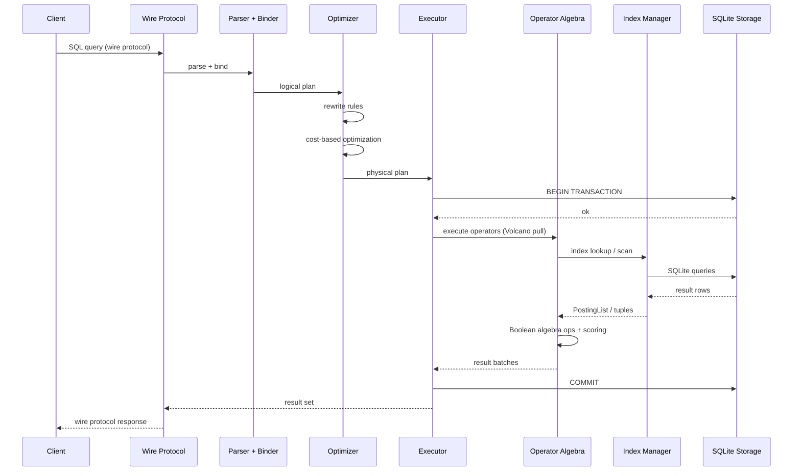
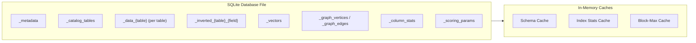
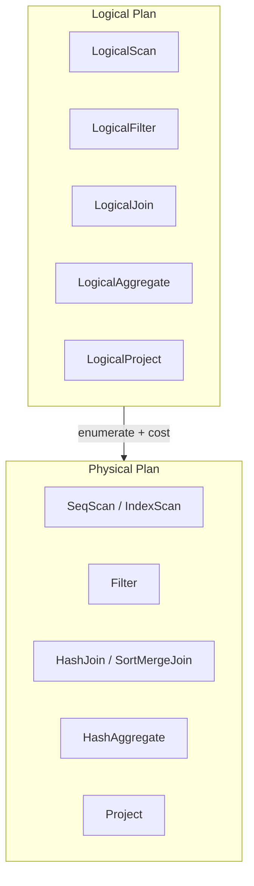

# UQA Database Implementation Plan

**Project**: UQA (Unified Query Algebra) SQL Database
**Author**: Jaepil Jeong
**Date**: 2026-03-07
**Revised**: 2026-03-07
**Status**: Planning

---

## 1. Executive Summary

This document describes the plan for implementing a production-grade SQL database built on the Unified Query Algebra (UQA) framework defined across four papers (Jeong, 2023--2026). The system unifies relational, text retrieval, vector search, and graph query paradigms under a single algebraic structure, using posting lists as the universal abstraction.

A Python prototype exists that demonstrates the correctness of the algebraic foundations. This plan evolves the prototype into a production system. SQLite serves as the storage backend -- providing ACID transactions, WAL, crash recovery, and page management -- so that engineering effort focuses on the UQA-differentiating layers: indexes, scoring, fusion, cross-paradigm optimization, and the wire protocol.

The target system provides:

- SQLite-backed storage with ACID transactions and WAL
- Persistent B-tree, inverted, HNSW, and graph indexes
- Volcano-model query execution with vectorized processing
- Cost-based optimizer with cross-paradigm statistics
- PostgreSQL wire protocol compatibility

### 1.1 Design Principles

| Principle | Description |
|-----------|-------------|
| **Algebraic correctness** | All operations satisfy the Boolean algebra axioms from the papers |
| **Posting-list universality** | Every query paradigm produces posting lists; cross-paradigm composition via set operations |
| **Probabilistic scoring** | Bayesian BM25 calibrated probabilities and log-odds fusion are first-class citizens |
| **SQLite as foundation** | Leverage SQLite for storage, ACID, WAL, and crash recovery; build indexes and query engine on top |
| **Incremental evolution** | Evolve the working prototype; each phase produces a testable system |

### 1.2 Prototype Learnings

The Python prototype validated the algebraic foundations and identified key design constraints:

| Area | Prototype Finding | Production Implication |
|------|-------------------|----------------------|
| Posting list algebra | Boolean algebra axioms hold; two-pointer merge is the core primitive | Posting lists need skip pointers and block-max metadata for performance |
| Scoring | Bayesian BM25 calibration works; log-odds fusion is numerically stable | Scoring must be integrated into the scan operator, not a separate pass |
| Cross-paradigm queries | Composing text + vector + graph via posting lists works but needs careful ordering | Cost-based optimizer must understand cross-paradigm selectivity |
| SQL compilation | pglast (PostgreSQL parser) provides full SQL compatibility | Keep pglast; parsing is not the bottleneck |
| Storage | SQLite write-through persistence works; in-memory rebuild is the bottleneck at scale | Move primary data path to SQLite; eliminate in-memory rebuild |
| Concurrency | Single-threaded execution limits throughput | SQLite WAL mode enables concurrent readers; write serialization is acceptable initially |

### 1.3 Why Python + SQLite

The original plan called for a clean-room Rust implementation of page management, buffer pool, WAL, heap files, and catalog. These are exactly what SQLite already provides:

| Component | Custom Implementation | SQLite |
|-----------|----------------------|--------|
| Page management | 8 KB pages, free list | Built-in pager |
| Buffer pool | LRU-K replacement | Built-in page cache |
| WAL + crash recovery | Physiological logging, ARIES | Built-in WAL mode |
| Heap file + tuples | Slotted pages, MVCC headers | B-tree tables |
| System catalog | Self-hosting catalog tables | sqlite_master + custom tables |
| ACID transactions | Custom lock manager | Built-in |

By using SQLite, Phase 1 (8 weeks of low-level storage work) is replaced by a much smaller effort to restructure the existing storage layer. Engineering time shifts to the UQA-differentiating work: persistent indexes, cross-paradigm optimization, and the wire protocol.

---

## 2. Target Architecture

### 2.1 System Architecture

```mermaid
graph TB
    subgraph Clients["Client Layer"]
        PGWire["PostgreSQL Wire Protocol"]
        PyAPI["Python API (in-process)"]
        USQL["usql (interactive shell)"]
    end

    subgraph Frontend["Query Frontend"]
        Parser["SQL Parser (pglast)"]
        Binder["Binder / Name Resolution"]
        TypeChecker["Type Checker"]
    end

    subgraph Optimizer["Query Optimizer"]
        LogicalPlan["Logical Plan Builder"]
        Rewriter["Rewrite Engine"]
        CostOptimizer["Cost-Based Optimizer"]
        PhysicalPlan["Physical Plan Generator"]
    end

    subgraph Executor["Execution Engine"]
        Volcano["Volcano Iterator Model"]
        VectorizedOps["Vectorized Batch Processing"]
        ExprEval["Expression Evaluator"]
    end

    subgraph Algebra["UQA Operator Algebra"]
        BoolOps["Boolean Ops"]
        ScanOps["Scan Operators"]
        JoinOps["Join Operators"]
        AggOps["Aggregation Operators"]
        ScoreOps["Scoring Operators"]
        FusionOps["Fusion Operators"]
        GraphOps["Graph Operators"]
    end

    subgraph IndexMgr["Index Manager"]
        BTree["B-Tree Index (SQLite)"]
        Inverted["Inverted Index"]
        HNSW["HNSW Vector Index"]
        GraphIdx["Graph Adjacency Index"]
        BlockMax["Block-Max Index"]
    end

    subgraph Storage["Storage Engine (SQLite)"]
        SQLiteDB["SQLite Database"]
        WAL["SQLite WAL"]
        Catalog["System Catalog"]
        HeapTables["Heap Tables (SQLite B-trees)"]
    end

    Clients --> Frontend
    Frontend --> Optimizer
    Optimizer --> Executor
    Executor --> Algebra
    Algebra --> IndexMgr
    Algebra --> Storage
    IndexMgr --> Storage
```



### 2.2 Data Flow



### 2.3 Storage Layer Architecture

The storage layer uses SQLite as the single source of truth. No in-memory rebuild on startup -- all reads go through SQLite.



**Key change from prototype**: Data tables (`_data_{table}`) store typed columns directly in SQLite instead of JSON blobs. This enables SQLite's built-in B-tree indexes for equality/range queries and eliminates JSON serialization overhead.

---

## 3. Implementation Phases

### Phase 1: Storage Engine Restructuring

**Goal**: Restructure the storage layer so SQLite is the single source of truth. Eliminate in-memory data structures as primary storage. Data reads go through SQLite; caches are derived and invalidated, not rebuilt.

**Duration**: 3 weeks

#### 3.1.1 Per-Table SQLite Storage

Replace the current model (in-memory dict + JSON write-through) with typed SQLite tables.

**Current model**:
```python
# Per-table: DocumentStore (dict) + Catalog (JSON blobs in SQLite)
table.document_store.put(doc_id, {"name": "Alice", "age": 30})
catalog.save_document("users", doc_id, {"name": "Alice", "age": 30})
```

**New model**:
```python
# Per-table: SQLite table with typed columns
# CREATE TABLE _data_users (
#     _rowid INTEGER PRIMARY KEY,
#     name TEXT,
#     age INTEGER
# )
storage.insert("users", {"name": "Alice", "age": 30})
```

**Design decisions**:

- Each UQA table maps to a SQLite table `_data_{table_name}` with typed columns
- Column types mapped: INT -> INTEGER, TEXT -> TEXT, FLOAT -> REAL, BOOL -> INTEGER, BYTES -> BLOB
- `_rowid` is the implicit primary key (SQLite rowid), serves as doc_id
- User-defined PRIMARY KEY maps to a UNIQUE constraint + SQLite index
- NOT NULL, DEFAULT constraints applied at SQLite level
- SERIAL/BIGSERIAL maps to SQLite INTEGER PRIMARY KEY AUTOINCREMENT

#### 3.1.2 Inverted Index Persistence

Move the inverted index from in-memory dict to SQLite tables.

**Current model**:
```python
# In-memory: dict[(field, term)] -> list[PostingEntry]
inverted_index._index[("content", "hello")] = [PostingEntry(doc_id=1, ...), ...]
```

**New model**:
```python
# SQLite table per (table, field):
# CREATE TABLE _inverted_users_content (
#     term TEXT NOT NULL,
#     doc_id INTEGER NOT NULL,
#     tf INTEGER NOT NULL,
#     positions TEXT NOT NULL,
#     PRIMARY KEY (term, doc_id)
# )
```

**Design decisions**:

- One SQLite table per (table_name, field_name) pair for isolation and query efficiency
- `PRIMARY KEY (term, doc_id)` ensures entries are stored sorted by (term, doc_id) in SQLite's B-tree
- This gives us term-then-doc_id ordering for free -- posting list iteration is a range scan
- Term-level statistics (df, total_tf) stored in a companion `_inverted_stats_{table}_{field}` table
- Field-level statistics (total_docs, avg_doc_length) stored in `_field_stats_{table}` table
- Block-max scores computed lazily and cached in memory

#### 3.1.3 System Catalog

Restructure the catalog to be the source of truth for all metadata.

**Tables**:

| SQLite Table | Purpose |
|---|---|
| `_metadata` | Key-value engine configuration |
| `_catalog_tables` | Table schemas (name, columns, constraints) |
| `_catalog_indexes` | Index definitions (name, type, table, columns, parameters) |
| `_catalog_sequences` | Auto-increment sequences |
| `_field_stats_{table}` | Per-field inverted index statistics (total_docs, avg_doc_length) |
| `_column_stats` | Per-column statistics for optimizer (distinct, min, max, histogram) |
| `_scoring_params` | Bayesian calibration parameters |

#### 3.1.4 Engine Restructuring

Refactor `Engine` to use SQLite-backed storage directly.

**Key changes**:

1. Remove `DocumentStore` as primary storage -- replaced by per-table SQLite tables
2. Remove `InvertedIndex` as primary storage -- replaced by per-field SQLite tables
3. `Table` class becomes a thin wrapper over SQLite table metadata
4. Sequential scan = `SELECT * FROM _data_{table}`
5. Insert = `INSERT INTO _data_{table}` + update inverted index SQLite tables
6. Delete = `DELETE FROM _data_{table}` + update inverted index
7. Keep `HNSWIndex` in-memory with SQLite persistence (hnswlib does not support SQLite natively)
8. Keep `GraphStore` in-memory with SQLite persistence (graph traversal needs adjacency lists in memory)

**What stays in memory (caches, not source of truth)**:

- Schema cache: `dict[str, TableSchema]` -- invalidated on DDL
- Block-max cache: `dict[(table, field, term), list[float]]` -- rebuilt from inverted index tables
- HNSW index: hnswlib in-memory -- rebuilt from `_vectors` table on startup
- Graph store: adjacency lists -- rebuilt from `_graph_vertices`/`_graph_edges` on startup

#### 3.1.5 Migration Path

The restructuring must be backward-compatible with existing databases:

1. Detect old-format database (has `_documents` table with JSON blobs)
2. Create new typed `_data_{table}` tables from `_catalog_tables` schema
3. Migrate data from `_documents` JSON to typed columns
4. Create new `_inverted_{table}_{field}` tables from `_postings`
5. Drop old tables after migration
6. Bump `_metadata` version number

---

### Phase 2: Index Infrastructure

**Goal**: Implement persistent index structures for all four paradigms. All indexes produce `PostingList` as output.

**Duration**: 8 weeks

#### 3.2.1 SQLite B-Tree Index (Relational)

SQLite already provides B-tree indexes. Wrap them to produce `PostingList`.

```python
# CREATE INDEX idx_users_age ON _data_users (age);
# Query: SELECT _rowid FROM _data_users WHERE age BETWEEN 20 AND 30;
# Result: PostingList of matching rowids
```

**Implementation**:

- `CREATE INDEX` in UQA maps to `CREATE INDEX` on the corresponding `_data_{table}` SQLite table
- Range scan: `SELECT _rowid FROM _data_{table} WHERE col op value` -> PostingList
- Equality: `SELECT _rowid FROM _data_{table} WHERE col = value` -> PostingList
- Multi-column: `CREATE INDEX idx ON _data_{table} (col1, col2)`
- Index-only scan when all projected columns are in the index

#### 3.2.2 Persistent Inverted Index

The inverted index is already in SQLite (Phase 1). Phase 2 adds performance structures:

**Skip pointers**:

- Store every 128th doc_id as a skip entry in a `_inverted_skip_{table}_{field}` table
- Enables fast forward-seek during posting list intersection
- Skip table: `(term TEXT, skip_doc_id INTEGER, offset INTEGER)`

**Block-max scores**:

- Store per-block (128 entries) maximum BM25 scores
- Table: `_inverted_blockmax_{table}_{field}` with `(term TEXT, block_id INTEGER, max_score REAL)`
- Enables BMW (Block-Max WAND) optimization

**VByte encoding** (optional optimization):

- Store doc_id gaps and positions as variable-byte encoded blobs instead of individual rows
- Reduces storage and improves sequential scan performance
- Table: `_inverted_packed_{table}_{field}` with `(term TEXT, packed_data BLOB, entry_count INTEGER)`

#### 3.2.3 Persistent HNSW Index

The HNSW index stores vector embeddings for approximate nearest neighbor search.

**Current model**: hnswlib in-memory, persisted as binary blobs in `_vectors`.

**New model**: Keep hnswlib for search, but add persistent graph structure in SQLite:

```sql
CREATE TABLE _hnsw_{table}_{field} (
    node_id    INTEGER PRIMARY KEY,
    doc_id     INTEGER NOT NULL,
    layer      INTEGER NOT NULL,
    vector     BLOB NOT NULL,
    neighbors  BLOB NOT NULL  -- packed neighbor lists per layer
);
CREATE TABLE _hnsw_meta_{table}_{field} (
    key   TEXT PRIMARY KEY,
    value TEXT NOT NULL  -- dimensions, M, ef_construction, entry_point, max_layer
);
```

**Design decisions**:

- M = 16, ef_construction = 200 (configurable per index)
- Vectors stored as float32 blobs (dimensions * 4 bytes)
- Neighbor lists packed as arrays of int32 per layer
- On startup: rebuild hnswlib index from SQLite tables (fast -- just insert vectors + set neighbors)
- Incremental updates: insert into both hnswlib and SQLite

**SQL**:

```sql
CREATE VECTOR INDEX idx_embedding ON articles (embedding)
    WITH (dimensions = 768, m = 16, ef_construction = 200);
```

#### 3.2.4 Persistent Graph Index

The graph index stores vertices and edges with adjacency structure.

**Current model**: in-memory `GraphStore` with dicts.

**New model**: SQLite tables with adjacency indexing:

```sql
CREATE TABLE _graph_vertices (
    vertex_id       INTEGER PRIMARY KEY,
    properties_json TEXT NOT NULL
);
CREATE TABLE _graph_edges (
    edge_id    INTEGER PRIMARY KEY AUTOINCREMENT,
    source_id  INTEGER NOT NULL,
    target_id  INTEGER NOT NULL,
    label      TEXT NOT NULL,
    properties_json TEXT NOT NULL
);
CREATE INDEX _graph_edges_out ON _graph_edges (source_id, label);
CREATE INDEX _graph_edges_in ON _graph_edges (target_id, label);
CREATE INDEX _graph_edges_label ON _graph_edges (label);
```

**Design decisions**:

- Adjacency queries use SQLite indexes: `SELECT target_id FROM _graph_edges WHERE source_id = ? AND label = ?`
- For graph traversal (BFS/DFS), load adjacency lists into memory on first access, cache by (vertex, label)
- For RPQ (Regular Path Queries), use iterative SQLite queries per hop
- Graph pattern matching: compile to SQL joins over `_graph_edges`

#### 3.2.5 Unified Index Manager

```python
class IndexManager:
    """Manages all index types. All indexes produce PostingList."""

    def create_index(self, index_def: IndexDef) -> None: ...
    def drop_index(self, name: str) -> None: ...
    def get_index(self, name: str) -> Index: ...
    def scan(self, index_name: str, predicate: Predicate) -> PostingList: ...
```

All index types implement a common `Index` interface that produces `PostingList`:

```python
class Index(ABC):
    def scan(self, predicate: Predicate) -> PostingList: ...
    def estimate_cardinality(self, predicate: Predicate) -> int: ...
    def scan_cost(self, predicate: Predicate) -> float: ...
```

---

### Phase 3: Transaction Manager

**Goal**: Multi-statement transactions with snapshot isolation.

**Duration**: 4 weeks

#### 3.3.1 SQLite Transaction Modes

Leverage SQLite's built-in transaction support:

- WAL mode for concurrent readers + single writer
- `BEGIN IMMEDIATE` for write transactions (prevents writer starvation)
- `SAVEPOINT` for nested transactions
- Snapshot isolation via SQLite's WAL read-only snapshots

#### 3.3.2 Connection Pool

```python
class ConnectionPool:
    """Manages SQLite connections for concurrent access."""

    def get_reader(self) -> sqlite3.Connection: ...
    def get_writer(self) -> sqlite3.Connection: ...
    def release(self, conn: sqlite3.Connection) -> None: ...
```

**Design decisions**:

- One writer connection (SQLite limitation), multiple reader connections
- Writer connection uses `BEGIN IMMEDIATE`
- Reader connections use `BEGIN DEFERRED` (read-only)
- Connection pool size configurable (default: 1 writer + 4 readers)

#### 3.3.3 Transaction API

```python
class Transaction:
    def __init__(self, conn: sqlite3.Connection, txn_id: int): ...
    def commit(self) -> None: ...
    def rollback(self) -> None: ...
    def savepoint(self, name: str) -> None: ...
    def release_savepoint(self, name: str) -> None: ...
    def rollback_to(self, name: str) -> None: ...
```

**Integration with Engine**:

- `Engine.begin()` -> Transaction
- `Engine.sql()` accepts optional Transaction parameter
- Auto-commit mode (default): each statement is its own transaction
- Explicit transaction: `BEGIN` / `COMMIT` / `ROLLBACK` via SQL

---

### Phase 4: Execution Engine

**Goal**: Volcano iterator model with vectorized batch processing for efficient query execution.

**Duration**: 6 weeks

#### 3.4.1 Volcano Iterator Model

```python
class PhysicalOperator(ABC):
    def open(self) -> None: ...
    def next(self) -> Batch | None: ...
    def close(self) -> None: ...
```

**Operators**:

| Operator | Description |
|----------|-------------|
| `SeqScanOp` | Sequential scan via `SELECT * FROM _data_{table}` |
| `IndexScanOp` | Index scan via SQLite index |
| `PostingListScanOp` | Inverted index scan for a term |
| `PostingListIntersectOp` | Two-pointer intersection of posting lists |
| `PostingListUnionOp` | Merge-union of posting lists |
| `BM25ScoreOp` | BM25 scoring over posting list |
| `BayesianBM25ScoreOp` | Bayesian BM25 probability scoring |
| `WANDTopKOp` | WAND top-k with block-max optimization |
| `HNSWSearchOp` | HNSW approximate nearest neighbor search |
| `GraphTraverseOp` | BFS/DFS graph traversal |
| `GraphPatternMatchOp` | Graph pattern matching via join compilation |
| `RPQOp` | Regular path query evaluation |
| `LogOddsFuseOp` | Log-odds fusion of multiple signals |
| `HashJoinOp` | Hash join |
| `SortMergeJoinOp` | Sort-merge join |
| `HashAggOp` | Hash aggregation |
| `SortOp` | External sort (spill to temp SQLite table) |
| `LimitOp` | Limit/offset |
| `ProjectOp` | Column projection |
| `FilterOp` | Predicate evaluation |

#### 3.4.2 Batch Processing

```python
@dataclass
class Batch:
    columns: dict[str, ColumnVector]
    selection: list[int] | None  # Selection vector for filter pushdown
    size: int

@dataclass
class ColumnVector:
    data: np.ndarray | list
    nulls: np.ndarray  # Boolean null bitmap
    dtype: DataType
```

**Design decisions**:

- Batch size: 1024 rows (configurable)
- NumPy arrays for numeric columns (vectorized operations)
- Selection vectors for predicate pushdown (avoid materializing filtered rows)
- Spill to temporary SQLite tables for sort and hash aggregation when memory budget exceeded

#### 3.4.3 Expression Evaluator

```python
class ExprEvaluator:
    def evaluate(self, expr: Expr, batch: Batch) -> ColumnVector: ...
```

Supports: arithmetic, comparison, logical, string functions, CASE, CAST, IS NULL, text_match, bayesian_match, knn_match, traverse_match, fuse_log_odds, fuse_prob_and/or/not.

---

### Phase 5: Query Optimizer

**Goal**: Cost-based optimization with cross-paradigm awareness.

**Duration**: 6 weeks

#### 3.5.1 Plan Representation



#### 3.5.2 Rewrite Rules

| Rule | Description |
|------|-------------|
| Filter pushdown | Push predicates below joins and aggregations |
| Predicate pushdown into index | Convert `WHERE col = val` to index scan |
| Text predicate to inverted scan | Convert `text_match()` to PostingListScanOp |
| Vector predicate to HNSW scan | Convert `knn_match()` to HNSWSearchOp |
| Graph predicate to traversal | Convert `traverse_match()` to GraphTraverseOp |
| Intersect reordering | Order posting list intersections by ascending cardinality |
| WAND conversion | Convert multi-term text search to WANDTopKOp when top-k is requested |
| Fusion signal ordering | Order fusion inputs by descending selectivity |
| Join reordering (DPccp) | Optimal join ordering via DPccp (Moerkotte & Neumann, 2006) — enumerates connected subgraph complement pairs; O(3^n) DP for bushy trees; greedy fallback for 16+ relations. **Implemented.** |
| Subquery decorrelation | Convert correlated subqueries to joins |

#### 3.5.3 Cost Model

```python
class CostModel:
    def estimate_cost(self, plan: PhysicalPlan) -> Cost: ...

@dataclass
class Cost:
    cpu: float    # CPU cycles (arbitrary units)
    io: float     # SQLite page reads
    rows: float   # Estimated output cardinality
```

**Per-operator cost formulas**:

| Operator | Cost Formula |
|----------|-------------|
| SeqScan | io = pages(table), cpu = rows(table) |
| IndexScan | io = log2(rows) + selectivity * pages, cpu = selectivity * rows |
| InvertedScan | io = df(term) / entries_per_page, cpu = df(term) |
| HNSWSearch | cpu = ef_search * log2(N), io = 0 (in-memory) |
| GraphTraverse | cpu = branching_factor ^ hops, io = hops * avg_degree |
| HashJoin | io = pages(left) + pages(right), cpu = rows(left) + rows(right) |
| Sort | io = 2 * pages * ceil(log_B(pages)), cpu = rows * log2(rows) |

#### 3.5.4 Statistics

Statistics stored in `_column_stats` and `_field_stats_{table}`:

- **Relational**: NDV (number of distinct values), null fraction, min/max, histogram (equi-depth), MCV (most common values)
- **Text**: Per-term df (document frequency), per-field total_docs, avg_doc_length
- **Vector**: Index size, average distance to centroid
- **Graph**: Vertex count, edge count, per-label degree distribution

---

### Phase 6: Advanced SQL Features

**Goal**: Subqueries, CTEs, window functions, views, prepared statements.

**Duration**: 6 weeks

#### 3.6.1 Subqueries

- Scalar subqueries: execute once, cache result
- EXISTS: semi-join conversion
- IN: hash semi-join
- Correlated: decorrelation to join when possible; otherwise nested-loop

#### 3.6.2 Common Table Expressions (CTEs)

- Non-recursive: materialize into temp SQLite table or inline if referenced once
- Recursive: iterative evaluation with convergence check

#### 3.6.3 Window Functions

- ROW_NUMBER, RANK, DENSE_RANK, NTILE
- LAG, LEAD, FIRST_VALUE, LAST_VALUE
- Aggregate functions with OVER (PARTITION BY ... ORDER BY ... ROWS/RANGE ...)
- Implementation: sort by partition key + order key, then streaming evaluation

#### 3.6.4 Views

- CREATE VIEW: store query text in catalog
- Query expansion: inline view definition at parse time
- No materialized views in this phase

#### 3.6.5 Prepared Statements

- PREPARE: parse + optimize, store physical plan template
- EXECUTE: substitute parameters, execute
- DEALLOCATE: release plan

---

### Phase 7: PostgreSQL Wire Protocol

**Goal**: Accept connections from psql, JDBC, psycopg2, and other PostgreSQL clients.

**Duration**: 6 weeks

#### 3.7.1 Protocol Messages

Implement PostgreSQL v3 wire protocol:

| Message | Direction | Purpose |
|---------|-----------|---------|
| StartupMessage | Client -> Server | Connection initiation |
| AuthenticationOk | Server -> Client | Authentication success |
| Query | Client -> Server | Simple query |
| Parse/Bind/Execute | Client -> Server | Extended query protocol |
| RowDescription | Server -> Client | Column metadata |
| DataRow | Server -> Client | Result row |
| CommandComplete | Server -> Client | Statement completion |
| ErrorResponse | Server -> Client | Error reporting |
| ReadyForQuery | Server -> Client | Transaction status |

#### 3.7.2 Server Architecture

```python
class PGServer:
    """PostgreSQL-compatible server using asyncio."""

    def __init__(self, engine: Engine, host: str, port: int): ...
    async def serve(self) -> None: ...
```

**Design decisions**:

- asyncio-based event loop (Python 3.12+)
- Default port: 5433 (avoid conflict with PostgreSQL on 5432)
- Authentication: trust (local), MD5 password
- TLS: optional, via Python ssl module
- One Engine instance shared across connections (SQLite handles concurrency)

#### 3.7.3 Session State

Per-connection state:

- Transaction status (idle, in transaction, failed)
- Prepared statements
- Portal state (extended query protocol)
- Client encoding, timezone, search_path

---

### Phase 8: Cross-Paradigm Query Optimization

**Goal**: Optimization strategies specific to multi-paradigm queries.

**Duration**: 6 weeks

#### 3.8.1 Paradigm-Aware Cost Model

Extend the cost model to handle cross-paradigm queries:

- **Text-first strategy**: Use inverted index to get candidate set, then filter/score
- **Vector-first strategy**: Use HNSW for initial candidates, then filter
- **Graph-first strategy**: Use graph traversal for topology, then score
- **Parallel strategy**: Execute paradigm-specific subqueries in parallel, fuse results

#### 3.8.2 Posting List Materialization Points

Decide when to materialize intermediate posting lists:

- Lazy evaluation: stream entries through the operator tree
- Eager materialization: collect into memory when (a) result is small, and (b) accessed multiple times
- Heuristic: materialize if estimated cardinality < 10,000 and fan-out > 1

#### 3.8.3 WAND + Filter Integration

Integrate WAND/BMW scoring with non-text predicates:

- Interleave WAND iteration with filter evaluation
- Skip scoring for documents that fail structural predicates
- Maintain WAND safety invariant: threshold updates only after full document evaluation

#### 3.8.4 Fusion Optimization

Optimize multi-signal fusion queries (log-odds, probabilistic):

- Signal ordering: evaluate cheapest signals first for early termination
- Threshold propagation: propagate top-k threshold into component signals
- Partial evaluation: skip signals that cannot change the ranking

---

### Phase 9: Performance and Scalability

**Goal**: Parallel execution, memory management, monitoring.

**Duration**: 6 weeks

#### 3.9.1 Parallel Operators

- Parallel sequential scan: partition table by rowid ranges
- Parallel hash join: partition both inputs by join key hash
- Parallel aggregation: partition, local aggregate, merge
- Parallel sort: partition, local sort, merge sort

**Non-parallelizable** (execute single-threaded):
- HNSW search (hnswlib is single-threaded per query)
- Graph BFS/DFS (sequential by nature)

**Implementation**: Python `concurrent.futures.ThreadPoolExecutor` for I/O-bound work; optional `ProcessPoolExecutor` for CPU-bound scoring.

#### 3.9.2 Memory Management

- Per-operator memory budget (configurable, default 64 MB total)
- Sort spill: write sorted runs to temp SQLite table, merge
- Hash join spill: partition to temp tables, recursive join
- Aggregation spill: partition by group key hash

#### 3.9.3 Monitoring

- EXPLAIN ANALYZE: execution statistics per operator (rows, time, memory)
- `uqa_stat_activity`: active queries, wait events
- `uqa_stat_tables`: per-table scan counts, row estimates vs actual
- `uqa_stat_indexes`: per-index scan counts, hit ratios
- Buffer pool (SQLite cache) hit ratio via `PRAGMA cache_spill` and `sqlite3_status()`

---

## 4. Phase Summary

| Phase | Goal | Duration | Key Deliverable |
|-------|------|----------|-----------------|
| 1 | Storage Engine Restructuring | 3 weeks | SQLite as single source of truth, typed tables, inverted index in SQLite |
| 2 | Index Infrastructure | 8 weeks | Persistent B-tree (SQLite), inverted (skip + block-max), HNSW, graph indexes |
| 3 | Transaction Manager | 4 weeks | Multi-statement transactions, connection pool, snapshot isolation |
| 4 | Execution Engine | 6 weeks | Volcano iterator, batch processing, expression evaluator |
| 5 | Query Optimizer | 6 weeks | Cost-based optimization, cross-paradigm statistics |
| 6 | Advanced SQL Features | 6 weeks | Subqueries, CTEs, window functions, views, prepared statements |
| 7 | PostgreSQL Wire Protocol | 6 weeks | psql/JDBC/psycopg2 client compatibility |
| 8 | Cross-Paradigm Optimization | 6 weeks | Multi-paradigm query strategies, fusion optimization |
| 9 | Performance and Scalability | 6 weeks | Parallel execution, memory management, monitoring |
| **Total** | | **51 weeks** | |

---

## 5. Dependencies

### Python Dependencies

| Package | Purpose | Phase |
|---------|---------|-------|
| pglast | PostgreSQL SQL parser | Existing |
| numpy | Vectorized batch processing, vector operations | Existing |
| hnswlib | HNSW approximate nearest neighbor search | Existing |
| sqlite3 | Storage engine (stdlib) | Phase 1 |
| asyncio | Wire protocol server (stdlib) | Phase 7 |

### Development Dependencies

| Package | Purpose |
|---------|---------|
| pytest | Test framework |
| pytest-asyncio | Async test support |
| psycopg2 | Wire protocol integration testing |

---

## 6. Risk Assessment

| Risk | Impact | Mitigation |
|------|--------|------------|
| SQLite write throughput bottleneck | Medium | WAL mode + batch writes; monitor with benchmarks |
| SQLite single-writer limitation | Medium | Connection pool with reader/writer separation |
| hnswlib memory footprint | High | Quantization, index partitioning, lazy loading |
| Graph traversal performance | Medium | Adjacency list caching, bounded hop count |
| pglast compatibility gaps | Low | Well-tested; fallback to manual parsing for extensions |
| Python GIL limits CPU parallelism | Medium | ProcessPoolExecutor for CPU-bound scoring; consider PyO3 for hot paths |
