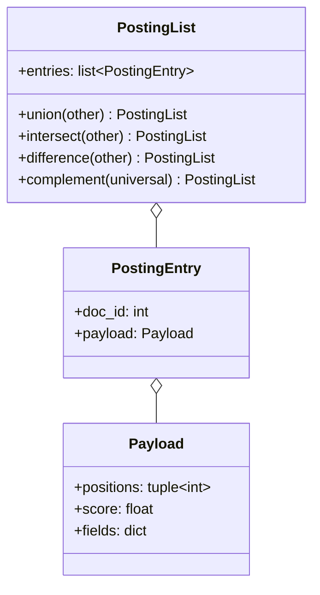
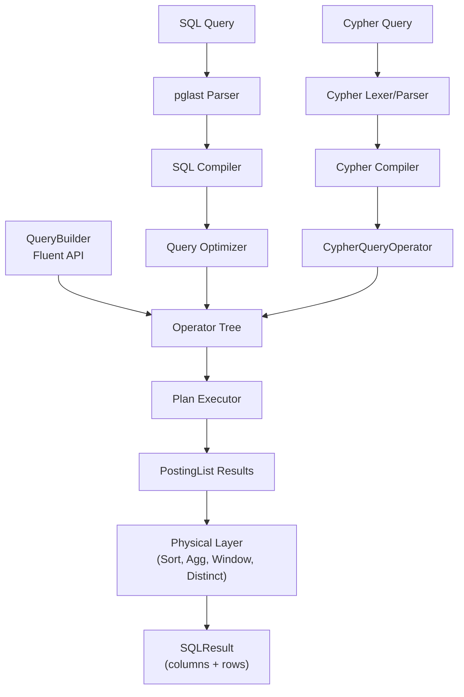
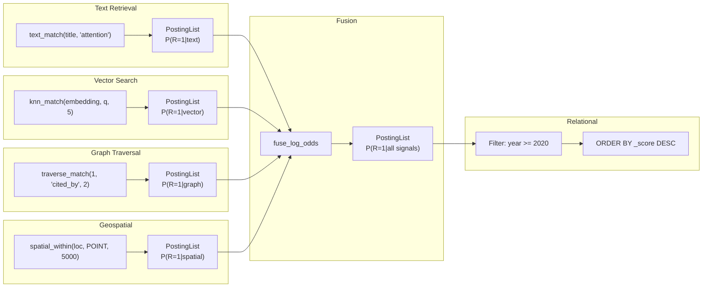

# UQA Technical Overview

**Jaepil Jeong**
Cognica, Inc.
*Email: jaepil@cognica.io*
Date: Mar 12, 2026

*"Logic pervades the world: the limits of the world are also its limits."*
— Ludwig Wittgenstein

This document provides a detailed technical exposition of the Unified Query Algebra, connecting the formal theory developed across three research papers to the concrete implementation in the UQA codebase.

[TOC]

---

## 1. Posting Lists as Universal Abstraction

### 1.1 The Core Thesis

UQA's foundational claim is that a single data structure — the **posting list** — can serve as the universal abstraction for result sets across relational, text retrieval, vector search, and graph query paradigms.

**Definition.** A posting list $L$ is an ordered sequence of entries:

$$
L = [(id_1, payload_1),\; (id_2, payload_2),\; \ldots,\; (id_n, payload_n)]
$$

where $id_i < id_j$ for all $i < j$ (sorted by document ID), and each payload carries positions, scores, and field values.

A bijection $PL: 2^{\mathcal{D}} \to \mathcal{L}$ maps document sets to posting lists and back, allowing set-theoretic reasoning to carry over directly.

### 1.2 Boolean Algebra

The structure $(\mathcal{L},\; \cup,\; \cap,\; \overline{\cdot},\; \emptyset,\; \mathcal{D})$ forms a **complete Boolean algebra** satisfying commutativity, associativity, distributivity, identity, and complement laws.

| Law | Equation |
|-----|----------|
| Commutativity | $A \cup B = B \cup A$, $A \cap B = B \cap A$ |
| Associativity | $(A \cup B) \cup C = A \cup (B \cup C)$ |
| Distributivity | $A \cap (B \cup C) = (A \cap B) \cup (A \cap C)$ |
| Identity | $A \cup \emptyset = A$, $A \cap \mathcal{D} = A$ |
| Complement | $A \cup \overline{A} = \mathcal{D}$, $A \cap \overline{A} = \emptyset$ |

This algebraic closure guarantees that any combination of AND, OR, and NOT across paradigms is well-defined, and query optimization can exploit lattice-theoretic rewrite rules.

### 1.3 Implementation

The `PostingList` class in `uqa/core/posting_list.py` implements the algebra directly:

```
PostingList
  entries: list[PostingEntry]       # sorted by doc_id
  union(other) -> PostingList       # two-pointer merge, all doc_ids
  intersect(other) -> PostingList   # two-pointer merge, shared doc_ids
  difference(other) -> PostingList  # entries in self but not other
  complement(universal) -> PostingList
```

Operator overloads map to algebra: `|` for union, `&` for intersect, `-` for difference. On merge, payloads are combined: positions are unioned, scores are summed, field dictionaries are merged. The `GeneralizedPostingList` extends this to join results where entries hold tuples of document IDs.



---

## 2. Cross-Paradigm Operators

### 2.1 Primitive Operators

Each paradigm maps into the posting list space through a primitive operator:

| Operator | Definition | Paradigm | Implementation |
|----------|-----------|----------|---------------|
| $T(t)$ | $PL(\lbrace d \in \mathcal{D} \mid t \in term(d, f) \rbrace)$ | Text retrieval | `TermOperator` |
| $V_\theta(q)$ | $PL(\lbrace d \in \mathcal{D} \mid sim(vec(d, f), q) \geq \theta \rbrace)$ | Vector search | `VectorSimilarityOperator` |
| $KNN_k(q)$ | $PL(D_k)$ where $\|D_k\| = k$, ranked by similarity | Vector search | `KNNOperator` |
| $Filter_{f,v}(L)$ | $L \cap PL(\lbrace d \in \mathcal{D} \mid d.f = v \rbrace)$ | Relational | `FilterOperator` |
| $Spatial_r(c)$ | $PL(\lbrace d \in \mathcal{D} \mid haversine(d.f, c) \leq r \rbrace)$ | Geospatial | `SpatialWithinOperator` |
| $Score_q(L)$ | $(L,\; [s_1, \ldots, s_{\|L\|}])$ | Scoring | `ScoreOperator` |

Because every operator produces a posting list, they compose freely:

$$
Hybrid_{t,q,\theta} = T(t) \cap V_\theta(q)
$$

### 2.2 Operator Monoid

All operators form a monoid under composition. The abstract base class `Operator` in `uqa/operators/base.py` exposes:

- `execute(context: ExecutionContext) -> PostingList` — the universal contract
- `compose(other) -> ComposedOperator` — sequential composition (monoid product)
- `cost_estimate(stats) -> float` — for optimizer decisions

The `ExecutionContext` bundles all storage backends: `DocumentStore`, `InvertedIndex`, `GraphStore`, `BlockMaxIndex`, `IndexManager`, `ParallelExecutor`, optional `vector_indexes` (HNSW, created explicitly via `CREATE INDEX ... USING hnsw`), and optional `spatial_indexes` (R*Tree, created via `CREATE INDEX ... USING rtree`).

### 2.3 Boolean Operators

| Operator | Theory | Implementation |
|----------|--------|---------------|
| Union $A_1 \cup A_2 \cup \ldots \cup A_n$ | Boolean OR | `UnionOperator` |
| Intersection $A_1 \cap A_2 \cap \ldots \cap A_n$ | Boolean AND | `IntersectOperator` |
| Complement $\mathcal{D} \setminus A$ | Boolean NOT | `ComplementOperator` |

`UnionOperator` and `IntersectOperator` support parallel execution of their operands via `ParallelExecutor` (ThreadPoolExecutor), with results reduced through `PostingList.union` or `PostingList.intersect`.

---

## 3. Scoring: From BM25 to Bayesian BM25

### 3.1 Classical BM25

Robertson and Zaragoza derived BM25 from a probabilistic model of term occurrence. The score for a document $d$ given query term $t$ is:

$$
BM25(d, t) = IDF(t) \cdot \frac{tf(t, d) \cdot (k_1 + 1)}{tf(t, d) + k_1 \cdot \left(1 - b + b \cdot \frac{|d|}{avgdl}\right)}
$$

where $IDF(t) = \ln\!\left(\frac{N - df(t) + 0.5}{df(t) + 0.5} + 1\right)$ is the Robertson-Sparck Jones inverse document frequency.

**Implementation.** `BM25Scorer` in `uqa/scoring/bm25.py` implements a numerically stable reformulation:

$$
score = w - \frac{w}{1 + f \cdot inv\_norm}
$$

where $w = boost \cdot IDF$ and $inv\_norm = 1 / (k_1 \cdot ((1-b) + b \cdot dl/avgdl))$.

The upper bound $ub(t) = boost \cdot IDF(t)$ supports safe document pruning in WAND/BMW.

### 3.2 The Probabilistic Relevance Gap

BM25 scores are not probabilities. They lie in $[0, +\infty)$ with query-dependent magnitudes, making them incompatible with other ranking signals and violating Robertson's own Probability Ranking Principle. For nearly five decades, this gap persisted.

### 3.3 Bayesian BM25

Bayesian BM25 closes the gap by applying Bayesian inference with a sigmoid likelihood model to transform BM25 scores into calibrated probabilities $P(R=1 \mid s) \in [0, 1]$.

**Sigmoid Posterior.** Under a symmetric likelihood assumption with log-linear likelihood ratio:

$$
P(R = 1 \mid s) = \sigma(\alpha(s - \beta))
$$

where $\sigma(x) = \frac{1}{1 + e^{-x}}$ is the logistic sigmoid.

**Three-Term Decomposition.** The full posterior decomposes in log-odds space (additive decomposition of Bayes' theorem):

$$
\text{logit}(P_{posterior}) = \underbrace{\text{logit}(L(s))}_{\text{likelihood}} + \underbrace{\text{logit}(b_r(f, \hat{n}))}_{\text{doc-dependent prior}} + \underbrace{\text{logit}(p)}_{\text{base rate}}
$$

where $L(s) = \sigma(\alpha(s-\beta))$ is the normalized likelihood ratio, $b_r(f, \hat{n})$ is a composite prior incorporating term frequency rarity and document length, and $p$ is the corpus-level base rate. This reduces expected calibration error by 68-77% without requiring relevance labels.

**Implementation.** `BayesianBM25Scorer` in `uqa/scoring/bayesian_bm25.py` delegates to the `bayesian-bm25` package, which implements the full three-term posterior with progressive hyperparameter estimation.

### 3.4 Vector Similarity

Cosine similarity $\cos\theta \in [-1, 1]$ is linearly calibrated to probability:

$$
P_{vec} = \frac{1 + \cos\theta}{2}
$$

This mapping is exact for the case where vector similarity represents angular proximity. `VectorScorer` in `uqa/scoring/vector.py` delegates to `bayesian-bm25`'s `cosine_to_probability()` for numerical stability.

---

## 4. Fusion: Combining Cross-Paradigm Signals

### 4.1 The Conjunction Shrinkage Problem

Given $n$ independent calibrated relevance signals, the naive probabilistic conjunction:

$$
P_{AND} = \prod_{i=1}^{n} P_i
$$

suffers from **conjunction shrinkage**: as $n$ increases, $P_{AND} \to 0$ even when all signals report high relevance. This violates the fundamental intuition that agreement among independent sources should increase confidence.

### 4.2 Log-Odds Conjunction

The log-odds conjunction resolves this by working in the natural parameter space of the Bernoulli distribution:

$$
P_{final} = \sigma\!\left(\frac{1}{n^{1-\alpha}} \sum_{i=1}^{n} \text{logit}(P_i)\right)
$$

where $\text{logit}(p) = \log\frac{p}{1-p}$ and $\alpha$ controls confidence scaling.

**Key properties:**

| Property | Guarantee |
|----------|-----------|
| Scale neutrality | All $P_i = p \implies P_{final} = p$ regardless of $n$ |
| Sign preservation | $\text{sgn}(\ell_{adjusted}) = \text{sgn}(\bar{\ell})$ |
| Irrelevance preservation | All $P_i < 0.5 \implies P_{final} < 0.5$ for all $n$ |
| Agreement amplification | All $P_i > 0.5 \implies P_{final} > \sigma(\bar{\ell})$ for $n \geq 2$ |

Setting $\alpha = 0.5$ yields the classical $\sqrt{n}$ confidence scaling law, where per-signal weight is $w_i = 1/\sqrt{n}$.

This is mathematically equivalent to the **normalized Logarithmic Opinion Pool** (Log-OP), also known as Hinton's **Product of Experts** (PoE, 2002):

$$
\text{logit}(P_{Log-OP}) = \sum_{i=1}^{n} \frac{1}{n} \text{logit}(P_i) = \bar{\ell}
$$

**Numerical comparison** ($n = 2$, $\alpha = 0.5$):

| $P_{text}$ | $P_{vec}$ | Product | Log-Odds | Interpretation |
|---|---|---|---|---|
| 0.9 | 0.9 | 0.81 | 0.96 | Strong agreement amplified |
| 0.7 | 0.7 | 0.49 | 0.77 | Moderate agreement preserved |
| 0.7 | 0.3 | 0.21 | 0.50 | Exact neutrality (logits cancel) |
| 0.3 | 0.3 | 0.09 | 0.23 | Irrelevance preserved |

### 4.3 Probabilistic Boolean Operations

For explicit Boolean query semantics:

| Operation | Formula | Log-space |
|-----------|---------|-----------|
| AND | $P = \prod P_i$ | $\log P = \sum \log P_i$ |
| OR | $P = 1 - \prod(1 - P_i)$ | $\log(1-P) = \sum \log(1-P_i)$ |
| NOT | $P = 1 - P_{signal}$ | |

All computed in log-space for numerical stability.

### 4.4 Implementation

| Function | Class | File |
|----------|-------|------|
| `fuse_log_odds(...)` | `LogOddsFusion` | `uqa/fusion/log_odds.py` |
| `fuse_prob_and(...)` | `ProbabilisticBoolean` | `uqa/fusion/boolean.py` |
| `fuse_prob_or(...)` | `ProbabilisticBoolean` | `uqa/fusion/boolean.py` |
| `fuse_prob_not(...)` | `ProbabilisticBoolean` | `uqa/fusion/boolean.py` |

In SQL:

```sql
SELECT title, _score FROM papers
WHERE fuse_log_odds(
    text_match(title, 'attention'),
    knn_match(embedding, ARRAY[0.1, 0.2, ...], 5)
) ORDER BY _score DESC;
```

---

## 5. Graph Extension

### 5.1 Graph-Posting List Isomorphism

The second paper extends the framework to graph data by establishing an isomorphism between graph posting lists and standard posting lists.

**Graph Posting List.** A graph posting list $L_G = [(id_1, G_1), \ldots, (id_n, G_n)]$ maps to standard posting lists via:

$$
\Phi(L_G) = PL\!\left(\bigcup_{i=1}^{n} \phi_{G \to D}(G_i)\right)
$$

This isomorphism preserves Boolean operations:

$$
\Phi(L_G^1 \cup_G L_G^2) = \Phi(L_G^1) \cup \Phi(L_G^2)
$$

$$
\Phi(L_G^1 \cap_G L_G^2) = \Phi(L_G^1) \cap \Phi(L_G^2)
$$

**Implementation.** `GraphPostingList` in `uqa/graph/posting_list.py` extends `PostingList`, providing `to_posting_list()` ($\Phi$) and `from_posting_list()` ($\Phi^{-1}$). Subgraph structure is encoded in `Payload.fields` as frozen sets of vertex/edge IDs.

### 5.2 Graph Operators

| Operator | Definition | Complexity | Implementation |
|----------|-----------|------------|---------------|
| $Traverse_{v,l,k}$ | BFS from $v$, edges matching $l$, up to $k$ hops | $O(\sum_{i=1}^{k} d^i)$ | `TraverseOperator` |
| $GMatch_P$ | Subgraph isomorphism via backtracking | $O(\|V_G\|^{\|V_P\|})$ (NP-complete) | `PatternMatchOperator` |
| $RPQ_R$ | Regular path query via NFA simulation | $O(\|V_G\|^2 \cdot \|R\|)$ | `RegularPathQueryOperator` |
| $VertexAgg_{p,f}$ | Aggregate property $p$ with function $f$ | $O(\|L_G\|)$ | `VertexAggregationOperator` |

### 5.3 Subgraph Isomorphism: Complexity and Mitigations

Pattern matching via subgraph isomorphism ($GMatch_P$) has worst-case complexity $O(\|V_G\|^{\|V_P\|})$ and is NP-complete. This is an inherent property of the problem itself — any system supporting general subgraph pattern matching faces the same theoretical bound. The key question is how to keep the **effective** search space tractable.

**Naive backtracking** iterates all $\|V_G\|$ vertices for each of the $\|V_P\|$ pattern variables in a fixed order, checking edge constraints only after all variables are assigned. For a pattern with $k$ variables on a graph with $n$ vertices, this explores up to $n^k$ complete assignments before discovering that most are invalid.

UQA applies three CSP (Constraint Satisfaction Problem) techniques that reduce the effective search space by orders of magnitude:

**1. Candidate Pre-computation with Arc Consistency.**
Before backtracking begins, each pattern variable's candidate set is computed by evaluating vertex constraints once against all graph vertices. Then an arc consistency fixpoint loop propagates edge constraints: if variable $A$ must connect to variable $B$ via a labeled edge, any candidate for $A$ that has no such outgoing edge to any candidate of $B$ is eliminated, and vice versa. This propagation repeats until no further reduction occurs.

$$
C_v^{(0)} = \{u \in V_G \mid u \text{ satisfies vertex constraints of } v\}
$$

$$
C_v^{(i+1)} = \{u \in C_v^{(i)} \mid \forall (v, w, l) \in E_P,\; \exists u' \in C_w^{(i)},\; (u, u', l) \in E_G\}
$$

This is computed to fixpoint ($C^{(i+1)} = C^{(i)}$), typically converging in 1-2 iterations. The reduction can be dramatic: on a graph with 1M vertices where only 1K have label `Person`, the candidate set shrinks by 1000x before any backtracking occurs.

**2. MRV (Minimum Remaining Values) Variable Ordering.**
At each recursion step, the algorithm selects the unassigned variable with the fewest remaining candidates — the "fail-first" heuristic. If one variable has 3 candidates and another has 10,000, trying the 3-candidate variable first means at most 3 branches explored before pruning occurs, rather than 10,000.

**3. Incremental Edge Validation.**
Instead of deferring all edge checks to the end (after all $k$ variables are assigned), each variable binding immediately validates all edge constraints connecting the newly bound variable to previously bound variables. Invalid partial assignments are pruned at depth 2 rather than depth $k$.

The combined effect:

| Optimization | Reduction Factor | Mechanism |
|---|---|---|
| Candidate pre-computation | $\|V_G\| \to \|C_v\|$ per variable | Domain initialization |
| Arc consistency | $\|C_v\| \to \|C_v'\| \leq \|C_v\|$ | Edge-based propagation |
| MRV ordering | Exponential pruning | Fail-first branching |
| Incremental edge validation | Early cutoff at depth $d \ll k$ | Forward checking |

In practice, Cypher patterns typically contain 3-7 nodes with label constraints, reducing the search to a small fraction of the graph. The theoretical $O(n^k)$ worst case manifests only for unlabeled patterns on dense graphs with no distinguishing constraints — a scenario rarely encountered in real workloads.

**Implementation.** `PatternMatchOperator` in `uqa/graph/operators.py` implements all three techniques. `CypherCompiler` in `uqa/graph/cypher/compiler.py` applies label-based candidate filtering via `vertices_by_label()` and incremental vertex/edge validation during path expansion. Variable-length relationship expansion uses BFS with `deque` for O(1) frontier access.

### 5.4 Regular Path Expressions

Regular path queries use an algebraic expression language over edge labels:

$$
R ::= l \;\mid\; R_1 \cdot R_2 \;\mid\; R_1 | R_2 \;\mid\; R^*
$$

The `RegularPathExpr` hierarchy (`Label`, `Concat`, `Alternation`, `KleeneStar`) in `uqa/graph/pattern.py` represents these expressions. The `RegularPathQueryOperator` uses Thompson's construction to build an NFA from the expression, then simulates it on the graph.

### 5.5 openCypher Integration

The `CypherCompiler` in `uqa/graph/cypher/` compiles openCypher queries into graph posting list operations:


Every Cypher clause transforms a **binding table** (represented as a `GraphPostingList`). The `CypherQueryOperator` integrates into the standard operator tree — it is not a bypass but a full posting-list citizen, visible in `EXPLAIN` output.

SQL integration via FROM-clause table functions:

```sql
SELECT * FROM cypher('social', $$
    MATCH (p:Person)-[:KNOWS]->(f:Person)
    WHERE p.age > 25
    RETURN p.name, f.name
$$) AS (person agtype, friend agtype);
```

---

## 6. System Architecture

### 6.1 Query Pipeline

All queries — regardless of entry point (SQL, Cypher, Fluent API) — produce intermediate and final results as posting lists:



### 6.2 SQL Compiler Pipeline

The SQL compiler in `uqa/sql/compiler.py` follows a staged pipeline:

1. **Parse.** pglast (PostgreSQL parser) produces an AST.
2. **Route.** Statement type dispatch (SELECT, INSERT, UPDATE, DELETE, DDL, utility).
3. **Compile SELECT:**
   - Materialize CTEs as temporary tables
   - Resolve FROM clause to (Table, source_op)
   - Create `ExecutionContext` from table storage
   - Process WHERE clause into operator tree
   - Optimize via `QueryOptimizer`
   - Execute operator tree to `PostingList`
   - Apply relational layer (GROUP BY, HAVING, ORDER BY, LIMIT, DISTINCT) via physical operators

### 6.3 Physical Execution

The physical layer in `uqa/execution/` uses the **Volcano iterator model**: each `PhysicalOperator` implements `open() / next() / close()`, pulling batches from children on demand (pipelined execution).

| Operator | Type | Strategy |
|----------|------|----------|
| `FilterOp` | Streaming | Vectorized Arrow compute for simple predicates; per-row fallback for LIKE, BETWEEN |
| `ExprFilterOp` | Streaming | Complex expressions via `ExprEvaluator` |
| `ProjectOp` | Streaming | Column selection |
| `ExprProjectOp` | Streaming | Vectorized Arrow compute for column refs and arithmetic; per-row fallback for complex expressions |
| `SortOp` | Blocking | Arrow-native `pc.sort_indices()` with Python stable sort fallback; external merge sort for disk spilling |
| `HashAggOp` | Blocking | Grace hash partitioning (spills to disk) |
| `DistinctOp` | Blocking | Hash partition dedup |
| `LimitOp` | Streaming | LIMIT/OFFSET |
| `WindowOp` | Blocking | Window function evaluation with bisect-based RANGE frame bounds |

### 6.4 Storage Architecture

Each SQL table maintains isolated storage instances:

```
Engine
+-- _tables: dict[str, Table]
|   +-- Table
|       +-- DocumentStore         (typed columnar storage)
|       +-- InvertedIndex         (term -> posting list per field)
|       +-- vector_indexes         (HNSW, created via CREATE INDEX ... USING hnsw)
|       +-- spatial_indexes        (R*Tree, created via CREATE INDEX ... USING rtree)
|       +-- ColumnStats           (per-column statistics for optimizer)
+-- _named_graphs: dict[str, GraphStore]
|   +-- GraphStore                (adjacency list + property maps)
+-- _foreign_servers: dict[str, ForeignServer]
+-- _foreign_tables: dict[str, ForeignTable]
+-- _fdw_handlers: dict[str, FDWHandler]
+-- _catalog: Catalog             (SQLite, write-through persistence)
+-- _transaction: Transaction     (BEGIN/COMMIT/ROLLBACK/SAVEPOINT)
```

When `db_path` is provided, all mutations are write-through to SQLite. On startup, `_load_from_catalog()` restores the full state.

### 6.5 Query Optimizer

The cost-based optimizer in `uqa/planner/` applies:

- **DPccp join order optimization** (Moerkotte & Neumann, 2006) — $O(3^n)$ dynamic programming over connected subgraph complement pairs for optimal bushy join trees; uses integer bitmask DP table, bytearray connectivity lookup, incremental connected subgraph enumeration, and canonical submask enumeration for efficient inner-loop execution
- Filter pushdown into intersections
- Vector threshold merge (same query vector)
- Intersect operand reordering by cardinality (cheapest first)
- Fusion signal reordering by cost
- R*Tree spatial index scan for POINT column range queries
- B-tree index scan substitution
- FDW predicate pushdown (comparison, IN, LIKE, ILIKE, BETWEEN)

Cardinality estimation uses equi-depth histograms and Most Common Values (MCV), with specialized estimators for text, vector, graph, and fusion operators.

---

## 7. Theory-to-Code Mapping

The table below maps each formal definition and theorem from the three papers to its concrete implementation:

### Paper 1: Unified Mathematical Framework

| Theory | Implementation |
|--------|---------------|
| Posting List (Definition 2.1.1) | `PostingList` in `uqa/core/posting_list.py` |
| Boolean Algebra (Theorem 2.1.2) | `union()`, `intersect()`, `difference()`, `complement()` |
| Generalized Posting List (Definition 4.1.2) | `GeneralizedPostingList` in `uqa/core/posting_list.py` |
| Operator Monoid (Theorem 3.2.3) | `Operator` ABC + `compose()` in `uqa/operators/base.py` |
| Term Operator $T(t)$ (Definition 3.1.1) | `TermOperator` in `uqa/operators/primitive.py` |
| Vector Operators $V_\theta$, $KNN_k$ (Definitions 3.1.2, 3.1.3) | `VectorSimilarityOperator`, `KNNOperator` |
| Spatial Operator $Spatial_r(c)$ | `SpatialWithinOperator` in `uqa/operators/primitive.py` |
| Filter Operator (Definition 3.1.4) | `FilterOperator` in `uqa/operators/primitive.py` |
| Score Operator (Definition 3.1.5) | `ScoreOperator` in `uqa/operators/primitive.py` |
| Hierarchical Documents (Definition 5.2.1) | `HierarchicalDocument` in `uqa/core/hierarchical.py` |
| BM25 (Definition 3.2.1) | `BM25Scorer` in `uqa/scoring/bm25.py` |
| UnionOperator | `UnionOperator` in `uqa/operators/boolean.py` |
| IntersectOperator | `IntersectOperator` in `uqa/operators/boolean.py` |
| ComplementOperator | `ComplementOperator` in `uqa/operators/boolean.py` |

### Paper 2: Graph Extension

| Theory | Implementation |
|--------|---------------|
| Graph-Posting List Isomorphism (Theorem 1.1.6) | `GraphPostingList` in `uqa/graph/posting_list.py` |
| Traversal Operator (Definition 2.2.1) | `TraverseOperator` in `uqa/graph/operators.py` |
| Pattern Match (Definition 5.2.2) | `PatternMatchOperator` in `uqa/graph/operators.py` |
| Regular Path Query (Definition 5.1.2) | `RegularPathQueryOperator` in `uqa/graph/operators.py` |
| Vertex Aggregation (Definition 2.2.3) | `VertexAggregationOperator` in `uqa/graph/operators.py` |
| Graph Pattern Expression (Definition 5.2.1) | `GraphPattern` in `uqa/graph/pattern.py` |
| Regular Path Expression (Definition 5.1.1) | `RegularPathExpr` hierarchy in `uqa/graph/pattern.py` |
| openCypher (cross-paradigm integration) | `CypherCompiler` in `uqa/graph/cypher/` |

### Paper 3: Bayesian BM25

| Theory | Implementation |
|--------|---------------|
| Sigmoid Posterior (Theorem 4.1.1) | `BayesianBM25Scorer.score()` in `uqa/scoring/bayesian_bm25.py` |
| Three-Term Decomposition (Theorem 4.4.2) | Two successive Bayes updates in `bayesian-bm25` package |
| Vector Calibration (Definition 7.1.2) | `VectorScorer.similarity_to_probability()` in `uqa/scoring/vector.py` |
| Probabilistic AND (Theorem 5.1.1) | `ProbabilisticBoolean.prob_and()` in `uqa/fusion/boolean.py` |
| Probabilistic OR (Theorem 5.2.1) | `ProbabilisticBoolean.prob_or()` in `uqa/fusion/boolean.py` |
| WAND Upper Bound (Theorem 6.1.2) | `BayesianBM25Scorer.upper_bound()` |

---

## 8. Cross-Paradigm Composition

The key invariant — **every query produces a PostingList** — enables seamless cross-paradigm composition:



In SQL, this is a single query:

```sql
SELECT title, _score FROM papers
WHERE fuse_log_odds(
    text_match(title, 'attention'),
    knn_match(embedding, ARRAY[0.1, 0.2, ...], 5),
    traverse_match(1, 'cited_by', 2)
) AND year >= 2020
ORDER BY _score DESC;
```

The query optimizer ensures efficient execution: each paradigm's operator executes independently (potentially in parallel), their posting lists are intersected via the fusion operator, and the relational filter is applied on the fused result.

---

## References

1. Jeong, J. (2023). A Unified Mathematical Framework for Query Algebras Across Heterogeneous Data Paradigms.

2. Jeong, J. (2024). Extending the Unified Mathematical Framework to Support Graph Data Structures.

3. Jeong, J. (2026). Bayesian BM25: A Probabilistic Framework for Hybrid Text and Vector Search.

