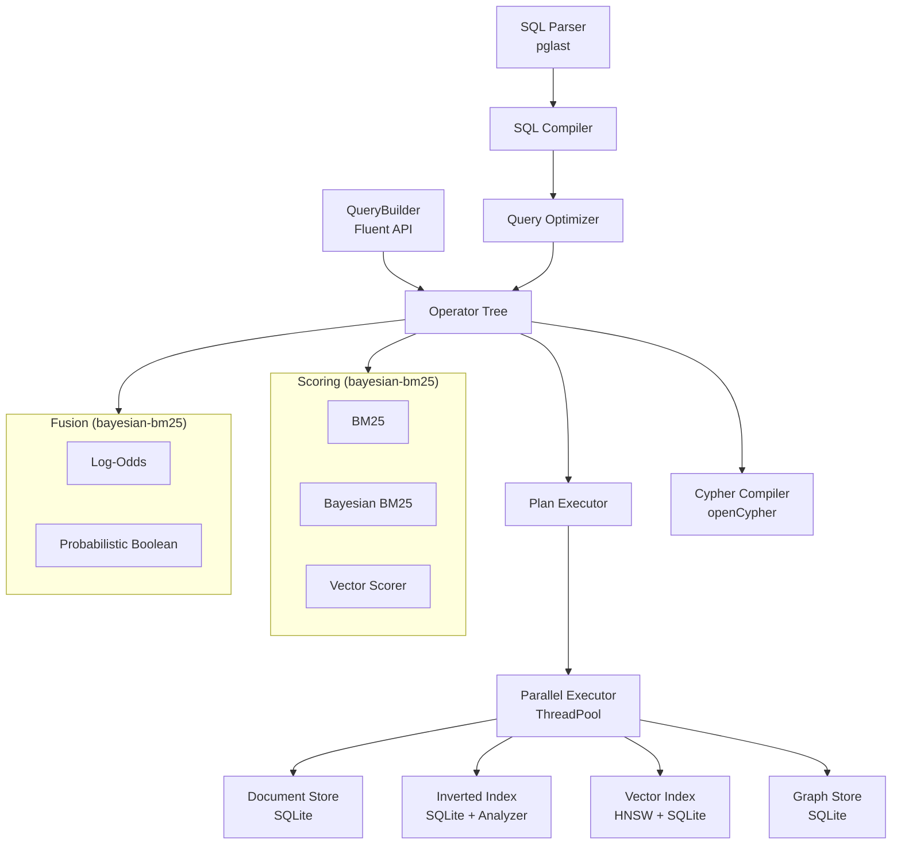

# UQA Reference Guide

[TOC]

## 1. Introduction

### 1.1 What is UQA?

UQA (Unified Query Algebra) is a database prototype that unifies four traditionally isolated data paradigms — relational SQL, full-text search, vector search, and graph queries — under a single algebraic structure, using **posting lists** as the universal abstraction.

Where conventional systems force users to stitch together a relational database, a search engine, a vector store, and a graph database — each with its own query language, data model, and operational overhead — UQA provides a single engine that speaks SQL enriched with cross-paradigm functions.

```sql
SELECT title, _score FROM papers
WHERE fuse_log_odds(
    text_match(title, 'attention'),
    knn_match(embedding, ARRAY[0.1, 0.2, ...], 5),
    traverse_match(1, 'cited_by', 2)
) AND year >= 2020
ORDER BY _score DESC;
```

This single query combines BM25 text scoring, KNN vector similarity, and graph traversal reachability into a fused relevance score, then applies a relational filter on publication year — an operation that would require coordinating three separate systems in a conventional stack.

### 1.2 Design Principles

UQA is built on three principles:

1. **Algebraic unification.** Every paradigm — relational filtering, term-based retrieval, vector similarity, graph traversal — produces the same data structure: an ordered posting list. Boolean algebra (union, intersection, complement) operates uniformly across all of them.

2. **Probabilistic scoring.** Relevance signals are not raw scores but calibrated probabilities in $[0, 1]$. This enables principled multi-signal fusion through Bayesian inference rather than ad-hoc weighting.

3. **SQL as the interface.** Standard SQL is extended with domain-specific functions (`text_match`, `knn_match`, `traverse`, `fuse_log_odds`) rather than replaced by a novel query language. Users retain the full power of relational SQL — joins, subqueries, CTEs, window functions, transactions — while gaining access to cross-paradigm operations.

### 1.3 Project Status

UQA is a research prototype implementing the theoretical framework described in a series of four papers (see Section 2). It includes a complete SQL compiler, SQLite-backed persistence, a cost-based query optimizer, parallel execution, and disk spilling. It is designed as a proof-of-concept for the unified query algebra rather than a production database.


## 2. Theoretical Foundations

UQA is grounded in four papers that progressively build the mathematical framework.

### 2.1 Paper 1: A Unified Mathematical Framework for Query Algebras Across Heterogeneous Data Paradigms (December 2023)

This foundational paper establishes **posting lists** as a universal abstraction for result sets across relational, text retrieval, and vector search paradigms. A posting list is an ordered sequence of (document_id, payload) pairs, where payloads carry paradigm-specific metadata — field values for relational queries, term positions and scores for text retrieval, similarity scores for vector search.

**Key results:**

- **Boolean algebra.** The set of posting lists under union, intersection, and complement forms a complete Boolean algebra isomorphic to the power set of documents (Theorem 2.1.2). This means any combination of cross-paradigm queries can be composed using the same three operations.

- **Operator calculus.** Primitive operators — $T$ (TermRetrieval), $V_\theta$ (VectorSimilarity), $KNN_k$, Filter, Score, Facet — are formally defined as functions producing posting lists. Their compositions form a monoid under function composition (Theorem 3.2.3), and derived operators for hybrid queries (HybridTextVector, SemanticFilter) are constructed from these primitives.

- **Join operations.** Cross-paradigm joins — TextVectorJoin, VectorRelationalJoin, and a generalized multi-paradigm join — are formally defined with proofs of commutativity (up to payload ordering) and associativity (Theorems 4.3.1, 4.3.2). Generalized posting lists carry multi-document tuples for join results.

- **Hierarchical data.** Path expressions and unnest operators handle nested JSON-like documents within the posting list framework.

- **Category theory.** A query category with posting lists as objects and operators as morphisms is established. Functors between paradigm-specific subcategories (relational, text, vector) formalize the cross-paradigm transformations. Natural transformations enable systematic rewriting rules for query optimization.

- **Query optimization.** Lattice-based rewriting rules — filter pushdown, vector threshold merge, intersect reordering by cardinality — are proven to preserve semantic equivalence while reducing computational cost.

### 2.2 Paper 2: Extending the Unified Mathematical Framework to Support Graph Data Structures (December 2024)

This paper extends the framework to incorporate graph data — vertices, edges, traversals, and pattern matching — as first-class citizens.

**Key results:**

- **Graph posting lists.** A graph posting list carries (id, subgraph) pairs. A bijective mapping between graph posting lists and standard posting lists establishes an isomorphism that preserves all Boolean algebra operations (Theorem 1.1.6).

- **Graph operators.** Three fundamental graph operators are defined: **Traverse** (BFS from a starting vertex with label filtering and hop limit), **PatternMatch** (subgraph isomorphism with vertex/edge constraints, optimized with candidate pre-computation, arc consistency pruning, MRV variable ordering, and incremental edge validation), and **Regular Path Query** (NFA-based evaluation of path expressions like `cited_by/cited_by`).

- **Cross-paradigm integration.** Operators for converting between graphs and relational data (ToGraph, FromGraph), graph-vector integration (vertex embeddings, vector-enhanced pattern matching), and graph-text integration (semantic graph search) are formally defined.

- **Complexity analysis.** Pattern matching is NP-complete in the worst case ($O(|V_G|^{|V_P|})$); regular path queries are polynomial ($O(|V|^2 \cdot |R|)$); traversal is $O(\sum_{i=1}^{k} d^i)$ where $d$ is the average degree.

### 2.3 Paper 3: Bayesian BM25 — A Probabilistic Framework for Hybrid Text and Vector Search (January 2026)

This paper addresses a five-decade gap in information retrieval: BM25 scores, despite being derived from a probabilistic model, are not probabilities. They are unbounded, query-dependent, and incompatible with other ranking signals. Bayesian BM25 closes this gap.

**The problem.** Standard BM25 scores range over $[0, +\infty)$. Directly combining them with bounded signals like cosine similarity ($[0, 1]$) causes signal dominance (Theorem 1.2.2). Reciprocal Rank Fusion (RRF) discards score magnitudes, losing confidence information (Theorem 1.3.2).

**The solution.** Bayesian BM25 applies Bayes' theorem with a **sigmoid likelihood model** ($P(s \mid R{=}1) = \sigma(\alpha(s - \beta))$), a **composite prior** incorporating term frequency and document length signals (Definition 4.2.3), and a **corpus-level base rate prior** capturing the global prevalence of relevance (Definition 4.4.1).

**Key results:**

- **Three-term posterior decomposition.** The log-odds of the posterior decomposes additively into likelihood, base rate, and document prior contributions (Theorem 4.4.2), enabling efficient computation via two successive Bayes updates.

- **Monotonicity preservation.** The Bayesian transformation preserves the ranking order of BM25 for fixed prior (Theorem 4.3.1), ensuring that higher BM25 scores still indicate higher relevance probability.

- **Calibration.** Expected calibration error is reduced by 68-77% compared to raw sigmoid calibration, without requiring relevance labels (Section 4.5).

- **WAND/BMW compatibility.** The transformation preserves safe document pruning through modified upper bounds that account for document-dependent priors (Theorem 6.1.2). Block-Max WAND partitions posting lists into fixed-size blocks and precomputes per-block maximum scores, enabling safe skipping of entire blocks during top-k retrieval.

- **Hybrid search fusion.** Calibrated probability signals from BM25 and vector similarity can be combined through probabilistic AND (product rule) and OR (inclusion-exclusion) operations. Log-space computation ensures numerical stability for extreme probabilities (Section 5.5).

- **Progressive parameter estimation.** The sigmoid parameters $\alpha$ and $\beta$ can be estimated online from the score distribution without relevance labels, using median and IQR heuristics (Section 8.3).

### 2.4 Paper 4: From Bayesian Inference to Neural Computation (February 2026)

This paper demonstrates that feedforward neural network structure **emerges analytically** from first-principles Bayesian inference over multiple relevance signals. Starting from the question "what is the probability that a document is relevant given multiple evidence signals?", the derivation arrives at a neural network without designing one.

**The derivation proceeds in three stages:**

1. **Calibration.** Each scoring signal produces a calibrated probability $P_i \in (0, 1)$.
2. **Log-odds aggregation.** Probabilities are mapped to log-odds via the logit function and combined as a weighted sum (normalized Logarithmic Opinion Pooling).
3. **Posterior computation.** The scaled mean log-odds passes through a sigmoid to produce the final probability.

**Key results:**

- **Neural structure as theorem.** The end-to-end computation has the structure of a feedforward neural network: inputs are calibrated to probabilities, pass through a logit nonlinearity (hidden layer), undergo linear aggregation with confidence scaling, and pass through a sigmoid output activation (Theorem 5.2.1). When all signals share sigmoid calibration, the logit-sigmoid identity collapses the hidden layer, yielding logistic regression (Theorem 5.2.1a). When signals have heterogeneous calibrations (the hybrid search case with BM25 + vector similarity), the logit performs a genuine nonlinear transformation, producing a true two-layer network.

- **Activation functions as probabilistic answers.** The sigmoid answers "how probable?" (Bayesian posterior for binary relevance). ReLU answers "how much?" (MAP estimator under sparse non-negative priors, Theorem 6.5.3). Swish answers "what is the expected relevant amount?" (Bayesian expected value under the same sparse gating structure, Theorem 6.7.4). GELU is the Gaussian approximation of Swish (Theorem 6.8.1). The ReLU-to-Swish transition is the MAP-to-Bayes duality of classical statistics applied to neural activations.

- **Log-odds conjunction resolves shrinkage.** Naive probabilistic conjunction (product rule) causes scores to shrink toward zero as more signals agree — violating the intuition that agreement should increase confidence. The log-odds mean with multiplicative confidence scaling ($\sqrt{n}$ law) preserves scale neutrality and sign: agreement among irrelevant signals cannot produce a relevance judgment (Corollary 4.2.3), a structural guarantee absent from additive formulations.

- **Attention as Logarithmic Opinion Pooling.** Relaxing the uniform reliability assumption — allowing weights to depend on query-signal interaction — yields the attention mechanism, mathematically equivalent to Hinton's Product of Experts with context-dependent reliability (Theorem 8.3). This provides a probabilistic justification for why attention computes a weighted sum.

- **Exact neural pruning.** WAND and Block-Max WAND algorithms from information retrieval constitute provably exact pruning methods for sigmoid-bounded neural structures, with formal safety guarantees unattainable with ReLU's unboundedness.

- **Depth from recursive inference.** Deep networks are chains of iterated marginalization over latent variables (Theorem 9.1.1). Each layer constructs the evidence required by the next.


## 3. Core Concepts

### 3.1 The Posting List

The posting list is the central abstraction in UQA. Every query operation — regardless of paradigm — produces a posting list.

A posting list is an ordered sequence of (doc_id, payload) pairs, sorted by doc_id. Each payload contains:

- **positions**: term positions within the document (for text retrieval)
- **score**: a relevance score (float)
- **fields**: a dictionary of metadata

The ordering by doc_id enables efficient two-pointer merge algorithms for Boolean operations:

- **Union** (OR): merge two sorted lists, keeping all entries
- **Intersection** (AND): merge two sorted lists, keeping only shared doc_ids
- **Complement** (NOT): subtract one list from the universal set

These operations form a complete Boolean algebra, meaning any Boolean combination of any paradigm's results is well-defined and efficiently computable.

### 3.2 Operators

Operators are functions that produce posting lists. They are the building blocks of query plans.

**Primitive operators:**

| Operator | Input | Output | Description |
|----------|-------|--------|-------------|
| TermOperator | term string | PostingList | Documents containing the term |
| KNNOperator | query vector, $k$ | PostingList | $k$ nearest neighbors by cosine similarity |
| VectorSimilarityOperator | query vector, $\theta$ | PostingList | Documents with similarity $\geq \theta$ |
| FilterOperator | field, predicate | PostingList | Documents matching the predicate |
| ScoreOperator | source, scorer | PostingList | Adds relevance scores to documents |
| FacetOperator | field | dict | Value counts for a field |

**Boolean operators:**

| Operator | Semantics |
|----------|-----------|
| UnionOperator | $A_1 \cup A_2 \cup \cdots \cup A_n$ |
| IntersectOperator | $A_1 \cap A_2 \cap \cdots \cap A_n$ |
| ComplementOperator | $\overline{A}$ |

**Fusion operators:**

| Operator | Semantics |
|----------|-----------|
| LogOddsFusionOperator | Combine calibrated probabilities via log-odds mean |
| ProbBoolFusionOperator | Probabilistic AND or OR |
| ProbNotOperator | Probabilistic NOT: $P' = 1 - P$ |

**Graph operators:**

| Operator | Semantics |
|----------|-----------|
| TraverseOperator | BFS traversal from a vertex |
| PatternMatchOperator | Subgraph isomorphism matching (MRV + arc consistency + incremental edge validation) |
| RegularPathQueryOperator | NFA-based regular path evaluation |

All operators implement an `execute(context)` method that returns a PostingList, and a `cost_estimate(stats)` method used by the query optimizer.

### 3.3 Scoring

UQA supports multiple scoring models, all of which produce values in $[0, 1]$:

**BM25** (traditional lexical scoring):

$$
\text{score}(f, n) = w - \frac{w}{1 + f \cdot \text{inv\_norm}}
$$

where $w = \text{boost} \cdot \text{IDF}(t)$ and $\text{inv\_norm}$ encodes document length normalization. Parameters: $k_1 = 1.2$, $b = 0.75$.

**Bayesian BM25** (calibrated probabilistic scoring): Transforms BM25 raw scores into $P(\text{relevant}) \in [0, 1]$ via Bayesian inference with a sigmoid likelihood model. The posterior decomposes into three additive log-odds terms: likelihood, base rate, and document prior.

**Vector similarity** (semantic scoring): Cosine similarity in $[-1, 1]$ is linearly mapped to probability space: $P = (1 + \text{sim}) / 2$.

### 3.4 Multi-Signal Fusion

When combining signals from different paradigms, UQA offers two approaches:

**Log-odds conjunction** (recommended): Maps each calibrated probability to log-odds via the logit function, computes the arithmetic mean, scales by $n^\alpha$ (default $\alpha = 0.5$ for $\sqrt{n}$ confidence scaling), and applies sigmoid to return to probability space. This resolves the conjunction shrinkage problem: agreement among signals amplifies confidence without penalizing for signal count.

$$
P_{\text{final}} = \sigma\!\left(\frac{1}{n^{1-\alpha}} \sum_{i=1}^{n} \operatorname{logit}(P_i)\right)
$$

Properties:
- Scale neutrality: if all $P_i = p$, then $P_{\text{final}} = p$ regardless of $n$
- Sign preservation: agreement among irrelevant signals cannot produce relevance
- Irrelevance preservation: all $P_i < 0.5$ implies $P_{\text{final}} < 0.5$
- Relevance preservation: all $P_i > 0.5$ implies $P_{\text{final}} > 0.5$

**Probabilistic Boolean**: Standard probability rules under independence.
- AND: $P = \prod_i P_i$
- OR: $P = 1 - \prod_i (1 - P_i)$
- NOT: $P = 1 - P_{\text{signal}}$


## 4. Function Reference

### 4.1 WHERE-Clause Functions

#### `text_match(field, query)`

Full-text search with BM25 scoring. Tokenizes the query string, retrieves the posting list for each token from the inverted index, intersects them, and scores results using BM25.

```sql
SELECT title, _score FROM papers
WHERE text_match(title, 'attention transformer')
ORDER BY _score DESC;
```

| Parameter | Type | Description |
|-----------|------|-------------|
| `field` | column name | The text column to search |
| `query` | string | Space-separated query terms |

Returns: PostingList with `_score` set to the BM25 score ($\geq 0$, unbounded).

#### `bayesian_match(field, query)`

Bayesian BM25 search. Same tokenization and retrieval as `text_match`, but applies the Bayesian calibration transform so that `_score` is $P(\text{relevant}) \in [0, 1]$.

```sql
SELECT title, _score FROM papers
WHERE bayesian_match(title, 'attention transformer')
ORDER BY _score DESC;
```

| Parameter | Type | Description |
|-----------|------|-------------|
| `field` | column name | The text column to search |
| `query` | string | Space-separated query terms |

Returns: PostingList with `_score` as a calibrated probability in $[0, 1]$.

#### `knn_match(field, vector, k)`

K-nearest neighbor vector search using the per-field HNSW index. The vector argument accepts either an `ARRAY[...]` literal or a `$N` parameter reference.

```python
# Option A: parameter binding
qv = np.random.randn(64).astype(np.float32)
result = engine.sql(
    "SELECT title, _score FROM papers WHERE knn_match(embedding, $1, 10) ORDER BY _score DESC",
    params=[qv],
)

# Option B: inline ARRAY literal
result = engine.sql(
    "SELECT title, _score FROM papers WHERE knn_match(embedding, ARRAY[0.1, 0.2, ...], 10) ORDER BY _score DESC"
)
```

| Parameter | Type | Description |
|-----------|------|-------------|
| `field` | column name | The VECTOR column to search |
| `vector` | ARRAY or $N | Query vector (float32) |
| `k` | integer | Number of nearest neighbors to retrieve |

Returns: PostingList with `_score` set to cosine similarity.

#### `traverse_match(start, label, max_hops)`

Graph reachability as a scored signal. Performs BFS from a starting vertex along edges with the given label, up to `max_hops` hops. Reachable vertices receive a score of 0.9.

```sql
SELECT title, _score FROM papers
WHERE traverse_match(1, 'cited_by', 2)
ORDER BY _score DESC;
```

| Parameter | Type | Description |
|-----------|------|-------------|
| `start` | integer | Starting vertex ID |
| `label` | string | Edge label to follow |
| `max_hops` | integer | Maximum traversal depth (default: 1) |

Returns: PostingList of reachable vertices with `_score = 0.9`.

#### `path_filter(path, value)` / `path_filter(path, op, value)`

Filter on nested (hierarchical) document fields. The 2-argument form tests equality; the 3-argument form applies a comparison operator.

```sql
-- Equality
SELECT * FROM orders WHERE path_filter('shipping.city', 'Seoul');

-- Comparison
SELECT * FROM orders WHERE path_filter('items.price', '>', 100);
```

| Parameter | Type | Description |
|-----------|------|-------------|
| `path` | string | Dot-separated path into the nested document |
| `op` | string | Comparison operator: `=`, `!=`, `<`, `>`, `<=`, `>=` |
| `value` | any | Value to compare against |

If any element in a nested array matches, the document is included.

#### `vector_exclude(field, positive_vector, negative_vector, k, threshold)`

KNN search with negative vector exclusion. Retrieves $k$ nearest neighbors to the positive vector, then removes documents whose cosine similarity to the negative vector exceeds the threshold.

```python
result = engine.sql(
    "SELECT title, _score FROM papers "
    "WHERE vector_exclude(embedding, $1, $2, 10, 0.8) ORDER BY _score DESC",
    params=[query_vec, negative_vec],
)
```

| Parameter | Type | Description |
|-----------|------|-------------|
| `field` | column name | The VECTOR column to search |
| `positive_vector` | ARRAY or $N | Query vector for KNN retrieval |
| `negative_vector` | ARRAY or $N | Negative vector for exclusion |
| `k` | integer | Number of nearest neighbors to retrieve |
| `threshold` | float | Exclusion threshold for negative similarity |

### 4.2 Fusion Meta-Functions

Fusion functions combine multiple signal functions into a single relevance score. Each signal argument must be a signal function call (`text_match`, `bayesian_match`, `knn_match`, or `traverse_match`). Inside a fusion context, `text_match` is automatically promoted to Bayesian BM25 calibration so all signals produce probabilities in $(0, 1)$.

#### `fuse_log_odds(signal1, signal2, ...[, alpha])`

Log-odds conjunction. Maps each signal's calibrated probability to log-odds, computes the mean, scales by $n^\alpha$, and applies sigmoid. The optional last numeric argument sets $\alpha$ (default: 0.5).

```sql
SELECT title, _score FROM papers
WHERE fuse_log_odds(
    text_match(title, 'attention'),
    knn_match(embedding, ARRAY[0.1, 0.2, ...], 5),
    traverse_match(1, 'cited_by', 2)
) ORDER BY _score DESC;

-- Custom alpha
SELECT title, _score FROM papers
WHERE fuse_log_odds(
    bayesian_match(title, 'neural'),
    knn_match(embedding, ARRAY[0.1, 0.2, ...], 10),
    0.7
) ORDER BY _score DESC;
```

#### `fuse_prob_and(signal1, signal2, ...)`

Probabilistic AND. Computes $P = \prod_i P_i$.

```sql
SELECT title, _score FROM papers
WHERE fuse_prob_and(
    text_match(title, 'attention'),
    knn_match(embedding, ARRAY[0.1, 0.2, ...], 5)
) ORDER BY _score DESC;
```

#### `fuse_prob_or(signal1, signal2, ...)`

Probabilistic OR. Computes $P = 1 - \prod_i (1 - P_i)$.

```sql
SELECT title, _score FROM papers
WHERE fuse_prob_or(
    text_match(title, 'attention'),
    knn_match(embedding, ARRAY[0.1, 0.2, ...], 5)
) ORDER BY _score DESC;
```

#### `fuse_prob_not(signal)`

Probabilistic NOT. Computes $P = 1 - P_{\text{signal}}$. Takes exactly one signal argument.

```sql
SELECT title, _score FROM papers
WHERE fuse_prob_not(text_match(title, 'noise'))
ORDER BY _score DESC;
```

### 4.3 SELECT Scalar Functions

#### `path_agg(path, func)`

Per-row aggregation over nested arrays. Navigates the dot-separated path into each document and applies the aggregation function to the array of values found.

```sql
SELECT path_agg('items.price', 'sum') AS total,
       path_agg('items.quantity', 'count') AS num_items
FROM orders
WHERE path_filter('shipping.city', 'Seoul');
```

| Parameter | Type | Description |
|-----------|------|-------------|
| `path` | string | Dot-separated path to a nested array field |
| `func` | string | Aggregation function: `sum`, `count`, `avg`, `min`, `max` |

#### `path_value(path)`

Access a nested field value by dot-path.

```sql
SELECT path_value('shipping.city') AS city,
       path_value('customer.name') AS name
FROM orders;
```

| Parameter | Type | Description |
|-----------|------|-------------|
| `path` | string | Dot-separated path to a nested field |

### 4.4 FROM-Clause Table Functions

#### `traverse(start, label, max_hops)`

BFS graph traversal as a virtual table. Returns one row per reachable vertex with its properties as columns.

```sql
SELECT _doc_id, _score FROM traverse(1, 'cited_by', 2);

-- With WHERE filtering on vertex properties
SELECT _doc_id, title FROM traverse(1, 'cited_by', 3)
WHERE _score > 0.5;
```

| Parameter | Type | Description |
|-----------|------|-------------|
| `start` | integer | Starting vertex ID |
| `label` | string | Edge label to follow |
| `max_hops` | integer | Maximum traversal depth |

#### `rpq(path_expr, start)`

Regular path query. Evaluates a regular path expression using NFA simulation and returns matching vertices.

```sql
-- Follow two 'cited_by' edges
SELECT _doc_id, title FROM rpq('cited_by/cited_by', 1);

-- Alternation: follow 'cited_by' or 'references'
SELECT _doc_id FROM rpq('cited_by|references', 1);
```

| Parameter | Type | Description |
|-----------|------|-------------|
| `path_expr` | string | Path expression using `/` (concatenation) and `\|` (alternation) |
| `start` | integer | Starting vertex ID (optional) |

#### `text_search(query, field, table)`

Table-scoped full-text search as a FROM-clause source. Returns documents from the specified table matching the query.

```sql
SELECT _doc_id, _score FROM text_search('attention', 'title', 'papers')
ORDER BY _score DESC;
```

| Parameter | Type | Description |
|-----------|------|-------------|
| `query` | string | Search query |
| `field` | string | Field to search |
| `table` | string | Table name (optional; defaults to current table context) |

#### `generate_series(start, stop[, step])`

Generates a series of values from `start` to `stop` with an optional `step` increment. Returns rows with a single `generate_series` column.

```sql
SELECT * FROM generate_series(1, 5);
SELECT * FROM generate_series(0, 100, 10);
```

#### `unnest(array)`

Expands an array to a set of rows. Returns rows with a single `unnest` column.

```sql
SELECT * FROM unnest(ARRAY[1, 2, 3]);
```

#### `regexp_split_to_table(string, pattern [, flags])`

Splits a string by a regular expression pattern and returns one row per part.

```sql
SELECT value FROM regexp_split_to_table('one,two,three', ',');
SELECT value FROM regexp_split_to_table('Hello   World', '\s+');
```

| Parameter | Type | Description |
|-----------|------|-------------|
| `string` | string | The string to split |
| `pattern` | string | Regular expression pattern to split on |
| `flags` | string | Optional flags: `i` (case-insensitive), `m` (multiline), `s` (dotall) |

#### `json_each(json)` / `json_each_text(json)`

Expands a JSON object into a set of key/value rows. `json_each` returns values as JSON; `json_each_text` returns values as text.

```sql
SELECT key, value FROM json_each('{"a": 1, "b": 2}');
SELECT key, value FROM json_each_text('{"name": "Alice", "age": "30"}');
```

#### `json_array_elements(json)` / `json_array_elements_text(json)`

Expands a JSON array into a set of rows. Each row contains a single `value` column.

```sql
SELECT value FROM json_array_elements('[1, 2, 3]');
SELECT value FROM json_array_elements_text('["a", "b", "c"]');
```

#### `create_graph(name)` / `drop_graph(name)`

Named graph management functions. `create_graph` creates an isolated graph namespace with dedicated SQLite-backed storage. `drop_graph` removes a named graph and its storage.

```sql
-- Create a named graph
SELECT * FROM create_graph('social');

-- Drop a named graph (cascades all vertices and edges)
SELECT * FROM drop_graph('social');
```

| Parameter | Type | Description |
|-----------|------|-------------|
| `name` | string | Graph namespace name |

#### `cypher(graph_name, query) AS (columns)`

Apache AGE compatible openCypher query execution. Embeds a Cypher query in the SQL FROM clause, executing it against a named graph and returning results as a virtual table. Column names and types are specified in the `AS` clause.

The Cypher compiler uses `GraphPostingList` as the core abstraction — every clause transforms a posting list where each entry represents a binding row, consistent with UQA's posting-list-based architecture.

```sql
-- Create vertices and relationships
SELECT * FROM cypher('social', $$
    CREATE (a:Person {name: 'Alice', age: 30})-[:KNOWS]->(b:Person {name: 'Bob', age: 25})
    RETURN a.name, b.name
$$) AS (a_name agtype, b_name agtype);

-- Pattern matching with filtering
SELECT * FROM cypher('social', $$
    MATCH (p:Person)-[:KNOWS]->(friend:Person)
    WHERE p.age > 25
    RETURN p.name AS person, friend.name AS friend, p.age AS age
    ORDER BY p.name
$$) AS (person agtype, friend agtype, age agtype);

-- MERGE with ON CREATE SET
SELECT * FROM cypher('social', $$
    MERGE (p:Person {name: 'Carol'})
    ON CREATE SET p.age = 28
    RETURN p.name, p.age
$$) AS (name agtype, age agtype);

-- Variable-length paths
SELECT * FROM cypher('social', $$
    MATCH (a:Person)-[:KNOWS*1..3]->(b:Person)
    RETURN DISTINCT a.name, b.name
$$) AS (from_name agtype, to_name agtype);

-- SQL WHERE on Cypher results
SELECT person, age FROM cypher('social', $$
    MATCH (p:Person) RETURN p.name AS person, p.age AS age
$$) AS (person agtype, age agtype)
WHERE age > 25;
```

| Parameter | Type | Description |
|-----------|------|-------------|
| `graph_name` | string | Named graph to query (must be created with `create_graph`) |
| `query` | string | openCypher query (typically wrapped in `$$...$$` dollar-quoting) |

**Supported Cypher clauses**: `MATCH`, `OPTIONAL MATCH`, `CREATE`, `MERGE` (with `ON CREATE SET` / `ON MATCH SET`), `SET`, `DELETE` / `DETACH DELETE`, `RETURN` (with `ORDER BY`, `LIMIT`, `SKIP`, `DISTINCT`, `AS`), `WITH`, `UNWIND`

**Supported expressions**: property access (`n.prop`), function calls (`id(n)`, `labels(n)`, `type(r)`, etc.), arithmetic, comparison, `AND`/`OR`/`NOT`/`XOR`, `IN`, `IS NULL`/`IS NOT NULL`, `CASE`/`WHEN`, list/map literals, list indexing, parameters (`$param`)

**Built-in Cypher functions**: `id`, `labels`, `type`, `properties`, `keys`, `size`, `length`, `coalesce`, `toInteger`, `toFloat`, `toString`, `toBoolean`, `toLower`, `toUpper`, `trim`, `left`, `right`, `substring`, `replace`, `split`, `reverse`, `startsWith`, `endsWith`, `contains`, `head`, `tail`, `last`, `range`, `abs`, `ceil`, `floor`, `round`, `sign`, `rand`

#### `create_analyzer(name, config)` / `drop_analyzer(name)` / `list_analyzers()`

Text analysis management functions. `create_analyzer` registers a custom analyzer from a JSON configuration specifying tokenizer, token filters, and character filters. `drop_analyzer` removes a custom analyzer. `list_analyzers` returns all registered analyzers (both built-in and custom).

```sql
-- Create a custom analyzer with stemming
SELECT * FROM create_analyzer('english_stem', '{
    "tokenizer": {"type": "standard"},
    "token_filters": [
        {"type": "lowercase"},
        {"type": "stop", "language": "english"},
        {"type": "porter_stem"}
    ],
    "char_filters": []
}');

-- List all registered analyzers
SELECT * FROM list_analyzers();

-- Drop a custom analyzer
SELECT * FROM drop_analyzer('english_stem');
```

| Parameter | Type | Description |
|-----------|------|-------------|
| `name` | string | Analyzer name |
| `config` | string | JSON configuration with `tokenizer`, `token_filters`, and `char_filters` arrays |

**Available tokenizers**: `whitespace`, `standard` (Unicode-aware), `keyword` (no splitting), `letter`, `pattern` (regex-based), `ngram` (n-gram generation)

**Available token filters**: `lowercase`, `uppercase`, `stop` (stop word removal), `porter_stem` (Porter stemmer), `length` (min/max filtering), `ngram` (character n-grams with `keep_short` option), `edge_ngram` (prefix n-grams), `ascii_folding` (Unicode-to-ASCII normalization), `synonym` (synonym expansion)

**Built-in analyzer presets**: `whitespace` (WhitespaceTokenizer + LowerCase), `standard` (StandardTokenizer + LowerCase + ASCIIFolding + StopWord + PorterStem), `standard_cjk` (standard + NGram(2, 3, keep_short=True)), `keyword` (no splitting, no filters). `DEFAULT_ANALYZER` uses the `standard` preset.

**Available character filters**: `html_strip` (HTML tag removal), `mapping` (character mapping), `pattern_replace` (regex replacement)

Custom analyzers are persisted to the SQLite catalog (`_analyzers` table) and automatically restored when the engine is reopened.


## 5. Architecture

### 5.1 High-Level Architecture



### 5.2 Storage Layer

All storage backends have two implementations: an in-memory variant for ephemeral use and a SQLite-backed variant for persistence.

**DocumentStore / SQLiteDocumentStore**: Stores full documents. Per-table isolation: each SQL table gets its own `_data_{table_name}` SQLite table with typed columns.

**InvertedIndex / SQLiteInvertedIndex**: Maps (field, term) pairs to posting lists. Includes skip pointers for fast forward-seeking during intersection and block-max indexes for WAND pruning. Per-table, per-field SQLite tables: `_inverted_{table}_{field}`. Text analysis is handled by pluggable Analyzers (Lucene-style pipeline: CharFilter -> Tokenizer -> TokenFilter) with per-field analyzer assignment.

**HNSWIndex / SQLiteVectorIndex**: Hierarchical Navigable Small World graph for approximate nearest neighbor search. Cosine distance metric. Configuration: ef_construction=200, M=16. Vectors stored as float32 blobs in the `_vectors` table.

**GraphStore / SQLiteGraphStore**: Adjacency-list graph storage with indexes on (source_id, label), (target_id, label), and (label). Vertex labels stored in a dedicated indexed column for efficient label-based filtering. Vertex and edge properties stored as JSON. Named graphs use isolated `_graph_{name}_*` SQLite tables.

**Catalog**: SQLite-based system catalog managing metadata, table schemas, documents, graph data, vectors, postings, statistics, scoring parameters, named graphs, and custom analyzers. Write-through semantics: every mutation writes to both in-memory structures and SQLite immediately. WAL mode for concurrent reads.

### 5.3 SQL Compiler

The SQL compiler uses pglast (PostgreSQL parser) to parse SQL into an AST, then compiles each statement into the appropriate operation:

- **DDL**: CREATE/DROP TABLE (IF NOT EXISTS/IF EXISTS), CREATE TEMPORARY TABLE, CREATE TABLE AS SELECT, ALTER TABLE (ADD/DROP/RENAME COLUMN, SET/DROP DEFAULT, SET/DROP NOT NULL, ALTER TYPE USING), TRUNCATE TABLE, CREATE/DROP INDEX, CREATE/DROP VIEW, CREATE SEQUENCE/NEXTVAL/CURRVAL/SETVAL, ALTER SEQUENCE, TABLE name, PREPARE/EXECUTE/DEALLOCATE
- **Constraints**: PRIMARY KEY, NOT NULL, DEFAULT, UNIQUE, CHECK, FOREIGN KEY
- **DML**: INSERT (VALUES, SELECT, ON CONFLICT DO NOTHING/UPDATE, RETURNING), UPDATE (SET, FROM join, RETURNING), DELETE (WHERE, USING join, RETURNING)
- **DQL**: SELECT with DISTINCT, WHERE, GROUP BY, HAVING, ORDER BY (NULLS FIRST/LAST), LIMIT, OFFSET, FETCH FIRST n ROWS ONLY, standalone VALUES
- **Joins**: INNER, LEFT, RIGHT, FULL OUTER, CROSS JOIN with equality and non-equality ON conditions, LATERAL subquery
- **Subqueries**: IN, EXISTS, scalar, correlated, LATERAL
- **CTEs**: WITH ... AS, WITH RECURSIVE
- **Window functions**: ROW_NUMBER, RANK, DENSE_RANK, NTILE, LAG, LEAD, NTH_VALUE, PERCENT_RANK, CUME_DIST with ROWS/RANGE BETWEEN frames, WINDOW w AS (...), FILTER (WHERE ...) on window aggregates
- **Aggregates**: COUNT/SUM/AVG/MIN/MAX, STRING_AGG, ARRAY_AGG, BOOL_AND/EVERY, BOOL_OR, STDDEV, VARIANCE, PERCENTILE_CONT/DISC, MODE, JSON_OBJECT_AGG, CORR, COVAR_POP/SAMP, REGR_* (10 functions), FILTER (WHERE ...), ORDER BY within aggregate
- **Types**: INTEGER, BIGINT, SERIAL, TEXT, VARCHAR, REAL, FLOAT, DOUBLE PRECISION, NUMERIC(p,s), BOOLEAN, DATE, TIME, TIMESTAMP, TIMESTAMPTZ, INTERVAL, JSON/JSONB, UUID, BYTEA, INTEGER[] (arrays), VECTOR(N)
- **JSON**: ->, ->>, #>, #>> operators, @>/<@ containment, ?/?|/?& key existence, JSONB_SET, JSONB_STRIP_NULLS, JSON_BUILD_OBJECT/ARRAY, JSON_OBJECT_KEYS, JSON_EXTRACT_PATH, JSON_TYPEOF, JSON_AGG, JSON_EACH, JSON_ARRAY_ELEMENTS
- **Date/Time**: EXTRACT, DATE_TRUNC, DATE_PART, NOW, CURRENT_DATE/TIME/TIMESTAMP, CLOCK_TIMESTAMP, TIMEOFDAY, AGE, TO_CHAR/TO_DATE/TO_TIMESTAMP, MAKE_DATE/MAKE_TIMESTAMP/MAKE_INTERVAL, TO_NUMBER, OVERLAPS, ISFINITE
- **Table functions**: GENERATE_SERIES, UNNEST, REGEXP_SPLIT_TO_TABLE, JSON_EACH/JSON_EACH_TEXT, JSON_ARRAY_ELEMENTS/JSON_ARRAY_ELEMENTS_TEXT
- **Graph functions**: cypher() (Apache AGE compatible openCypher), create_graph(), drop_graph()
- **FDW**: CREATE/DROP SERVER, CREATE/DROP FOREIGN TABLE, DuckDB FDW (Parquet/CSV/JSON), Arrow Flight SQL FDW, Hive partitioning (`hive_partitioning` option), predicate pushdown (=, !=, <, >, IN, LIKE, ILIKE, BETWEEN)
- **Analysis functions**: create_analyzer(), drop_analyzer(), list_analyzers()
- **System catalogs**: information_schema.columns, pg_catalog.pg_tables, pg_catalog.pg_views, pg_catalog.pg_indexes, pg_catalog.pg_type
- **Transactions**: BEGIN, COMMIT, ROLLBACK, SAVEPOINT
- **Utility**: EXPLAIN, ANALYZE

The compiler translates WHERE clauses into operator trees (union/intersect/complement), recognizing extended functions like `text_match`, `knn_match`, `traverse_match`, and fusion meta-functions like `fuse_log_odds`.

### 5.4 Query Optimizer

The optimizer applies equivalence-preserving rewrite rules:

1. **Filter pushdown**: Pushes FilterOperator through IntersectOperator to reduce intermediate result sizes early.
2. **Graph pattern filter pushdown**: Incorporates filter predicates into vertex pattern constraints, pruning during matching rather than post-filtering.
3. **Vector threshold merge**: Combines multiple vector similarity operators with the same query vector into a single HNSW search.
4. **Intersect operand reordering**: Sorts operands by estimated cardinality (cheapest first) for optimal two-pointer intersection.
5. **Fusion signal reordering**: Sorts signals by cost estimate for early termination.
6. **Index scan substitution**: Replaces full-table FilterOperator scans with B-tree index scans when the estimated cost is lower.

The optimizer uses a **CardinalityEstimator** backed by per-column statistics: equi-depth histograms and Most Common Values (MCVs), populated by the ANALYZE command.

### 5.5 Execution Engine

**Plan Executor**: Recursively walks the operator tree, executing each operator and collecting timing statistics. The EXPLAIN command produces a tree-formatted query plan.

**Parallel Executor**: Independent operator branches (children of Union, Intersect, and Fusion operators) execute concurrently via ThreadPoolExecutor. Configurable via `parallel_workers` (default: 4, 0 to disable).

**Volcano Iterator Engine**: Pull-based pipelined execution using Apache Arrow columnar batches (RecordBatch). Physical operators implement open/next/close. Selection vectors enable lazy filtering without materializing intermediate results.

**Disk Spilling**: Blocking operators (sort, hash-aggregate, distinct) spill intermediate data to temporary Arrow IPC files when input exceeds `spill_threshold` rows:

| Operator | Strategy |
|----------|----------|
| SortOp | External merge sort with k-way min-heap merge |
| HashAggOp | Grace hash: partition into 16 on-disk files, aggregate each independently |
| DistinctOp | Hash partition dedup: same 16-partition strategy |


## 6. Usage

### 6.1 Installation

```bash
pip install uqa

# From source
pip install -e .

# With development dependencies
pip install -e ".[dev]"
```

Requirements: Python 3.12+, numpy >= 1.26, pyarrow >= 20.0, bayesian-bm25 >= 0.8.0, hnswlib >= 0.8, pglast >= 7.0.

### 6.2 Creating an Engine

```python
from uqa.engine import Engine

# In-memory (ephemeral)
engine = Engine(vector_dimensions=64, max_elements=10000)

# Persistent (SQLite-backed)
engine = Engine(db_path="research.db", vector_dimensions=64)

# With tuning
engine = Engine(
    db_path="research.db",
    vector_dimensions=64,
    max_elements=100000,
    parallel_workers=4,     # concurrent operator execution
    spill_threshold=100000  # spill to disk after 100K rows
)

# Context manager
with Engine(db_path="research.db") as engine:
    ...
```

### 6.3 SQL API

The SQL API is the primary interface for UQA.

#### Schema Definition

```sql
CREATE TABLE papers (
    id SERIAL PRIMARY KEY,
    title TEXT NOT NULL,
    year INTEGER NOT NULL,
    field TEXT,
    citations INTEGER DEFAULT 0,
    embedding VECTOR(64)
);
```

Supported column types: `INTEGER`, `BIGINT`, `SERIAL`, `BIGSERIAL`, `TEXT`, `VARCHAR`, `REAL`, `FLOAT`, `DOUBLE PRECISION`, `NUMERIC(p,s)`, `BOOLEAN`, `DATE`, `TIME`, `TIMESTAMP`, `TIMESTAMPTZ`, `INTERVAL`, `JSON`, `JSONB`, `UUID`, `BYTEA`, `INTEGER[]` (arrays), `VECTOR(N)`. The `VECTOR(N)` type creates a per-field HNSW index with N dimensions for use with `knn_match()`.

#### Data Manipulation

```sql
INSERT INTO papers (title, year, field, citations) VALUES
    ('attention is all you need', 2017, 'NLP', 90000),
    ('bert pre-training', 2019, 'NLP', 75000),
    ('graph neural networks', 2018, 'graph', 45000);

-- UPSERT
INSERT INTO papers (id, title, year) VALUES (1, 'updated title', 2017)
ON CONFLICT (id) DO UPDATE SET title = EXCLUDED.title;

-- RETURNING
INSERT INTO papers (title, year) VALUES ('new paper', 2025) RETURNING *;

UPDATE papers SET citations = 95000
WHERE title = 'attention is all you need' RETURNING id, citations;

-- UPDATE with FROM join
UPDATE papers SET citations = s.total
FROM (SELECT paper_id, SUM(count) AS total FROM citations GROUP BY paper_id) s
WHERE papers.id = s.paper_id;

DELETE FROM papers WHERE citations < 1000 RETURNING id, title;

-- DELETE with USING join
DELETE FROM papers USING blacklist WHERE papers.id = blacklist.paper_id;
```

#### Relational Queries

```sql
-- Standard SQL
SELECT title, year FROM papers WHERE year >= 2018 ORDER BY year DESC LIMIT 10;

-- Aggregation
SELECT field, COUNT(*) AS cnt, AVG(citations) AS avg_cites
FROM papers GROUP BY field HAVING COUNT(*) > 1;

-- Joins (INNER, LEFT, RIGHT, FULL OUTER, CROSS)
SELECT p.title, a.name
FROM papers p INNER JOIN authors a ON p.id = a.paper_id;

-- LATERAL subquery
SELECT p.title, top.cnt
FROM papers p, LATERAL (
    SELECT COUNT(*) AS cnt FROM citations c WHERE c.paper_id = p.id
) top;

-- Subqueries
SELECT title FROM papers
WHERE citations > (SELECT AVG(citations) FROM papers);

-- CTEs
WITH top_papers AS (
    SELECT * FROM papers WHERE citations > 50000
)
SELECT field, COUNT(*) FROM top_papers GROUP BY field;

-- Window functions
SELECT title, year,
    ROW_NUMBER() OVER (PARTITION BY field ORDER BY citations DESC) AS rank
FROM papers;

-- Views
CREATE VIEW recent_papers AS SELECT * FROM papers WHERE year >= 2020;
SELECT * FROM recent_papers;

-- Prepared statements
PREPARE find_by_year(int) AS SELECT title FROM papers WHERE year = $1;
EXECUTE find_by_year(2017);
DEALLOCATE find_by_year;

-- Transactions
BEGIN;
INSERT INTO papers (title, year) VALUES ('new paper', 2024);
SAVEPOINT sp1;
DELETE FROM papers WHERE year < 2010;
ROLLBACK TO SAVEPOINT sp1;
COMMIT;
```

#### Full-Text Search

```sql
-- BM25 scoring (raw scores)
SELECT title, _score FROM papers
WHERE text_match(title, 'attention transformer')
ORDER BY _score DESC;

-- Bayesian BM25 (calibrated probabilities)
SELECT title, _score FROM papers
WHERE bayesian_match(title, 'attention transformer')
ORDER BY _score DESC;
```

`text_match(field, query)` tokenizes the query, retrieves posting lists for each term, intersects them, and scores results using BM25. `bayesian_match` does the same but applies the Bayesian calibration transform, producing $P(\text{relevant}) \in [0, 1]$.

#### Vector Search

```sql
-- K-nearest neighbors with ARRAY literal
SELECT title, _score FROM papers
WHERE knn_match(embedding, ARRAY[0.1, 0.2, ...], 10) ORDER BY _score DESC;
```

```python
-- K-nearest neighbors with parameter binding
qv = np.random.randn(64).astype(np.float32)
result = engine.sql(
    "SELECT title, _score FROM papers WHERE knn_match(embedding, $1, 10) ORDER BY _score DESC",
    params=[qv],
)
```

#### Graph Queries

```sql
-- Traverse: BFS from vertex 1 along 'cited_by' edges, up to 2 hops
SELECT _doc_id, title FROM traverse(1, 'cited_by', 2);

-- Regular path query: follow two 'cited_by' edges
SELECT _doc_id, title FROM rpq('cited_by/cited_by', 1);

-- Graph traversal as a scored signal in WHERE
SELECT title, _score FROM papers
WHERE traverse_match(1, 'cited_by', 2) ORDER BY _score DESC;
```

#### Graph Query Language (openCypher)

Apache AGE compatible graph query using the `cypher()` SQL function. Named graphs provide isolated graph namespaces.

```sql
-- Create a named graph
SELECT * FROM create_graph('social');

-- Create vertices with labels and relationships
SELECT * FROM cypher('social', $$
    CREATE (a:Person {name: 'Alice', age: 30})
    CREATE (b:Person {name: 'Bob', age: 25})
    CREATE (c:Person {name: 'Carol', age: 28})
    CREATE (a)-[:KNOWS]->(b)
    CREATE (a)-[:KNOWS]->(c)
    CREATE (b)-[:WORKS_WITH]->(c)
    RETURN a.name
$$) AS (name agtype);

-- Pattern matching with WHERE filtering
SELECT * FROM cypher('social', $$
    MATCH (p:Person)-[:KNOWS]->(friend:Person)
    WHERE p.age >= 28
    RETURN p.name AS person, friend.name AS friend
    ORDER BY person
$$) AS (person agtype, friend agtype);

-- MERGE: create if not exists, update if exists
SELECT * FROM cypher('social', $$
    MERGE (p:Person {name: 'Dave'})
    ON CREATE SET p.age = 35
    ON MATCH SET p.age = p.age + 1
    RETURN p.name, p.age
$$) AS (name agtype, age agtype);

-- Aggregation with WITH pipeline
SELECT * FROM cypher('social', $$
    MATCH (p:Person)-[:KNOWS]->(friend:Person)
    WITH p, count(friend) AS num_friends
    WHERE num_friends > 1
    RETURN p.name, num_friends
$$) AS (name agtype, num_friends agtype);

-- Variable-length path traversal
SELECT * FROM cypher('social', $$
    MATCH (a:Person {name: 'Alice'})-[:KNOWS*1..2]->(b:Person)
    RETURN DISTINCT b.name
$$) AS (reachable agtype);

-- OPTIONAL MATCH (left outer join semantics)
SELECT * FROM cypher('social', $$
    MATCH (p:Person)
    OPTIONAL MATCH (p)-[:MANAGES]->(e:Person)
    RETURN p.name, e.name AS manages
$$) AS (person agtype, manages agtype);

-- UNWIND lists
SELECT * FROM cypher('social', $$
    UNWIND [1, 2, 3] AS x
    RETURN x, x * x AS squared
$$) AS (x agtype, squared agtype);

-- SQL operations on Cypher results
SELECT person, age FROM cypher('social', $$
    MATCH (p:Person) RETURN p.name AS person, p.age AS age
$$) AS (person agtype, age agtype)
WHERE age > 25 ORDER BY age DESC;

-- Clean up
SELECT * FROM drop_graph('social');
```

#### Multi-Signal Fusion

```sql
-- Log-odds fusion of text, vector, and graph signals
SELECT title, _score FROM papers
WHERE fuse_log_odds(
    text_match(title, 'attention'),
    knn_match(embedding, ARRAY[0.1, 0.2, ...], 5),
    traverse_match(1, 'cited_by', 2)
) ORDER BY _score DESC;

-- Custom confidence scaling (alpha = 0.7)
SELECT title, _score FROM papers
WHERE fuse_log_odds(
    bayesian_match(title, 'neural'),
    knn_match(embedding, ARRAY[0.1, 0.2, ...], 10),
    0.7
) ORDER BY _score DESC;

-- Probabilistic Boolean
SELECT title, _score FROM papers
WHERE fuse_prob_and(
    text_match(title, 'attention'),
    knn_match(embedding, ARRAY[0.1, 0.2, ...], 5)
) ORDER BY _score DESC;

SELECT title, _score FROM papers
WHERE fuse_prob_or(
    text_match(title, 'attention'),
    knn_match(embedding, ARRAY[0.1, 0.2, ...], 5)
) ORDER BY _score DESC;
```

#### Hierarchical Data

```sql
-- Filter on nested paths
SELECT * FROM orders WHERE path_filter('shipping.city', 'Seoul');

-- Comparison operators on nested paths
SELECT * FROM orders WHERE path_filter('items.price', '>', 100);

-- Aggregate nested arrays
SELECT path_agg('items.price', 'sum') AS total FROM orders
WHERE path_filter('shipping.city', 'Seoul');

-- Access nested field values
SELECT path_value('shipping.city') AS city FROM orders;
```

#### Query Introspection

```sql
-- Show the query execution plan
EXPLAIN SELECT title, _score FROM papers
WHERE text_match(title, 'attention') ORDER BY _score DESC;

-- Collect column statistics for the optimizer
ANALYZE papers;
```

### 6.4 QueryBuilder Fluent API

The fluent API provides a programmatic alternative to SQL.

```python
from uqa.engine import Engine
from uqa.core.types import Equals, GreaterThanOrEqual
import numpy as np

engine = Engine()

# All queries require a table name
q = engine.query(table="papers")

# Term search
result = q.term("attention", field="title").execute()

# BM25 scoring
result = (
    engine.query(table="papers")
    .term("attention", field="title")
    .score_bm25("attention")
    .execute()
)

# Bayesian BM25 scoring
result = (
    engine.query(table="papers")
    .term("attention", field="title")
    .score_bayesian_bm25("attention")
    .execute()
)

# Boolean composition
relevant = engine.query(table="papers").term("attention")
not_graph = engine.query(table="papers").term("graph").not_()
result = relevant.and_(not_graph).execute()

# KNN vector search
query_vec = np.random.randn(64).astype(np.float32)
result = engine.query(table="papers").knn(query_vec, k=10).execute()

# Hybrid: text AND vector
text = engine.query(table="papers").term("transformer").score_bm25("transformer")
vector = engine.query(table="papers").knn(query_vec, k=10)
result = text.and_(vector).execute()

# Filter
result = (
    engine.query(table="papers")
    .term("attention")
    .filter("year", GreaterThanOrEqual(2020))
    .execute()
)

# Facets
facets = engine.query(table="papers").facet("field")  # dict[value, count]

# Aggregation
count = (
    engine.query(table="papers")
    .filter("year", GreaterThanOrEqual(2020))
    .aggregate("id", "count")
)

# Graph traversal
team = engine.query(table="employees").traverse(start_id=1, label="manages", max_hops=2)
members = team.execute()
total_salary = team.vertex_aggregate("salary", "sum")

# Join
result = (
    engine.query(table="papers").term("attention")
    .join(
        engine.query(table="papers").term("transformer"),
        left_field="id",
        right_field="paper_id"
    )
    .execute()
)

# Explain
plan = engine.query(table="papers").term("attention").explain()
print(plan)
```

### 6.5 Arrow / Parquet Export

Query results can be exported to Apache Arrow tables and Parquet files. When the result originates from the physical execution engine, Arrow RecordBatches are preserved and `to_arrow()` performs a zero-copy conversion without intermediate dict materialization.

#### SQL API

```python
result = engine.sql("SELECT title, year FROM papers ORDER BY year")

# Convert to Arrow Table (zero-copy when batches are available)
arrow_table = result.to_arrow()
print(arrow_table.schema)    # int64, string, etc.
print(arrow_table.num_rows)

# Write to Parquet
result.to_parquet("papers.parquet")

# Lazy iteration (generator-based, does not materialize all rows)
for row in result:
    print(row["title"])
```

#### QueryBuilder API

```python
# Execute and return Arrow Table directly
arrow_table = (
    engine.query(table="papers")
    .term("attention", field="title")
    .score_bm25("attention")
    .execute_arrow()
)

# Execute and write to Parquet
(
    engine.query(table="papers")
    .term("attention", field="title")
    .execute_parquet("search_results.parquet")
)
```

The Arrow table from `execute_arrow()` includes `_doc_id` (int64), `_score` (float64), and any document field columns present in the posting list payload.

### 6.6 Programmatic Document API

The Engine provides a direct document API for adding and removing documents, graph vertices, and edges. All operations require an explicit table name — there is no global store.

```python
import numpy as np
from uqa.engine import Engine
from uqa.core.types import Vertex, Edge

engine = Engine(db_path="data.db")

# Create a table first
engine.sql("""
    CREATE TABLE papers (
        id INT PRIMARY KEY,
        title TEXT NOT NULL,
        year INTEGER,
        embedding VECTOR(64)
    )
""")

# Add documents with embeddings
engine.add_document(
    doc_id=1,
    document={"title": "attention is all you need", "year": 2017},
    table="papers",
    embedding=np.random.randn(64).astype(np.float32),
)

# Delete documents
engine.delete_document(doc_id=1, table="papers")

# Graph vertices and edges require a table
engine.sql("CREATE TABLE network (id INT PRIMARY KEY, name TEXT)")
engine.add_graph_vertex(
    Vertex(vertex_id=1, properties={"name": "Alice"}), table="network"
)
engine.add_graph_vertex(
    Vertex(vertex_id=2, properties={"name": "Bob"}), table="network"
)
engine.add_graph_edge(
    Edge(
        edge_id=1, source_id=1, target_id=2,
        label="manages", properties={"since": 2020},
    ),
    table="network",
)

# Persist scoring parameters for Bayesian BM25 calibration
engine.save_scoring_params("text_signal", {"alpha": 1.0, "beta": 3.5})
params = engine.load_scoring_params("text_signal")
```

### 6.7 Interactive SQL Shell

UQA includes an interactive SQL shell with syntax highlighting and autocompletion.

```bash
usql                 # In-memory
usql --db mydata.db  # Persistent database
```

Shell commands:

| Command | Description |
|---------|-------------|
| `\dt` | List tables (regular and foreign) |
| `\d <table>` | Describe table schema (regular or foreign) |
| `\di` | List inverted-index fields per table |
| `\dF` | List foreign tables (server, source, options) |
| `\dS` | List foreign servers (type, connection options) |
| `\dg` | List named graphs (vertex/edge counts) |
| `\ds <table>` | Show column statistics (requires ANALYZE first) |
| `\x` | Toggle expanded (vertical) display |
| `\o [file]` | Redirect output to file (no arg restores stdout) |
| `\timing` | Toggle query timing display |
| `\reset` | Reset the engine |
| `\?` | Show help |
| `\q` | Quit |

### 6.8 Transactions

UQA supports ACID transactions with savepoints through the SQL interface and the programmatic API.

```python
# SQL transactions
engine.sql("BEGIN")
engine.sql("INSERT INTO papers (title, year) VALUES ('new paper', 2024)")
engine.sql("SAVEPOINT sp1")
engine.sql("DELETE FROM papers WHERE year < 2010")
engine.sql("ROLLBACK TO SAVEPOINT sp1")  # undo the DELETE
engine.sql("COMMIT")

# Programmatic transactions
txn = engine.begin()
try:
    engine.add_document(1, {"title": "test"})
    txn.commit()
except Exception:
    txn.rollback()
```


## 7. Significance

### 7.1 Unification Through Algebra

The central contribution of UQA is demonstrating that four historically separate data paradigms can be unified under a single algebraic structure without sacrificing the expressivity of any individual paradigm. The posting list abstraction is not a lowest-common-denominator compromise but a genuine isomorphism: every operation in the Boolean algebra of posting lists has a well-defined semantics in each paradigm, and cross-paradigm compositions inherit the algebraic properties (commutativity, associativity, distributivity) of the underlying Boolean algebra.

This means, for example, that a query combining BM25 text scoring with KNN vector search and graph traversal is not an ad-hoc pipeline but a composition of operators whose algebraic properties are formally proven. The query optimizer can apply rewriting rules (filter pushdown, operand reordering) with guaranteed semantic preservation because the rules are derived from the algebraic structure, not from heuristics.

### 7.2 Closing the Probabilistic Relevance Gap

For nearly fifty years, BM25 scores — despite originating from a probabilistic model — have been treated as opaque numbers rather than probabilities. Bayesian BM25 closes this gap by returning BM25 to the probability space from which it was derived. The practical consequence is that BM25 scores become directly comparable with and combinable with other probabilistic signals (vector similarity, graph reachability) without ad-hoc normalization.

The log-odds conjunction framework resolves a fundamental problem with naive probabilistic combination: the conjunction shrinkage problem, where multiplying independent probability estimates drives the combined score toward zero as more signals agree. The log-odds mean with $\sqrt{n}$ confidence scaling preserves the direction of evidence while amplifying its magnitude proportionally to the number of agreeing signals.

### 7.3 Neural Structure from Probability

The fourth paper reveals that the multi-signal fusion pipeline — calibrate, transform to log-odds, aggregate, apply sigmoid — has the exact structure of a feedforward neural network. This is not an analogy; the correspondence is proven algebraically. The result reverses the conventional direction of explanation in neural network theory: rather than designing a neural architecture and analyzing it probabilistically, UQA begins with probability and arrives at neural structure as a mathematical consequence.

This has implications beyond information retrieval. The derivation provides probabilistic origins for the dominant activation functions (sigmoid, ReLU, Swish, GELU), shows that attention is Logarithmic Opinion Pooling with context-dependent reliability, and establishes that depth arises from iterated marginalization over latent variables.


## 8. Examples

Example scripts are provided in the `examples/` directory:

### Fluent API (`examples/fluent/`)

| Script | Topics |
|--------|--------|
| `text_search.py` | BM25, Bayesian BM25, boolean composition, facets, aggregation |
| `vector_and_hybrid.py` | KNN, hybrid search, vector exclusion, log-odds fusion |
| `graph.py` | Traversal, RPQ, pattern matching, graph indexes |
| `hierarchical.py` | Nested data, path filters, path aggregation |
| `analysis.py` | Text analysis pipeline, tokenizers, filters, stemming, per-field analyzers |
| `export.py` | Arrow/Parquet export from fluent queries, BM25 scoring, round-trip |

### SQL (`examples/sql/`)

| Script | Topics |
|--------|--------|
| `basics.py` | DDL, DML, SELECT, CTE, window functions, transactions, views |
| `functions.py` | text_match, knn_match, path_agg, path_value, path_filter |
| `graph.py` | FROM traverse/rpq, aggregates, GROUP BY, WHERE |
| `fusion.py` | fuse_log_odds, fuse_prob_and/or/not, EXPLAIN |
| `analysis.py` | Text analyzers via SQL: create, list, drop, persistence |
| `export.py` | Arrow/Parquet export from SQL queries, type preservation, JOIN export |
| `fdw.py` | Foreign Data Wrappers, DuckDB (Parquet/CSV/JSON), JOINs, Hive partitioning |


## 9. Testing

Tests use pytest with hypothesis for property-based testing.

```bash
# Run all tests
python -m pytest uqa/tests/ -v

# Run a specific test file
python -m pytest uqa/tests/test_sql.py -v
```

1879 tests across 47 test files covering core algebra, operators, scoring, fusion, SQL compilation, physical execution, joins, graph operations, openCypher graph queries, SQLite persistence, transactions, cost optimization, parallel execution, PostgreSQL 17 compatibility, text analysis pipeline, Arrow/Parquet export, Foreign Data Wrappers (Hive partitioning, predicate pushdown), interactive SQL shell, and end-to-end integration.


## 10. References

1. Jeong, J. (2023). A Unified Mathematical Framework for Query Algebras Across Heterogeneous Data Paradigms.

2. Jeong, J. (2024). Extending the Unified Mathematical Framework to Support Graph Data Structures.

3. Jeong, J. (2026). Bayesian BM25: A Probabilistic Framework for Hybrid Text and Vector Search.

4. Jeong, J. (2026). From Bayesian Inference to Neural Computation: The Analytical Emergence of Neural Network Structure from Probabilistic Relevance Estimation.
